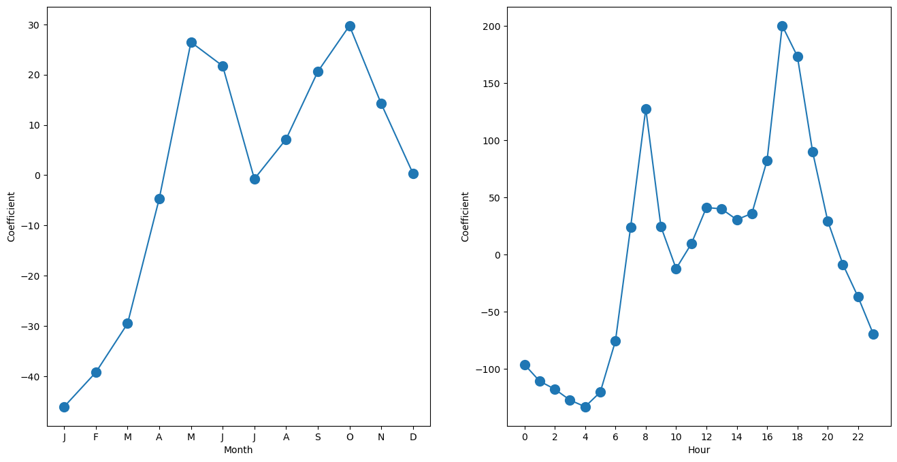
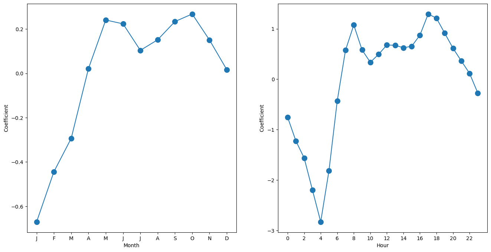
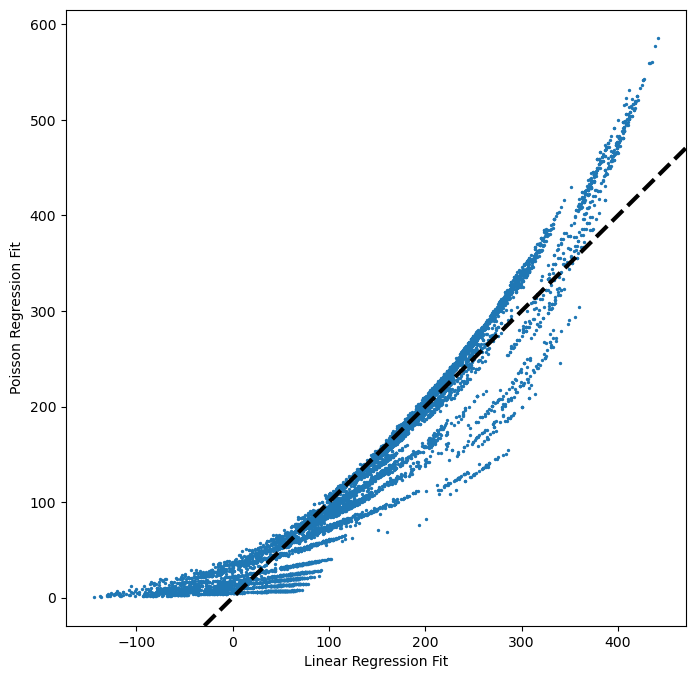

# 1. Datenüberblick

- Dataset mit stündlichen und täglichen Fahrradmietdaten von Capital Bikeshare (2011-2012) mit Wetter- und Saisondetails
- 8645 Zeilen
- 15 Variablen:
  - season: Jahreszeit (Winter=1, Frühling=2, Sommer=3, Herbst=4)
  - mnth: Monat
  - day: Tag des Jahres (1-365)
  - hr: Stunde des Tages (0-23)
  - holiday: Feiertag (Ja=1, Nein=0)
  - weekday: Wochentag (Sonntag=0, Samstag=6)
  - workingday: Arbeitstag (Ja=1, Nein=0)
  - weathersit: Wetterbedingungen
  - temp: Normalisierte Temperatur (Celsius)
  - atemp: Normalisierte "gefühlte" Temperatur (Celsius)
  - hum: Normalisierte Luftfeuchtigkeit
  - windspeed: Normalisierte Windgeschwindigkeit
  - casual: Anzahl der Freizeitfahrer
  - registered: Anzahl der registrierten Fahrer
  - bikers: Gesamtanzahl der Fahrer

# 2. Packages und Daten

```python=
import numpy as np, pandas as pd, matplotlib.pyplot as plt
import statsmodels.api as sm
from ISLP import load_data
from ISLP.models import (ModelSpec as MS, summarize)
```

```python=
Bike = load_data('Bikeshare')
Bike.head()
```

<table  class="dataframe">
  <thead>
<tr style="text-align: right;">
  <th></th>
  <th>season</th>
  <th>mnth</th>
  <th>day</th>
  <th>hr</th>
  <th>holiday</th>
  <th>weekday</th>
  <th>workingday</th>
  <th>weathersit</th>
  <th>temp</th>
  <th>atemp</th>
  <th>hum</th>
  <th>windspeed</th>
  <th>casual</th>
  <th>registered</th>
  <th>bikers</th>
</tr>
  </thead>
  <tbody>
<tr>
  <th>0</th>
  <td>1</td>
  <td>Jan</td>
  <td>1</td>
  <td>0</td>
  <td>0</td>
  <td>6</td>
  <td>0</td>
  <td>clear</td>
  <td>0.24</td>
  <td>0.2879</td>
  <td>0.81</td>
  <td>0.0</td>
  <td>3</td>
  <td>13</td>
  <td>16</td>
</tr>
<tr>
  <th>1</th>
  <td>1</td>
  <td>Jan</td>
  <td>1</td>
  <td>1</td>
  <td>0</td>
  <td>6</td>
  <td>0</td>
  <td>clear</td>
  <td>0.22</td>
  <td>0.2727</td>
  <td>0.80</td>
  <td>0.0</td>
  <td>8</td>
  <td>32</td>
  <td>40</td>
</tr>
<tr>
  <th>2</th>
  <td>1</td>
  <td>Jan</td>
  <td>1</td>
  <td>2</td>
  <td>0</td>
  <td>6</td>
  <td>0</td>
  <td>clear</td>
  <td>0.22</td>
  <td>0.2727</td>
  <td>0.80</td>
  <td>0.0</td>
  <td>5</td>
  <td>27</td>
  <td>32</td>
</tr>
<tr>
  <th>3</th>
  <td>1</td>
  <td>Jan</td>
  <td>1</td>
  <td>3</td>
  <td>0</td>
  <td>6</td>
  <td>0</td>
  <td>clear</td>
  <td>0.24</td>
  <td>0.2879</td>
  <td>0.75</td>
  <td>0.0</td>
  <td>3</td>
  <td>10</td>
  <td>13</td>
</tr>
<tr>
  <th>4</th>
  <td>1</td>
  <td>Jan</td>
  <td>1</td>
  <td>4</td>
  <td>0</td>
  <td>6</td>
  <td>0</td>
  <td>clear</td>
  <td>0.24</td>
  <td>0.2879</td>
  <td>0.75</td>
  <td>0.0</td>
  <td>0</td>
  <td>1</td>
  <td>1</td>
</tr>
  </tbody>
</table>

```python=
Bike.describe().round(1)
```

<table  class="dataframe">
  <thead>
<tr style="text-align: right;">
  <th></th>
  <th>season</th>
  <th>day</th>
  <th>holiday</th>
  <th>weekday</th>
  <th>workingday</th>
  <th>temp</th>
  <th>atemp</th>
  <th>hum</th>
  <th>windspeed</th>
  <th>casual</th>
  <th>registered</th>
  <th>bikers</th>
</tr>
  </thead>
  <tbody>
<tr>
  <th>count</th>
  <td>8645.0</td>
  <td>8645.0</td>
  <td>8645.0</td>
  <td>8645.0</td>
  <td>8645.0</td>
  <td>8645.0</td>
  <td>8645.0</td>
  <td>8645.0</td>
  <td>8645.0</td>
  <td>8645.0</td>
  <td>8645.0</td>
  <td>8645.0</td>
</tr>
<tr>
  <th>mean</th>
  <td>2.5</td>
  <td>184.4</td>
  <td>0.0</td>
  <td>3.0</td>
  <td>0.7</td>
  <td>0.5</td>
  <td>0.5</td>
  <td>0.6</td>
  <td>0.2</td>
  <td>28.6</td>
  <td>115.2</td>
  <td>143.8</td>
</tr>
<tr>
  <th>std</th>
  <td>1.1</td>
  <td>104.8</td>
  <td>0.2</td>
  <td>2.0</td>
  <td>0.5</td>
  <td>0.2</td>
  <td>0.2</td>
  <td>0.2</td>
  <td>0.1</td>
  <td>38.8</td>
  <td>109.5</td>
  <td>133.8</td>
</tr>
<tr>
  <th>min</th>
  <td>1.0</td>
  <td>1.0</td>
  <td>0.0</td>
  <td>0.0</td>
  <td>0.0</td>
  <td>0.0</td>
  <td>0.0</td>
  <td>0.0</td>
  <td>0.0</td>
  <td>0.0</td>
  <td>0.0</td>
  <td>1.0</td>
</tr>
<tr>
  <th>25%</th>
  <td>2.0</td>
  <td>94.0</td>
  <td>0.0</td>
  <td>1.0</td>
  <td>0.0</td>
  <td>0.3</td>
  <td>0.3</td>
  <td>0.5</td>
  <td>0.1</td>
  <td>3.0</td>
  <td>26.0</td>
  <td>31.0</td>
</tr>
<tr>
  <th>50%</th>
  <td>3.0</td>
  <td>185.0</td>
  <td>0.0</td>
  <td>3.0</td>
  <td>1.0</td>
  <td>0.5</td>
  <td>0.5</td>
  <td>0.6</td>
  <td>0.2</td>
  <td>14.0</td>
  <td>90.0</td>
  <td>109.0</td>
</tr>
<tr>
  <th>75%</th>
  <td>3.0</td>
  <td>275.0</td>
  <td>0.0</td>
  <td>5.0</td>
  <td>1.0</td>
  <td>0.7</td>
  <td>0.6</td>
  <td>0.8</td>
  <td>0.3</td>
  <td>38.0</td>
  <td>168.0</td>
  <td>211.0</td>
</tr>
<tr>
  <th>max</th>
  <td>4.0</td>
  <td>365.0</td>
  <td>1.0</td>
  <td>6.0</td>
  <td>1.0</td>
  <td>1.0</td>
  <td>1.0</td>
  <td>1.0</td>
  <td>0.9</td>
  <td>272.0</td>
  <td>567.0</td>
  <td>651.0</td>
</tr>
  </tbody>
</table>

```python=
Bike.weathersit.value_counts()
```

    weathersit
    clear  5645
    cloudy/misty   2218
    light rain/snow 781
    heavy rain/snow   1
    Name: count, dtype: int64

# 3. Lineare Regression

```python=
X = MS(['mnth','hr','workingday','temp','weathersit']).fit_transform(Bike)
Y = Bike['bikers']
M_lm = sm.OLS(Y, X).fit()
summarize(M_lm)
```

<table  class="dataframe">
  <thead>
<tr style="text-align: right;">
  <th></th>
  <th>coef</th>
  <th>std err</th>
  <th>t</th>
  <th>P>|t|</th>
</tr>
  </thead>
  <tbody>
<tr>
  <th>intercept</th>
  <td>-68.6317</td>
  <td>5.307</td>
  <td>-12.932</td>
  <td>0.000</td>
</tr>
<tr>
  <th>mnth[Feb]</th>
  <td>6.8452</td>
  <td>4.287</td>
  <td>1.597</td>
  <td>0.110</td>
</tr>
<tr>
  <th>mnth[March]</th>
  <td>16.5514</td>
  <td>4.301</td>
  <td>3.848</td>
  <td>0.000</td>
</tr>
<tr>
  <th>mnth[April]</th>
  <td>41.4249</td>
  <td>4.972</td>
  <td>8.331</td>
  <td>0.000</td>
</tr>
<tr>
  <th>mnth[May]</th>
  <td>72.5571</td>
  <td>5.641</td>
  <td>12.862</td>
  <td>0.000</td>
</tr>
<tr>
  <th>mnth[June]</th>
  <td>67.8187</td>
  <td>6.544</td>
  <td>10.364</td>
  <td>0.000</td>
</tr>
<tr>
  <th>mnth[July]</th>
  <td>45.3245</td>
  <td>7.081</td>
  <td>6.401</td>
  <td>0.000</td>
</tr>
<tr>
  <th>mnth[Aug]</th>
  <td>53.2430</td>
  <td>6.640</td>
  <td>8.019</td>
  <td>0.000</td>
</tr>
<tr>
  <th>mnth[Sept]</th>
  <td>66.6783</td>
  <td>5.925</td>
  <td>11.254</td>
  <td>0.000</td>
</tr>
<tr>
  <th>mnth[Oct]</th>
  <td>75.8343</td>
  <td>4.950</td>
  <td>15.319</td>
  <td>0.000</td>
</tr>
<tr>
  <th>mnth[Nov]</th>
  <td>60.3100</td>
  <td>4.610</td>
  <td>13.083</td>
  <td>0.000</td>
</tr>
<tr>
  <th>mnth[Dec]</th>
  <td>46.4577</td>
  <td>4.271</td>
  <td>10.878</td>
  <td>0.000</td>
</tr>
<tr>
  <th>hr[1]</th>
  <td>-14.5793</td>
  <td>5.699</td>
  <td>-2.558</td>
  <td>0.011</td>
</tr>
<tr>
  <th>hr[2]</th>
  <td>-21.5791</td>
  <td>5.733</td>
  <td>-3.764</td>
  <td>0.000</td>
</tr>
<tr>
  <th>hr[3]</th>
  <td>-31.1408</td>
  <td>5.778</td>
  <td>-5.389</td>
  <td>0.000</td>
</tr>
<tr>
  <th>hr[4]</th>
  <td>-36.9075</td>
  <td>5.802</td>
  <td>-6.361</td>
  <td>0.000</td>
</tr>
<tr>
  <th>hr[5]</th>
  <td>-24.1355</td>
  <td>5.737</td>
  <td>-4.207</td>
  <td>0.000</td>
</tr>
<tr>
  <th>hr[6]</th>
  <td>20.5997</td>
  <td>5.704</td>
  <td>3.612</td>
  <td>0.000</td>
</tr>
<tr>
  <th>hr[7]</th>
  <td>120.0931</td>
  <td>5.693</td>
  <td>21.095</td>
  <td>0.000</td>
</tr>
<tr>
  <th>hr[8]</th>
  <td>223.6619</td>
  <td>5.690</td>
  <td>39.310</td>
  <td>0.000</td>
</tr>
<tr>
  <th>hr[9]</th>
  <td>120.5819</td>
  <td>5.693</td>
  <td>21.182</td>
  <td>0.000</td>
</tr>
<tr>
  <th>hr[10]</th>
  <td>83.8013</td>
  <td>5.705</td>
  <td>14.689</td>
  <td>0.000</td>
</tr>
<tr>
  <th>hr[11]</th>
  <td>105.4234</td>
  <td>5.722</td>
  <td>18.424</td>
  <td>0.000</td>
</tr>
<tr>
  <th>hr[12]</th>
  <td>137.2837</td>
  <td>5.740</td>
  <td>23.916</td>
  <td>0.000</td>
</tr>
<tr>
  <th>hr[13]</th>
  <td>136.0359</td>
  <td>5.760</td>
  <td>23.617</td>
  <td>0.000</td>
</tr>
<tr>
  <th>hr[14]</th>
  <td>126.6361</td>
  <td>5.776</td>
  <td>21.923</td>
  <td>0.000</td>
</tr>
<tr>
  <th>hr[15]</th>
  <td>132.0865</td>
  <td>5.780</td>
  <td>22.852</td>
  <td>0.000</td>
</tr>
<tr>
  <th>hr[16]</th>
  <td>178.5206</td>
  <td>5.772</td>
  <td>30.927</td>
  <td>0.000</td>
</tr>
<tr>
  <th>hr[17]</th>
  <td>296.2670</td>
  <td>5.749</td>
  <td>51.537</td>
  <td>0.000</td>
</tr>
<tr>
  <th>hr[18]</th>
  <td>269.4409</td>
  <td>5.736</td>
  <td>46.976</td>
  <td>0.000</td>
</tr>
<tr>
  <th>hr[19]</th>
  <td>186.2558</td>
  <td>5.714</td>
  <td>32.596</td>
  <td>0.000</td>
</tr>
<tr>
  <th>hr[20]</th>
  <td>125.5492</td>
  <td>5.704</td>
  <td>22.012</td>
  <td>0.000</td>
</tr>
<tr>
  <th>hr[21]</th>
  <td>87.5537</td>
  <td>5.693</td>
  <td>15.378</td>
  <td>0.000</td>
</tr>
<tr>
  <th>hr[22]</th>
  <td>59.1226</td>
  <td>5.689</td>
  <td>10.392</td>
  <td>0.000</td>
</tr>
<tr>
  <th>hr[23]</th>
  <td>26.8376</td>
  <td>5.688</td>
  <td>4.719</td>
  <td>0.000</td>
</tr>
<tr>
  <th>workingday</th>
  <td>1.2696</td>
  <td>1.784</td>
  <td>0.711</td>
  <td>0.477</td>
</tr>
<tr>
  <th>temp</th>
  <td>157.2094</td>
  <td>10.261</td>
  <td>15.321</td>
  <td>0.000</td>
</tr>
<tr>
  <th>weathersit[cloudy/misty]</th>
  <td>-12.8903</td>
  <td>1.964</td>
  <td>-6.562</td>
  <td>0.000</td>
</tr>
<tr>
  <th>weathersit[heavy rain/snow]</th>
  <td>-109.7446</td>
  <td>76.667</td>
  <td>-1.431</td>
  <td>0.152</td>
</tr>
<tr>
  <th>weathersit[light rain/snow]</th>
  <td>-66.4944</td>
  <td>2.965</td>
  <td>-22.425</td>
  <td>0.000</td>
</tr>
  </tbody>
</table>

- Es gibt insgesamt 40 Prädiktoren.
- `hr[0]` und `mnth[Jan]` sind Basiswerte mit null Koeffizienten.
- Andere Werte werden gegen diese gemessen.
- Beispiel: 
  - Der Februar-Koeffizient von 6.845 bedeutet etwa 7 mehr Fahrer im Februar als im Januar.
  - März hat etwa 16,5 mehr Fahrer als Januar.

```python=
hr_encode = contrast('hr', 'sum')
mnth_encode = contrast('mnth', 'sum')
```

```python=
X2 = MS([mnth_encode,hr_encode,'workingday','temp','weathersit']).fit_transform(Bike)
M2_lm = sm.OLS(Y, X2).fit()
S2 = summarize(M2_lm); S2
```

<table  class="dataframe">
  <thead>
<tr style="text-align: right;">
  <th></th>
  <th>coef</th>
  <th>std err</th>
  <th>t</th>
  <th>P>|t|</th>
</tr>
  </thead>
  <tbody>
<tr>
  <th>intercept</th>
  <td>73.5974</td>
  <td>5.132</td>
  <td>14.340</td>
  <td>0.000</td>
</tr>
<tr>
  <th>mnth[Jan]</th>
  <td>-46.0871</td>
  <td>4.085</td>
  <td>-11.281</td>
  <td>0.000</td>
</tr>
<tr>
  <th>mnth[Feb]</th>
  <td>-39.2419</td>
  <td>3.539</td>
  <td>-11.088</td>
  <td>0.000</td>
</tr>
<tr>
  <th>mnth[March]</th>
  <td>-29.5357</td>
  <td>3.155</td>
  <td>-9.361</td>
  <td>0.000</td>
</tr>
<tr>
  <th>mnth[April]</th>
  <td>-4.6622</td>
  <td>2.741</td>
  <td>-1.701</td>
  <td>0.089</td>
</tr>
<tr>
  <th>mnth[May]</th>
  <td>26.4700</td>
  <td>2.851</td>
  <td>9.285</td>
  <td>0.000</td>
</tr>
<tr>
  <th>mnth[June]</th>
  <td>21.7317</td>
  <td>3.465</td>
  <td>6.272</td>
  <td>0.000</td>
</tr>
<tr>
  <th>mnth[July]</th>
  <td>-0.7626</td>
  <td>3.908</td>
  <td>-0.195</td>
  <td>0.845</td>
</tr>
<tr>
  <th>mnth[Aug]</th>
  <td>7.1560</td>
  <td>3.535</td>
  <td>2.024</td>
  <td>0.043</td>
</tr>
<tr>
  <th>mnth[Sept]</th>
  <td>20.5912</td>
  <td>3.046</td>
  <td>6.761</td>
  <td>0.000</td>
</tr>
<tr>
  <th>mnth[Oct]</th>
  <td>29.7472</td>
  <td>2.700</td>
  <td>11.019</td>
  <td>0.000</td>
</tr>
<tr>
  <th>mnth[Nov]</th>
  <td>14.2229</td>
  <td>2.860</td>
  <td>4.972</td>
  <td>0.000</td>
</tr>
<tr>
  <th>hr[0]</th>
  <td>-96.1420</td>
  <td>3.955</td>
  <td>-24.307</td>
  <td>0.000</td>
</tr>
<tr>
  <th>hr[1]</th>
  <td>-110.7213</td>
  <td>3.966</td>
  <td>-27.916</td>
  <td>0.000</td>
</tr>
<tr>
  <th>hr[2]</th>
  <td>-117.7212</td>
  <td>4.016</td>
  <td>-29.310</td>
  <td>0.000</td>
</tr>
<tr>
  <th>hr[3]</th>
  <td>-127.2828</td>
  <td>4.081</td>
  <td>-31.191</td>
  <td>0.000</td>
</tr>
<tr>
  <th>hr[4]</th>
  <td>-133.0495</td>
  <td>4.117</td>
  <td>-32.319</td>
  <td>0.000</td>
</tr>
<tr>
  <th>hr[5]</th>
  <td>-120.2775</td>
  <td>4.037</td>
  <td>-29.794</td>
  <td>0.000</td>
</tr>
<tr>
  <th>hr[6]</th>
  <td>-75.5424</td>
  <td>3.992</td>
  <td>-18.925</td>
  <td>0.000</td>
</tr>
<tr>
  <th>hr[7]</th>
  <td>23.9511</td>
  <td>3.969</td>
  <td>6.035</td>
  <td>0.000</td>
</tr>
<tr>
  <th>hr[8]</th>
  <td>127.5199</td>
  <td>3.950</td>
  <td>32.284</td>
  <td>0.000</td>
</tr>
<tr>
  <th>hr[9]</th>
  <td>24.4399</td>
  <td>3.936</td>
  <td>6.209</td>
  <td>0.000</td>
</tr>
<tr>
  <th>hr[10]</th>
  <td>-12.3407</td>
  <td>3.936</td>
  <td>-3.135</td>
  <td>0.002</td>
</tr>
<tr>
  <th>hr[11]</th>
  <td>9.2814</td>
  <td>3.945</td>
  <td>2.353</td>
  <td>0.019</td>
</tr>
<tr>
  <th>hr[12]</th>
  <td>41.1417</td>
  <td>3.957</td>
  <td>10.397</td>
  <td>0.000</td>
</tr>
<tr>
  <th>hr[13]</th>
  <td>39.8939</td>
  <td>3.975</td>
  <td>10.036</td>
  <td>0.000</td>
</tr>
<tr>
  <th>hr[14]</th>
  <td>30.4940</td>
  <td>3.991</td>
  <td>7.641</td>
  <td>0.000</td>
</tr>
<tr>
  <th>hr[15]</th>
  <td>35.9445</td>
  <td>3.995</td>
  <td>8.998</td>
  <td>0.000</td>
</tr>
<tr>
  <th>hr[16]</th>
  <td>82.3786</td>
  <td>3.988</td>
  <td>20.655</td>
  <td>0.000</td>
</tr>
<tr>
  <th>hr[17]</th>
  <td>200.1249</td>
  <td>3.964</td>
  <td>50.488</td>
  <td>0.000</td>
</tr>
<tr>
  <th>hr[18]</th>
  <td>173.2989</td>
  <td>3.956</td>
  <td>43.806</td>
  <td>0.000</td>
</tr>
<tr>
  <th>hr[19]</th>
  <td>90.1138</td>
  <td>3.940</td>
  <td>22.872</td>
  <td>0.000</td>
</tr>
<tr>
  <th>hr[20]</th>
  <td>29.4071</td>
  <td>3.936</td>
  <td>7.471</td>
  <td>0.000</td>
</tr>
<tr>
  <th>hr[21]</th>
  <td>-8.5883</td>
  <td>3.933</td>
  <td>-2.184</td>
  <td>0.029</td>
</tr>
<tr>
  <th>hr[22]</th>
  <td>-37.0194</td>
  <td>3.934</td>
  <td>-9.409</td>
  <td>0.000</td>
</tr>
<tr>
  <th>workingday</th>
  <td>1.2696</td>
  <td>1.784</td>
  <td>0.711</td>
  <td>0.477</td>
</tr>
<tr>
  <th>temp</th>
  <td>157.2094</td>
  <td>10.261</td>
  <td>15.321</td>
  <td>0.000</td>
</tr>
<tr>
  <th>weathersit[cloudy/misty]</th>
  <td>-12.8903</td>
  <td>1.964</td>
  <td>-6.562</td>
  <td>0.000</td>
</tr>
<tr>
  <th>weathersit[heavy rain/snow]</th>
  <td>-109.7446</td>
  <td>76.667</td>
  <td>-1.431</td>
  <td>0.152</td>
</tr>
<tr>
  <th>weathersit[light rain/snow]</th>
  <td>-66.4944</td>
  <td>2.965</td>
  <td>-22.425</td>
  <td>0.000</td>
</tr>
  </tbody>
</table>

- Alle außer `hr[23]` und `mnth[Dec]` haben berichtete Koeffizienten.
- Die nicht berichteten Koeffizienten der letzten Stufen sind die negative Summe aller anderen Stufen.
  - Dadurch summieren sich die Koeffizienten zu null und repräsentieren Abweichungen vom Mittelwert.
- Beispiel: Der Koeffizient für Januar von $-46.087$ bedeutet 46 weniger Fahrer im Januar im Vergleich zum Jahresdurchschnitt.
- Die Wahl der Kodierung spielt keine Rolle, solange das Modell korrekt interpretiert wird.
  - Es liefert die gleichen Vorhersagen, unabhängig von der Kodierung.

```python=
np.sum((M_lm.fittedvalues - M2_lm.fittedvalues)**2)
```

    1.3316295598298798e-20

- Wir plotten die Koeffizientenschätzungen für `mnth` links und für `hr` rechts.
- Zuerst berechnen wir den Koeffizienten von `mnth[Dec]`.
- Dann berechnen wir den Koeffizienten von `hr[23]`.

```python=
months = Bike['mnth'].dtype.categories
# Extract coefficients of Jan to Nov
coef_month = S2[S2.index.str.contains('mnth')]['coef']
# Calculate Dec coefficient = -sum(Jan2Nov)
coef_month = pd.concat([coef_month, pd.Series([-coef_month.sum()], index=['mnth[Dec]'])])
coef_month
```

    mnth[Jan] -46.0871
    mnth[Feb] -39.2419
    mnth[March]   -29.5357
    mnth[April]-4.6622
    mnth[May]  26.4700
    mnth[June] 21.7317
    mnth[July] -0.7626
    mnth[Aug]   7.1560
    mnth[Sept] 20.5912
    mnth[Oct]  29.7472
    mnth[Nov]  14.2229
    mnth[Dec]   0.3705
    dtype: float64

```python=
coef_hr = S2[S2.index.str.contains('hr')]['coef']
coef_hr = coef_hr.reindex(['hr[{0}]'.format(h) for h in range(23)])
coef_hr = pd.concat([coef_hr, pd.Series([-coef_hr.sum()], index=['hr[23]'])])
```

```python=
fig, (ax_month, ax_hr) = plt.subplots(1, 2, figsize=(16, 8))
# First subplot for month
x_month = np.arange(coef_month.shape[0])
ax_month.plot(x_month, coef_month, marker='o', ms=10)
ax_month.set_xticks(x_month)
ax_month.set_xticklabels([l[5] for l in coef_month.index])
ax_month.set_xlabel('Month'); ax_month.set_ylabel('Coefficient')
# Second subplot for hour
x_hr = np.arange(coef_hr.shape[0])
ax_hr.plot(x_hr, coef_hr, marker='o', ms=10)
ax_hr.set_xticks(x_hr[::2])
ax_hr.set_xticklabels(range(24)[::2])
ax_hr.set_xlabel('Hour'); ax_hr.set_ylabel('Coefficient');
```



# 4. Poisson Regression

```python=
M_pois = sm.GLM(Y, X2, family=sm.families.Poisson()).fit()
```

- Wir wiederholen den ähnlichen Prozess, um für `mnth` und `hr` zu plotten.

```python=
Smry_pois = summarize(M_pois)
coef_month = Smry_pois[Smry_pois.index.str.contains('mnth')]['coef']
coef_month = pd.concat([coef_month, pd.Series([-coef_month.sum()], index=['mnth[Dec]'])])
coef_hr = Smry_pois[Smry_pois.index.str.contains('hr')]['coef']
coef_hr = pd.concat([coef_hr, pd.Series([-coef_hr.sum()], index=['hr[23]'])])
```

```python=
fig, (ax_month, ax_hr) = plt.subplots(1, 2, figsize=(16, 8))
# First subplot for month
x_month = np.arange(coef_month.shape[0])
ax_month.plot(x_month, coef_month, marker='o', ms=10)
ax_month.set_xticks(x_month)
ax_month.set_xticklabels([l[5] for l in coef_month.index])
ax_month.set_xlabel('Month'); ax_month.set_ylabel('Coefficient')
# Second subplot for hour
x_hr = np.arange(coef_hr.shape[0])
ax_hr.plot(x_hr, coef_hr, marker='o', ms=10)
ax_hr.set_xticks(x_hr[::2])
ax_hr.set_xticklabels(range(24)[::2])
ax_hr.set_xlabel('Hour'); ax_hr.set_ylabel('Coefficient');
```



- Wir plotten die angepassten Werte von zwei Modellen.

```python=
fig, ax = plt.subplots(figsize=(8, 8))
ax.scatter(M2_lm.fittedvalues,
   M_pois.fittedvalues, s=2)
ax.set_xlabel('Linear Regression Fit')
ax.set_ylabel('Poisson Regression Fit')
ax.axline([0,0], c='black', linewidth=3, linestyle='--', slope=1);
```



- Poisson-Regressionsvorhersagen korrelieren mit linearen Modellvorhersagen.
- Sie sind jedoch nicht negativ und tendieren dazu, bei sehr niedrigen oder hohen Fahrgastzahlen größer zu sein.
- Wir passen Poisson-Regressionsmodelle mit `sm.GLM(family=sm.families.Poisson())` an.
- Zuvor verwendeten wir `sm.GLM(family=sm.families.Binomial())` für logistische Regression.
- Andere `family`-Optionen, wie `sm.families.Gamma()`, passen verschiedene GLMs an.
