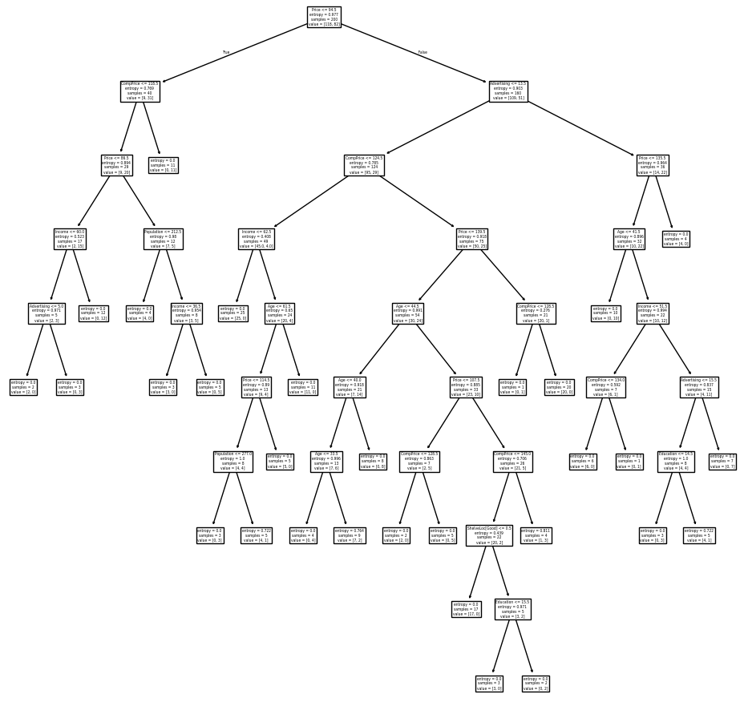

# 1. Datenbeschreibung
- Simulierte Daten zu Autokindersitz-Verkäufen in 400 Geschäften:
    - 400 Zeilen
    - 11 Variablen:
        - Sales: Verkaufszahlen (in Tausend)
        - CompPrice: Preis des Konkurrenten
        - Income: Einkommensniveau der Gemeinschaft (in Tausend Dollar)
        - Advertising: Werbebudget vor Ort (in Tausend Dollar)
        - Population: Bevölkerungsgröße in der Region (in Tausend)
        - Price: Firmenpreis für Kindersitze
        - ShelveLoc: Qualität des Regals (Bad, Good, Medium)
        - Age: Durchschnittsalter der Bevölkerung
        - Education: Bildungsstand
        - Urban: Stadt- oder Landlage (No, Yes)
        - US: In den USA oder nicht (No, Yes)

# 2. Packages und Daten

```python=
import numpy as np, pandas as pd, matplotlib.pyplot as plt
import sklearn.model_selection as skm
from sklearn.tree import (DecisionTreeClassifier as DTC,
                          plot_tree, export_text)
from sklearn.metrics import accuracy_score, log_loss
from ISLP import load_data, confusion_table
from ISLP.models import ModelSpec as MS
```

```python=
Carseats = load_data('Carseats')
Carseats.head(2)
```

<table>
  <thead>
    <tr style="text-align: right;">
      <th></th>
      <th>Sales</th>
      <th>CompPrice</th>
      <th>Income</th>
      <th>Advertising</th>
      <th>Population</th>
      <th>Price</th>
      <th>ShelveLoc</th>
      <th>Age</th>
      <th>Education</th>
      <th>Urban</th>
      <th>US</th>
    </tr>
  </thead>
  <tbody>
    <tr>
      <th>0</th>
      <td>9.50</td>
      <td>138</td>
      <td>73</td>
      <td>11</td>
      <td>276</td>
      <td>120</td>
      <td>Bad</td>
      <td>42</td>
      <td>17</td>
      <td>Yes</td>
      <td>Yes</td>
    </tr>
    <tr>
      <th>1</th>
      <td>11.22</td>
      <td>111</td>
      <td>48</td>
      <td>16</td>
      <td>260</td>
      <td>83</td>
      <td>Good</td>
      <td>65</td>
      <td>10</td>
      <td>Yes</td>
      <td>Yes</td>
    </tr>
  </tbody>
</table>

```python=
Carseats.describe().round(1)
```

<table>
  <thead>
    <tr style="text-align: right;">
      <th></th>
      <th>Sales</th>
      <th>CompPrice</th>
      <th>Income</th>
      <th>Advertising</th>
      <th>Population</th>
      <th>Price</th>
      <th>Age</th>
      <th>Education</th>
    </tr>
  </thead>
  <tbody>
    <tr>
      <th>mean</th>
      <td>7.5</td>
      <td>125.0</td>
      <td>68.7</td>
      <td>6.6</td>
      <td>264.8</td>
      <td>115.8</td>
      <td>53.3</td>
      <td>13.9</td>
    </tr>
    <tr>
      <th>std</th>
      <td>2.8</td>
      <td>15.3</td>
      <td>28.0</td>
      <td>6.7</td>
      <td>147.4</td>
      <td>23.7</td>
      <td>16.2</td>
      <td>2.6</td>
    </tr>
    <tr>
      <th>min</th>
      <td>0.0</td>
      <td>77.0</td>
      <td>21.0</td>
      <td>0.0</td>
      <td>10.0</td>
      <td>24.0</td>
      <td>25.0</td>
      <td>10.0</td>
    </tr>
    <tr>
      <th>25%</th>
      <td>5.4</td>
      <td>115.0</td>
      <td>42.8</td>
      <td>0.0</td>
      <td>139.0</td>
      <td>100.0</td>
      <td>39.8</td>
      <td>12.0</td>
    </tr>
    <tr>
      <th>50%</th>
      <td>7.5</td>
      <td>125.0</td>
      <td>69.0</td>
      <td>5.0</td>
      <td>272.0</td>
      <td>117.0</td>
      <td>54.5</td>
      <td>14.0</td>
    </tr>
    <tr>
      <th>75%</th>
      <td>9.3</td>
      <td>135.0</td>
      <td>91.0</td>
      <td>12.0</td>
      <td>398.5</td>
      <td>131.0</td>
      <td>66.0</td>
      <td>16.0</td>
    </tr>
    <tr>
      <th>max</th>
      <td>16.3</td>
      <td>175.0</td>
      <td>120.0</td>
      <td>29.0</td>
      <td>509.0</td>
      <td>191.0</td>
      <td>80.0</td>
      <td>18.0</td>
    </tr>
  </tbody>
</table>

# 3. Klassifikationsbäume

- Klassifikationsbaum vs. Regressionsbaum:
  - Regressionsbaum: Vorhersage durch Mittelwert der Trainingsbeobachtungen.
  - Klassifikationsbaum: Vorhersage durch häufigste Klasse der Trainingsbeobachtungen.

- Klassifikationsbaum erstellen:
  - Nutzen rekursives binäres Teilen.
  - Klassifikationsfehlerrate als Kriterium:
    - Fehlerquote: $E = 1 - \max_k {\hat{p}}_{mk}$.
      - $k$ ist eine Klasse, $m$ ist ein Bereich im Klassifikationsbaum.
      - ${\hat{p}}_{mk}$ ist der Anteil der Trainingsbeobachtungen im Bereich $m$ aus der Klasse $k$.
      - Beispiele:
        - $k = 1$ könnte "Herzkrankheit" sein, $k = 2$ "Keine Herzkrankheit".
        - $m = 3$ bezieht sich auf den dritten Endknoten.
        - ${\hat{p}}_{3,1}$ ist der Anteil der Beobachtungen im dritten Bereich, die als "Herzkrankheit" klassifiziert sind.


- Bessere Kriterien als Klassifikationsfehlerrate:
  - Gini-Index: $G = \sum_{k=1}^{K} {\hat{p}}_{mk} (1 - {\hat{p}}_{mk})$
    - Klein, wenn Knoten rein ist.
  - Entropie: $D = -\sum_{k=1}^{K} {\hat{p}}_{mk} \log {\hat{p}}_{mk}$
    - Klein bei reinen Knoten.

- Node Purity:
  - Split erhöht Knotenreinheit.
  - Wichtig für genaue Vorhersagen.
  - Beispiel: Split "RestECG<1" am Baumende erhöht Reinheit, obwohl Vorhersage gleich bleibt.

## 3.1. Baum erstellen

- Erstellen der binären Variable `High`

```python=
#High = Carseats.Sales > 8
High = np.where(Carseats.Sales > 8, "Yes", "No")
```

- Erstellen der Designmatrix:

```python=
Design_Matrix = MS(Carseats.columns.drop('Sales'), intercept=False).fit_transform(Carseats)
feature_names = Design_Matrix.columns
X = np.asarray(Design_Matrix)
```

- Argumente für die `DecisionTreeClassifier` Funktion:
  - `criterion`: Funktion zur Messung der Split-Qualität (Standard: `gini`)
  - `max_depth`: Maximale Tiefe des Baums (Standard: `None`)
  - `min_samples_split`: Minimale Anzahl von Samples für einen Split (Standard: `2`)
  - `min_samples_leaf`: Minimale Anzahl von Samples in einem Blattknoten (Standard: `1`)
  - `random_state`: Seed für den Zufallsgenerator beim Mischen der Daten (Standard: `None`)

```python=
TRE_clas = DTC(criterion='entropy', max_depth=3, random_state=0)        
TRE_clas.fit(X, High);
accuracy_score(High, TRE_clas.predict(X))
# 0.79
```

- Trainingsfehlerquote: 21%
- Klassifikationsbäume:
  - Nutzung von `log_loss()` zur Bestimmung des Deviance-Werts
  - Formel: $-2 \sum_m \sum_k n_{mk} \log \hat{p}_{mk}$
    - $n_{mk}$: Anzahl der Beobachtungen im m-ten Endknoten der k-ten Klasse
- Zusammenhang:
  - Deviance ähnelt der im Buch definierten *Entropie*
  - Kleine Deviance deutet auf gute Anpassung an Trainingsdaten hin

```python=
np.sum( log_loss(High, TRE_clas.predict_proba(X)) )
# 0.471
```

```python=
fig, ax = plt.subplots(figsize=(12,12))
plot_tree(TRE_clas, feature_names=feature_names, ax=ax);
```


- Wichtiger Indikator für `Sales`: `ShelveLoc`
- `show_weights=True` zeigt Beobachtungsanzahl in jedem Knote an.

```python=
print(export_text(TRE_clas, feature_names=feature_names, show_weights=True))
```

    |--- ShelveLoc[Good] <= 0.50
    |   |--- Price <= 92.50
    |   |   |--- Income <= 57.00
    |   |   |   |--- weights: [7.00, 3.00] class: No
    |   |   |--- Income >  57.00
    |   |   |   |--- weights: [7.00, 29.00] class: Yes
    |   |--- Price >  92.50
    |   |   |--- Advertising <= 13.50
    |   |   |   |--- weights: [183.00, 41.00] class: No
    |   |   |--- Advertising >  13.50
    |   |   |   |--- weights: [20.00, 25.00] class: Yes
    |--- ShelveLoc[Good] >  0.50
    |   |--- Price <= 135.00
    |   |   |--- US[Yes] <= 0.50
    |   |   |   |--- weights: [6.00, 11.00] class: Yes
    |   |   |--- US[Yes] >  0.50
    |   |   |   |--- weights: [2.00, 49.00] class: Yes
    |   |--- Price >  135.00
    |   |   |--- Income <= 46.00
    |   |   |   |--- weights: [6.00, 0.00] class: No
    |   |   |--- Income >  46.00
    |   |   |   |--- weights: [5.00, 6.00] class: Yes
    

- Datenaufteilung:
  - In Trainings- und Validierungssets (je 200 Elemente)
- Modellanpassung:
  - Baum auf Trainingsdaten anpassen
  - Leistung auf Validierungsdaten bewerten

```python=
validation = skm.ShuffleSplit(n_splits=1, test_size=200, random_state=0)
results = skm.cross_validate(TRE_clas, X, High, cv=validation)
results['test_score']
# array([0.685])
```

## 3.2. Baum beschneiden

- Datenaufteilung:
  - In Trainings- und Testsets (je 50%)
- Kreuzvalidierung:
  - Baum auf Trainingsdaten beschneiden
- Bewertung:
  - Beschnittenen Baum auf Testdaten evaluieren

```python=
X_train, X_test, High_train, High_test = skm.train_test_split(
    X, High, test_size=0.5, random_state=0)
```

```python=
TRE_clas = DTC(criterion='entropy', random_state=0).fit(X_train, High_train)
accuracy_score(High_test, TRE_clas.predict(X_test))
# 0.735
```

- Baum ohne maximale Tiefe neu anpassen:
  - Ergebnis: 73,5% korrekte Vorhersagen im Testset.

-  

```python=
ccp_path = TRE_clas.cost_complexity_pruning_path(X_train, High_train)
ccp_path
```

    ccp_alphas: array([0.0, 0.016, 0.017, 0.018, 0.018, 0.019,
    0.020, 0.020, 0.021, 0.021, 0.022, 0.022, 0.024, 0.025,
    0.027, 0.027, 0.029, 0.029, 0.032, 0.044, 0.062, 0.100])

    impurities: array([0.0, 0.016, 0.050, 0.068, 0.086, 0.126,
    0.146, 0.167, 0.189, 0.211, 0.255, 0.278, 0.326, 0.352,
    0.434, 0.543, 0.572, 0.659, 0.723, 0.813, 0.876, 0.976])

- Kostenkomplexitätswerte:
  - Kombination aus Baumverunreinigung und Knotenzahl.
- CCP alphas:
  - Effektive Komplexitätsparameter zum Beschneiden eines Entscheidungsbaums
  - Aufgelistet von klein bis groß
  - Jede $\alpha$ entspricht einer anderen beschnittenen Version des Baums
- Verunreinigungen und $\alpha$-Werte optimierbar durch Kreuzvalidierung
  

```python=
# Set 10-fold cross-validation up
kfold = skm.KFold(10, random_state=1, shuffle=True)
# Run grid search
grid = skm.GridSearchCV(TRE_clas, {'ccp_alpha': ccp_path.ccp_alphas},
                        refit=True, cv=kfold, scoring='accuracy')
# Refit with the prunned tree
grid.fit(X_train, High_train)
# Show the trainning error rate
grid.best_score_
# 0.685
```

- Beschnittenen Baum plotten

```python=
ax = plt.subplots(figsize=(12, 12))[1]
plot_tree(grid.best_estimator_, feature_names=feature_names, ax=ax);
```

    

    
- Endknoten zählen

```python=
grid.best_estimator_.tree_.n_leaves
# 30
```

- Baum mit 30 Endknoten:
  - Niedrigste Kreuzvalidierungs-Fehlerrate bei 68,5% Genauigkeit
- Leistungsbewertung:
  - Nutzung der `predict()` Funktion auf dem Testdatensatz

```python=
accuracy_score(High_test, grid.best_estimator_.predict(X_test))
# 0.72
```

```python=
# Show confusion table
confusion_table(grid.best_estimator_.predict(X_test), High_test)
```

<table>
  <thead>
    <tr style="text-align: right;">
      <th>Predicted\Truth</th>
      <th>No</th>
      <th>Yes</th>
    </tr>
  </thead>
  <tbody>
    <tr>
      <th>No</th>
      <td>94</td>
      <td>32</td>
    </tr>
    <tr>
      <th>Yes</th>
      <td>24</td>
      <td>50</td>
    </tr>
  </tbody>
</table>

- Aktuelle Klassifizierung:
  - 72,0% der Testbeobachtungen korrekt
  - Etwas schlechter als der vollständige Baum mit 35 Blättern
- Kreuzvalidierung:
  - Keine signifikante Verbesserung
  - Nur 5 Blätter beschnitten, Fehler erhöht
- Hinweis:
  - Ergebnisse können mit verschiedenen Zufallszahlen variieren
  - Kreuzvalidierung hat gewisse Varianz

# 4. Klassifikationsbäume mit verschiedenen Labels

- Obige Fall:
  - Labels: "Yes" und "No"
  - Kodierung: No=0, Yes=1
- Nächster Fall:
  - Labels: "High_Sales" und "Low_Sales"
  - Kodierung: High_Sales=0, Low_Sales=1

```python=
High = np.where(Carseats.Sales > 8, "High_Sales", "Low_Sales")
X_train,X_test,High_train,High_test = skm.train_test_split(X,High,test_size=0.5,random_state=0)
```


```python=
TRE_clas = DTC(criterion='entropy', random_state=0)
TRE_clas.fit(X_train, High_train)
accuracy_score(High_test, TRE_clas.predict(X_test))
# 0.735
```

- Baum ohne maximale Tiefe neu anpassen:
  - Ergebnis: Ähnlich wie zuvor

```python=
ccp_path = TRE_clas.cost_complexity_pruning_path(X_train, High_train)
```

- Baum mit Kreuzvalidierung beschneiden.

```python=
# Set 10-fold cross-validation up
kfold = skm.KFold(10, random_state=1, shuffle=True)
# Run grid search
grid = skm.GridSearchCV(TRE_clas, {'ccp_alpha': ccp_path.ccp_alphas},
                        refit=True, cv=kfold, scoring='accuracy')
# Refit with the prunned tree
grid.fit(X_train, High_train)
# Show the trainning error rate
grid.best_score_
# 0.685
```

- Beschnittenen Baum plotten.

```python=
ax = plt.subplots(figsize=(12, 12))[1]
plot_tree(grid.best_estimator_, feature_names=feature_names, ax=ax);
```

    

    

```python=
# Count the number of leaves
grid.best_estimator_.tree_.n_leaves
# 10
```

```python=
# Access the test error rate
accuracy_score(High_test, grid.best_estimator_.predict(X_test))
# 0.68
```

```python=
# Show confusion table
confusion_table(grid.best_estimator_.predict(X_test), High_test)
```

<table>
  <thead>
    <tr style="text-align: right;">
      <th>Predicted\Truth</th>
      <th>High_Sales</th>
      <th>Low_Sales</th>
    </tr>
  </thead>
  <tbody>
    <tr>
      <th>High_Sales</th>
      <td>38</td>
      <td>20</td>
    </tr>
    <tr>
      <th>Low_Sales</th>
      <td>44</td>
      <td>98</td>
    </tr>
  </tbody>
</table>

# 5. Bäume vs. Lineare Modelle

- Regression und Klassifikation:
  - Bäume und lineare Modelle unterscheiden sich stark.
  - Lineare Regression: $f(X) = \beta_0 + \sum_{j=1}^{p}{X_j\beta_j}$
  - Regressionsbäume: $f(X) = \sum_{m=1}^{M}{c_m\ 1_{(X\in R_m)}}$

- Modellwahl:
  - Lineares Modell funktioniert gut bei linearen Zusammenhängen.
  - Entscheidungsbäume sind besser bei komplexen, nicht-linearen Beziehungen.
  - Leistung durch Kreuzvalidierung oder Validierungsset schätzen.

- Weitere Überlegungen:
  - Bäume bieten bessere Interpretierbarkeit und Visualisierung.

## Vor- und Nachteile von Entscheidungsbäumen

- Vorteile:
  - Einfach zu erklären.
  - Näher an menschlicher Entscheidungsfindung.
  - Grafisch darstellbar und leicht verständlich.
  - Handhaben qualitative Prädiktoren ohne Dummy-Variablen.

- Nachteile:
  - Geringere Vorhersagegenauigkeit.
  - Nicht robust; kleine Datenänderungen führen zu großen Baumänderungen.

- Verbesserung der Leistung:
  - Aggregation vieler Bäume (Bagging, Random Forests, Boosting).