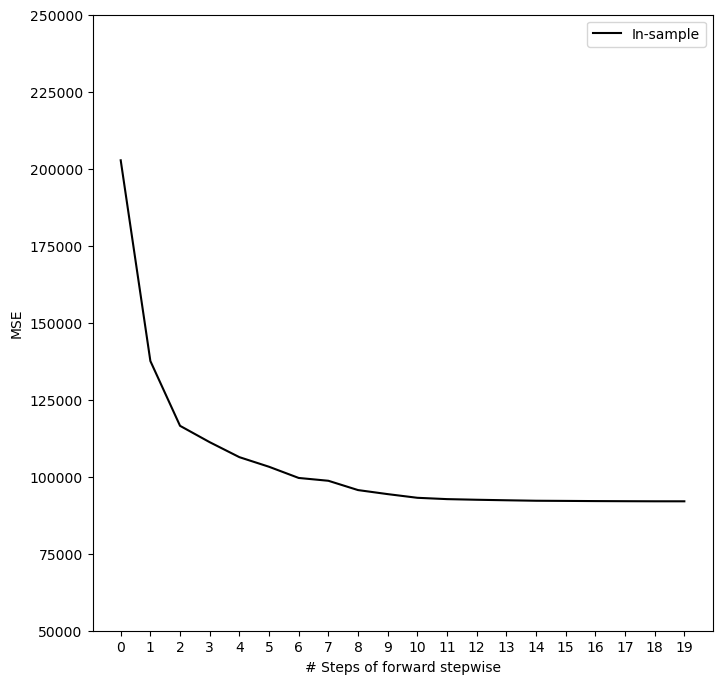
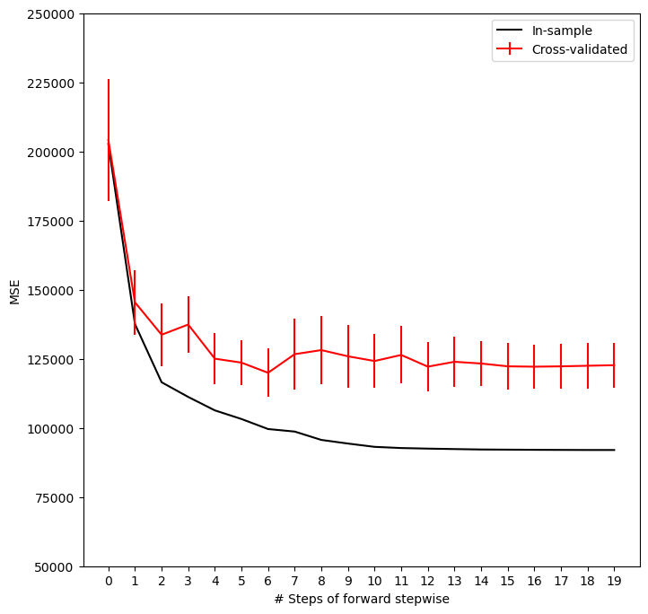
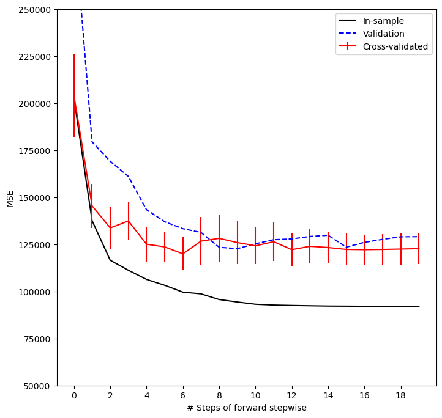
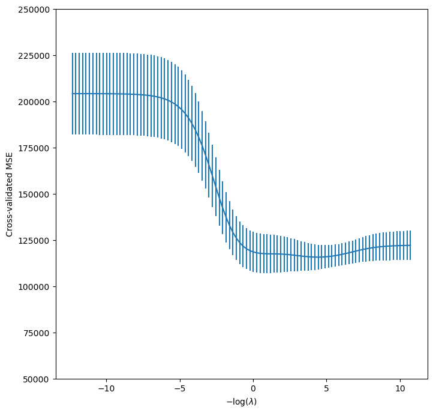
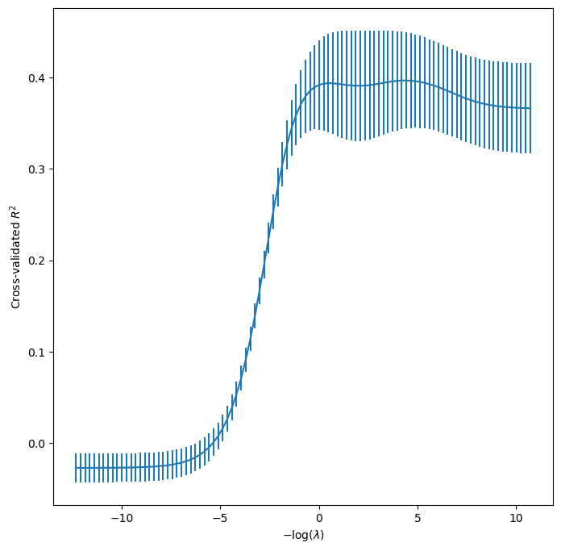
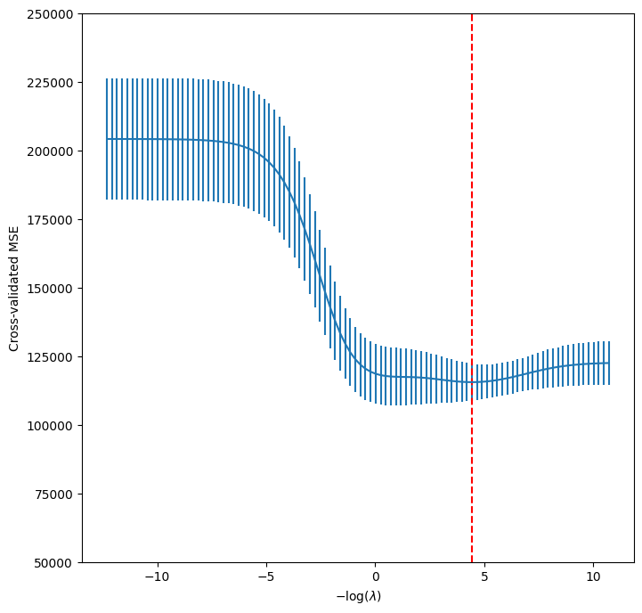
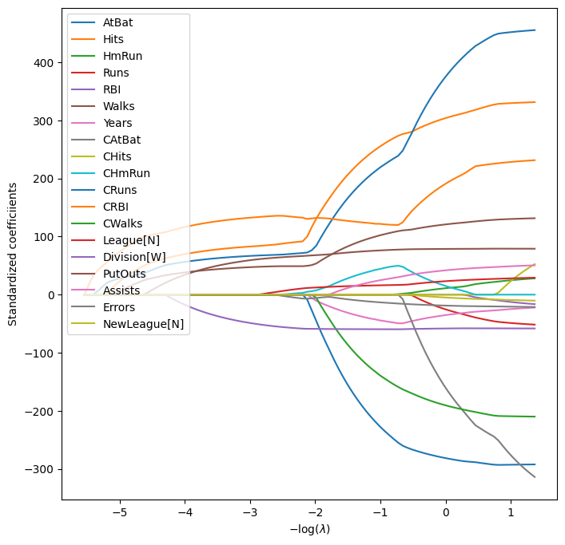
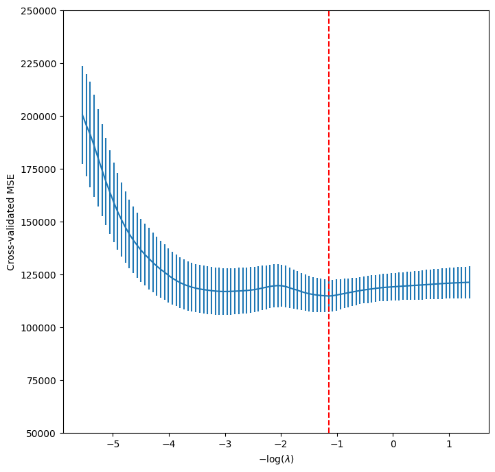
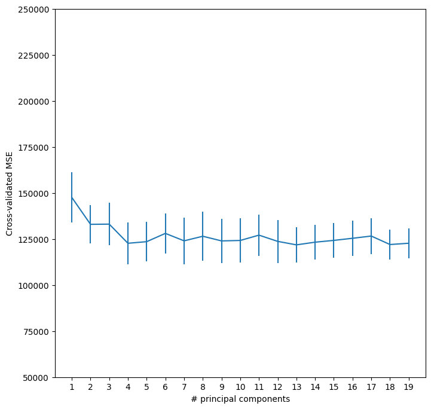
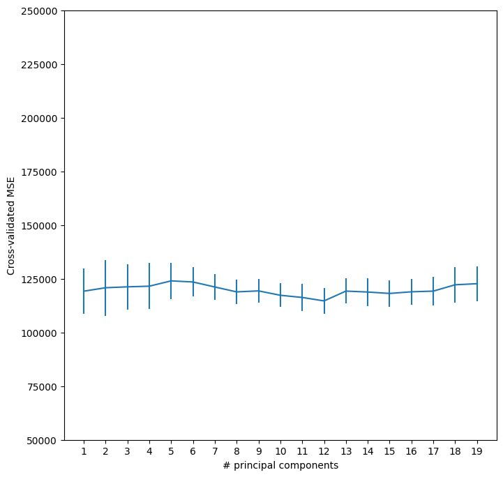

# Hitters

---
title: "Hitters"
author: "db"
---

# 1. Datenüberblick

- Major League Baseball Daten (1986-1987)
- Zeilen: 322 (59 fehlen, 263 übrig)
- Zielvariable: `Salary` (Jahresgehalt 1987 in Tausend Dollar)
- Variablen (20):
  - `AtBat`: Schläge 1986
  - `Hits`: Treffer 1986
  - `HmRun`: Home Runs 1986
  - `Runs`: Runs 1986
  - `RBI`: Runs Batted In 1986
  - `Walks`: Walks 1986
  - `Years`: Jahre in den Major Leagues
  - `CAtBat`: Schläge in der Karriere
  - `CHits`: Treffer in der Karriere
  - `CHmRun`: Home Runs in der Karriere
  - `CRuns`: Runs in der Karriere
  - `CRBI`: Runs Batted In in der Karriere
  - `CWalks`: Walks in der Karriere
  - `League`: Liga Ende 1986 (A, N)
  - `Division`: Division Ende 1986 (E, W)
  - `PutOuts`: Put Outs 1986
  - `Assists`: Assists 1986
  - `Errors`: Errors 1986
  - `Salary`: Jahresgehalt 1987 in Tausend Dollar
  - `NewLeague`: Liga Anfang 1987 (A, N)

# 2. Packages und Daten

```python=
import numpy as np, pandas as pd, matplotlib.pyplot as plt
import statsmodels.api as sm
import sklearn.model_selection as skm
import sklearn.linear_model as skl
from sklearn.pipeline import Pipeline
from sklearn.decomposition import PCA
from sklearn.cross_decomposition import PLSRegression
from sklearn.preprocessing import StandardScaler
from ISLP import load_data
from ISLP.models import \
 (ModelSpec as MS, Stepwise,
  sklearn_selected, sklearn_selection_path)
from l0bnb import fit_path
from functools import partial
```

```python=
Hitters = load_data('Hitters'); print(Hitters.shape); Hitters.head()
```

(322, 20)

<table class="dataframe">
  <thead>
    <tr style="text-align: right;">
      <th></th>
      <th>AtBat</th>
      <th>Hits</th>
      <th>HmRun</th>
      <th>Runs</th>
      <th>RBI</th>
      <th>Walks</th>
      <th>Years</th>
      <th>CAtBat</th>
      <th>CHits</th>
      <th>CHmRun</th>
    </tr>
  </thead>
  <tbody>
    <tr>
      <th>0</th>
      <td>293</td>
      <td>66</td>
      <td>1</td>
      <td>30</td>
      <td>29</td>
      <td>14</td>
      <td>1</td>
      <td>293</td>
      <td>66</td>
      <td>1</td>
    </tr>
    <tr>
      <th>1</th>
      <td>315</td>
      <td>81</td>
      <td>7</td>
      <td>24</td>
      <td>38</td>
      <td>39</td>
      <td>14</td>
      <td>3449</td>
      <td>835</td>
      <td>69</td>
    </tr>
  </tbody>
</table>

<table class="dataframe">
  <thead>
    <tr style="text-align: right;">
      <th></th>
      <th>CRuns</th>
      <th>CRBI</th>
      <th>CWalks</th>
      <th>League</th>
      <th>Division</th>
      <th>PutOuts</th>
      <th>Assists</th>
      <th>Errors</th>
      <th>Salary</th>
      <th>NewLeague</th>
    </tr>
  </thead>
  <tbody>
    <tr>
      <th>0</th>
      <td>30</td>
      <td>29</td>
      <td>14</td>
      <td>A</td>
      <td>E</td>
      <td>446</td>
      <td>33</td>
      <td>20</td>
      <td>NaN</td>
      <td>A</td>
    </tr>
    <tr>
      <th>1</th>
      <td>321</td>
      <td>414</td>
      <td>375</td>
      <td>N</td>
      <td>W</td>
      <td>632</td>
      <td>43</td>
      <td>10</td>
      <td>475.0</td>
      <td>N</td>
    </tr>
  </tbody>
</table>

```python=
Hitters.describe().round(1)
```

<table>
  <thead>
<tr style="text-align: right;">
  <th></th>
  <th>AtBat</th>
  <th>Hits</th>
  <th>HmRun</th>
  <th>Runs</th>
  <th>RBI</th>
  <th>Walks</th>
  <th>Years</th>
  <th>CAtBat</th>
  <th>CHits</th>
  <th>CHmRun</th>
  <th>CRuns</th>
  <th>CRBI</th>
  <th>CWalks</th>
  <th>PutOuts</th>
  <th>Assists</th>
  <th>Errors</th>
  <th>Salary</th>
</tr>
  </thead>
  <tbody>
<tr>
  <th>mean</th>
  <td>380.9</td>
  <td>101.0</td>
  <td>10.8</td>
  <td>50.9</td>
  <td>48.0</td>
  <td>38.7</td>
  <td>7.4</td>
  <td>2648.7</td>
  <td>717.6</td>
  <td>69.5</td>
  <td>358.8</td>
  <td>330.1</td>
  <td>260.2</td>
  <td>288.9</td>
  <td>106.9</td>
  <td>8.0</td>
  <td>535.9</td>
</tr>
<tr>
  <th>std</th>
  <td>153.4</td>
  <td>46.5</td>
  <td>8.7</td>
  <td>26.0</td>
  <td>26.2</td>
  <td>21.6</td>
  <td>4.9</td>
  <td>2324.2</td>
  <td>654.5</td>
  <td>86.3</td>
  <td>334.1</td>
  <td>333.2</td>
  <td>267.1</td>
  <td>280.7</td>
  <td>136.9</td>
  <td>6.4</td>
  <td>451.1</td>
</tr>
<tr>
  <th>min</th>
  <td>16.0</td>
  <td>1.0</td>
  <td>0.0</td>
  <td>0.0</td>
  <td>0.0</td>
  <td>0.0</td>
  <td>1.0</td>
  <td>19.0</td>
  <td>4.0</td>
  <td>0.0</td>
  <td>1.0</td>
  <td>0.0</td>
  <td>0.0</td>
  <td>0.0</td>
  <td>0.0</td>
  <td>0.0</td>
  <td>67.5</td>
</tr>
<tr>
  <th>25%</th>
  <td>255.2</td>
  <td>64.0</td>
  <td>4.0</td>
  <td>30.2</td>
  <td>28.0</td>
  <td>22.0</td>
  <td>4.0</td>
  <td>816.8</td>
  <td>209.0</td>
  <td>14.0</td>
  <td>100.2</td>
  <td>88.8</td>
  <td>67.2</td>
  <td>109.2</td>
  <td>7.0</td>
  <td>3.0</td>
  <td>190.0</td>
</tr>
<tr>
  <th>50%</th>
  <td>379.5</td>
  <td>96.0</td>
  <td>8.0</td>
  <td>48.0</td>
  <td>44.0</td>
  <td>35.0</td>
  <td>6.0</td>
  <td>1928.0</td>
  <td>508.0</td>
  <td>37.5</td>
  <td>247.0</td>
  <td>220.5</td>
  <td>170.5</td>
  <td>212.0</td>
  <td>39.5</td>
  <td>6.0</td>
  <td>425.0</td>
</tr>
<tr>
  <th>75%</th>
  <td>512.0</td>
  <td>137.0</td>
  <td>16.0</td>
  <td>69.0</td>
  <td>64.8</td>
  <td>53.0</td>
  <td>11.0</td>
  <td>3924.2</td>
  <td>1059.2</td>
  <td>90.0</td>
  <td>526.2</td>
  <td>426.2</td>
  <td>339.2</td>
  <td>325.0</td>
  <td>166.0</td>
  <td>11.0</td>
  <td>750.0</td>
</tr>
<tr>
  <th>max</th>
  <td>687.0</td>
  <td>238.0</td>
  <td>40.0</td>
  <td>130.0</td>
  <td>121.0</td>
  <td>105.0</td>
  <td>24.0</td>
  <td>14053.0</td>
  <td>4256.0</td>
  <td>548.0</td>
  <td>2165.0</td>
  <td>1659.0</td>
  <td>1566.0</td>
  <td>1378.0</td>
  <td>492.0</td>
  <td>32.0</td>
  <td>2460.0</td>
</tr>
  </tbody>
</table>

```python=
np.isnan(Hitters['Salary']).sum()
```

59

```python=
Hitters = Hitters.dropna(); Hitters.shape
```

(263, 20)

# 3. Teilmengewahlmethoden

## 3.1. Vorwärtsselektion

```python=
design = MS(Hitters.columns.drop('Salary')).fit(Hitters)
X = design.transform(Hitters)
# Shape of X: 263 x 20
```

- Wir definieren die Suchstrategie mit `Stepwise()` aus `ISLP.models`:
  - `Stepwise.first_peak()`: Läuft, bis keine Verbesserung mehr gefunden wird.
  - `Stepwise.fixed_steps()`: Läuft eine festgelegte Anzahl von Schritten.

```python=
strategy = Stepwise.first_peak(design, direction='forward', 
   max_terms=len(design.terms))
```

- Wir verwenden die Vorwärtsselektion mit `sklearn_selected()` aus `ISLP.models`, um ein lineares Regressionsmodell anzupassen.
  - Diese Funktion nutzt ein `statsmodels`-Modell und eine Suchstrategie.
  - Standardbewertung ist MSE.
- Hinweis: Die Methode `fit()` kann `X` nicht als Eingabe verwenden.
- Das Ergebnis wählt alle 19 Variablen aus.

```python=
# Define the response
Y = np.array(Hitters.Salary)
# Fit the model
hitters_MSE = sklearn_selected(sm.OLS, strategy).fit(Hitters, Y)
# Show the selected predictors
hitters_MSE.selected_state_
```

    ('Assists', 'AtBat', 'CAtBat', 'CHits', 'CHmRun')
    ('CRBI', 'CRuns', 'CWalks', 'Division', 'Errors')
    ('Hits', 'HmRun', 'League', 'NewLeague', 'PutOuts')
    ('RBI', 'Runs', 'Walks', 'Years')

- Wir können $C_p$ als Kriterium zur Modellauswahl verwenden.
  - $C_p$ ist keine eingebaute `sklearn`-Metrik.
  - Wir müssen es selbst definieren.
  - Da `sklearn` höhere Werte bevorzugt, müssen wir $C_p$ negieren.

```python=
def nCp(sigma2, estimator, X, Y):
    n, p = X.shape
    Yhat = estimator.predict(X)
    RSS = np.sum((Y - Yhat)**2)
    return - (RSS + 2 * p * sigma2) / n
```

- Funktion `nCp` benötigt $\sigma^2$: Berechnung $\sigma^2$ aus die vollige Modell.
- Fixierung von $\sigma^2$:
  - Weil Parameter `scoring` nur `estimator, X, Y` benötigt.
  - mit `partial()` aus `functools`.
  - Funktion `nCp` verwendet jetzt nur `estimator, X, Y`.

```python=
# Compute the sigma2
sigma2 = sm.OLS(Y,X).fit().scale
# Fix sigma2 in nCp
neg_Cp = partial(nCp, sigma2)
```

- Verwendung von `nCp` für das Scoring führt zu einem kleineren Modell von 10 Variablen.

```python=
hitters_Cp = sklearn_selected(sm.OLS, strategy, scoring=neg_Cp).fit(Hitters, Y)
hitters_Cp.selected_state_
```

    ('Assists', 'AtBat', 'CAtBat', 'CRBI', 'CRuns')
    ('CWalks', 'Division', 'Hits', 'PutOuts', 'Walks')

### a. Auswahl von Modellen mit alle Daten als Trainingsdaten

- `sklearn_selection_path()` speichert alle Modelle bei jedem Schritt.
- Strategie mit `Stepwise.fixed_steps()`:
  - Feste 20 Schritte von NULL bis vollständig mit 19 Variablen.
- Berechnung der angepassten Werte für alle Modelle.
- Ergebnis: Liste von 263 angepassten Werten für jedes der 20 Modelle.

```python=
# Define the strategy
strategy = Stepwise.fixed_steps(model_spec=design, n_steps=len(design.terms), direction='forward')
# Fit the models
full_path = sklearn_selection_path(sm.OLS, strategy).fit(Hitters, Y)
# Fitted values
Yhat_in = full_path.predict(Hitters)
# Shape of Yhat_in: 263 x 20
# row is fitted values, column is model
```

- Berechnung des MSE für jedes Modell.
- Darstellung des MSE gegen die Anzahl der Variablen pro Modell.
  - Skalierung: 50.000 bis 250.000 zum vergleich mit Cross-Validation-MSE und anderen Methoden später.

```python=
mse_fig, ax = plt.subplots(figsize=(8,8))
insample_mse = ((Yhat_in - Y[:,None])**2).mean(0)
# Y[:,None] is to make it a column vector.
# mean(0) is to average over the rows.
# insample_mse is a vector of 20
n_steps = insample_mse.shape[0] # Number of steps is 20
ax.plot(np.arange(n_steps), # from 0 to 19
insample_mse, 
'k', label='In-sample')
ax.set_ylabel('MSE'); ax.set_xlabel('Number of Variables')
ax.set_ylim([50000,250000]); ax.set_xticks(range(20)); ax.legend();
```



### b. Auswahl von Modellen mit Kreuzvalidierung

- Durchführung von 5-facher Kreuzvalidierung für jedes Modell.
- Verwendung von `cross_val_predict()` aus `sklearn` zur Berechnung der angepassten Werte.
- Training auf den verbleibenden Folds, Berechnung der Werte für den ausgeschlossenen Fold.
  1. Erster Fold ausgeschlossen, Modell auf restlichen 4 Folds trainiert.
  2. Angepasste Werte für ersten Fold berechnet.
  3. Prozess für restliche Folds wiederholt.

```python=
K = 5
kfold = skm.KFold(K, shuffle=True, random_state=0)
Yhat_cv = skm.cross_val_predict(full_path, Hitters, Y, cv=kfold)
# Shape of Yhat_cv: 263 x 20
```

- Berechnung des MSE für jedes Modell in jedem Cross-Validation-Fold:
  - 5 MSEs pro Modell.
- Berechnung von Mittelwert und Varianz der 5 MSEs pro Modell.
  - Varianzschätzung ist ungenau wegen überlappender Trainingssätze (Fehler sind nicht unabhängig).
- Indizes der Trainings- und Testsätze für jeden Fold:
  - Verwendung der `split()`-Methode von `kfold` zur Ermittlung der Indizes.
  - Gleiche Indizes für 20 Modelle dank fixiertem `random_state`.

```python=
# Show shape of each train and test set for each fold
for train_idx, test_idx in kfold.split(Y):
  print(test_idx[:3])
# Shape of train_idx: 210, of test_idx: 53
```

    [ 5  7  8]
    [ 3  4 13]
    [ 0  2 10]
    [ 1  6 11]
    [ 9 21 25]

```python=
cv_mse = []
for train_idx, test_idx in kfold.split(Y):
  squared_errors = (Yhat_cv[test_idx] - Y[test_idx, None])**2
  # Y[test_idx, None] is to make it a column vector.
  cv_mse.append(squared_errors.mean(0))
  # mean(0) is to average over the rows.
# Shape of cv_mse: 5 x 20
```

- Plotten des mittleren MSEs gegen die Anzahl der Variablen.
- Plotten des Standardfehlers des mittleren MSEs gegen die Anzahl der Variablen.
  - $\text{std(mean)} = \frac{Std}{\sqrt{K}}$

```python=
ax.errorbar(x = np.arange(n_steps), # n_steps=20
            y = np.mean(cv_mse, axis=0),
            yerr = np.std(cv_mse, axis=0) / np.sqrt(K),
            label = 'Cross-validated',
            c = 'r') # color red
ax.set_ylim([50000,250000]); ax.legend(); mse_fig
```



### c. Auswahl von Modellen mit dem Validierungsansatz

- Verwendung von `skm.ShuffleSplit()`: Aufteilung der Daten in Trainingssatz (80% = 210) und Testsatz (20% = 53)

```python=
validation = skm.ShuffleSplit(n_splits=1, test_size=0.2, random_state=0)
# Get indices of the training and test set
# train_idx, test_idx = list(validation.split(Y))[0]
for train_idx, test_idx in validation.split(Y):
  train_idx = train_idx
  test_idx = test_idx
```

- Modell für jeden Schritt auf dem Trainingssatz trainieren.
- Vorhersage der Antwort auf dem Validierungssatz.
- Ergebnis: Liste von 53 vorhergesagten Werten für jedes der 20 Modelle.

```python=
# Define the strategy
strategy = Stepwise.fixed_steps(model_spec=design, n_steps=len(design.terms), direction='forward')
# Fit the models on the training set
full_path = sklearn_selection_path(sm.OLS, strategy)
full_path.fit(Hitters.iloc[train_idx], Y[train_idx])
# Predict values on the validation set
Yhat_val = full_path.predict(Hitters.iloc[test_idx])
# Shape of Yhat_val is 53 x 20
```

```python=
squared_errors = (Yhat_val - Y[test_idx, None])**2
# Shape of squared_errors is 53 x 20
validation_mse = squared_errors.mean(0)
# mean(0) is to average over the rows.
# validation_mse is a vector of 20 
```

```python=
ax.plot(np.arange(n_steps), # n_steps=20
        validation_mse,
        'b--', # color blue, broken line
        label='Validation')
ax.set_xticks(np.arange(n_steps)[::2]); ax.set_ylim([50000,250000]); ax.legend(); mse_fig
```



## 3.2. Beste Teilmengenauswahl

- Forward stepwise selection: *Greedy* Methode, fügt jeweils eine Variable zum Modell hinzu.
- Anwendung von Best Subset Selection auf `Hitters`-Daten:
  - Beste Prädiktorensätze für jede Teilmenge.
- Verwendung von `fit_path` aus `l0bnb` für Best Subset Selection.
- Subset-Größe als Strafe behandelt, erzeugt Lösungsweg:
  - Auswirkungen auf Cross-Validation.
- Definition der Designmatrix `X` ohne Interzeptor.

```python=
D = design.fit_transform(Hitters)
D = D.drop('intercept', axis=1)
X = np.asarray(D)
```

```python=
path = fit_path(X, Y, max_nonzeros=X.shape[1])
```

    Preprocessing Data.
    BnB Started.
    Iteration: 1. Number of non-zeros:  1
    Iteration: 2. Number of non-zeros:  2
    Iteration: 3. Number of non-zeros:  2
    Iteration: 4. Number of non-zeros:  2
    Iteration: 5. Number of non-zeros:  3
    Iteration: 6. Number of non-zeros:  3
    Iteration: 7. Number of non-zeros:  4
    Iteration: 8. Number of non-zeros:  9
    Iteration: 9. Number of non-zeros:  9
    Iteration: 10. Number of non-zeros:  9
    Iteration: 11. Number of non-zeros:  9
    Iteration: 12. Number of non-zeros:  9
    Iteration: 13. Number of non-zeros:  9
    Iteration: 14. Number of non-zeros:  9
    Iteration: 15. Number of non-zeros:  9
    Iteration: 16. Number of non-zeros:  9
    Iteration: 17. Number of non-zeros:  9
    Iteration: 18. Number of non-zeros:  17
    Iteration: 19. Number of non-zeros:  19

- Modell bei Schritt 4 betrachten:
  - `'B'` hat zwei nicht-null Koeffizienten.
  - Strafe `lambda_0` beträgt $0.114.
- Vorhersagen:
  - Basierend auf `lambda_0` auf Validierungssatz.
  - Oder über Cross-Validation.

```python=
path[3]
```

    {'B': array([0,3.255,0,0,0,0,0,0,0,0,0,0.6778,0,0,0,0,0,0,0]),
     'B0': -38.982,
     'lambda_0': 0.0114,
     'M': 0.583,
     'Time_exceeded': False}

# 4. Ridge Regression

- **Ridge Regression:**
  - Minimiert $\sum_{i=1}^{n} \left( y_i - \beta_0 - \sum_{j=1}^{p} \beta_j x_{ij} \right)^2 + \lambda \sum_{j=1}^{p} \beta_j^2 = \text{RSS} + \lambda \sum_{j=1}^{p} \beta_j^2$.
  - $\lambda \geq 0$ muss separat bestimmt werden.
  - Zwei Kriterien:
    - RSS klein halten.
    - Schrumpfungsstrafe $\lambda \sum_{j} \beta_j^2$.
  - $\lambda$ kontrolliert die Balance:
    - $\lambda = 0$: Gleich wie Least Squares.
    - $\lambda \to \infty$: Schätzungen nähern sich null.
  - Verschiedene Schätzungen $\hat{\beta}^{\lambda}_R$ für jede $\lambda$.
  - Auswahl eines guten $\lambda$ ist entscheidend.

- **Schrumpfungsstrafe:**
  - Gilt für $\beta_1, \ldots, \beta_p$, nicht für $\beta_0$.
  - $\beta_0$ misst den Mittelwert bei $x_{i1} = x_{i2} = \ldots = x_{ip} = 0$.
  - Bei zentrierten Daten: $\hat{\beta}_0 = \bar{y} = \sum_{i=1}^{n} y_i / n$.

- **ℓ2 Norm:**
  - Die ℓ2-Norm eines Vektors ist die Quadratwurzel der Summe der Quadrate seiner Einträge.
  - In Ridge Regression:
    - Die ℓ2-Norm der Ridge-Regressionskoeffizienten wird durch den Term $\sum_{j=1}^{p} \beta_j^2$ dargestellt.
    - Diese Norm wird verwendet, um die Schrumpfungsstrafe zu berechnen.

- **Warum ist Ridge Regression besser als Least Squares?**
  - **Bias-Variance Trade-off:**
    - $\lambda$ erhöht: Flexibilität und Varianz sinken, Bias steigt.

  - **Ridge Regression vs Least Squares:**
    - Least Squares: Niedriger Bias, hohe Varianz.
    - Ridge Regression: Geringere Varianz, etwas höherer Bias.
    - Bei $p \approx n$: Least Squares hat hohe Varianz.
    - Bei $p > n$: Least Squares nicht eindeutig, Ridge Regression funktioniert gut.

  - **Computationale Vorteile:**
    - Best Subset Selection: $2^p$ Modelle, oft unpraktikabel.
    - Ridge Regression: Ein Modell pro $\lambda$.
    - Berechnungen für alle $\lambda$ fast identisch zu Least Squares.

## 4.1. Ridge Regression für ein λ

- `X` ohne Interzeptor verwenden.
- Spalten von `X` standardisieren (Mittelwert 0, Standardabweichung 1).
- Zwei Optionen für Ridge Regression:
  - `skl.Ridge()` aus `sklearn.linear_model` mit `alpha` als Strafparameter.
  - `skl.ElasticNet()` aus `sklearn.linear_model` mit `l1_ratio=0` für Ridge Regression.
- `l1_ratio` Werte:
  - `0`: Entspricht Ridge Regression.
  - `1`: Entspricht Lasso Regression.
  - `0 < l1_ratio < 1`: Hybridmodell.
- Parameter $\lambda$ wird in `sklearn` als `alphas` bezeichnet. Zur Konsistenz nennen wir ihn `lambdas`.

```python=
# Standardization
Xs = X - X.mean(0)[None,:]
# X.mean(0) is the mean of each column.
# X.mean(0)[None,:] is to make it a row vector.
X_scale = X.std(0)
Xs = Xs / X_scale[None,:]
```

- $\lambda$-Werte von $10^{8}$ bis $10^{-2}$ erstellen, skaliert durch die Standardabweichung von y.
- **Gründe für die Skalierung:**
1. Normierung des Regularisierungseffekts:
   - Der Regularisierungsterm wird zur RSS in der Verlustfunktion hinzugefügt.
     - Große y-Skala: Große RSS, kleinerer Effekt des Regularisierungsterms.
     - Kleine y-Skala: Kleine RSS, größerer Effekt des Regularisierungsterms.
   - Skalierung des Regularisierungsterms mit der Standardabweichung von y sorgt für einen konsistenten Effekt auf die Verlustfunktion, unabhängig von der Skala von y.
2. Vergleichbarkeit zwischen Datensätzen:
3. Stabilität bei der Modellauswahl:
   - Skalierung stabilisiert den Auswahlprozess von $\lambda$ (z.B. bei Kreuzvalidierung) und stellt sicher, dass der gewählte Wert nicht zu empfindlich auf die Skala von y reagiert.

```python=
lambdas = 10**np.linspace(8, -2, 100) / Y.std()
# Fit Ridge regression with skl.ElasticNet
ridge_ElasticNet = skl.ElasticNet(alpha=lambdas[59], l1_ratio=0)
ridge_ElasticNet.fit(Xs, Y)
ridge_ElasticNet.coef_
```

    /opt/conda/lib/python=3.11/site-packages/sklearn/linear_model/_coordinate_descent.py:697: ConvergenceWarning: Objective did not converge. You might want to increase the number of iterations, check the scale of the features or consider increasing regularisation. Duality gap:...
    array([-13.413,  59.911,  -5.296,  29.658,  22.029,  46.246, -11.475,
            22.718,  51.622,  43.255,  52.365,  54.56 ,  -8.126,  17.743,
           -53.458,  62.501,  10.395, -16.702,   0.558])

```python=
# Fit Ridge regression with skl.Ridge
ridge_Ridge = skl.Ridge(alpha=lambdas[59]).fit(Xs, Y)
ridge_Ridge.coef_
```

    array([-286.928,  325.593,   30.738,  -49.645,  -20.462,  131.999,
            -24.46 , -337.102,  112.513,    8.919,  420.473,  218.463,
           -204.046,   31.265,  -59.038,   78.769,   51.901,  -22.747, -12.963])

```python=
# Fit Ridge regression with skl.ridge_regression
skl.ridge_regression(Xs, Y, alpha=lambdas[59])
```

    array([-286.928,  325.593,   30.738,  -49.645,  -20.462,  131.999,
            -24.46 , -337.102,  112.513,    8.919,  420.473,  218.463,
           -204.046,   31.265,  -59.038,   78.769,   51.901,  -22.747, -12.963])

## 4.2. Ridge Regression for Multiple λ

```python=
# Ignore UserWarning
import warnings
warnings.filterwarnings('ignore', category=UserWarning)
```

- Standardmäßig wählt`ElasticNet.path`  automatisch eine $\lambda$-Spanne:
  - Von maximalem $\lambda$ (alle Koeffizienten null) bis minimalem $\lambda$ (kaum Regularisierung).
- L1-Regularisierung (Lasso oder `ElasticNet` mit `l1_ratio > 0`):
  - Kleinster $\lambda$-Wert macht alle Koeffizienten null.
- Bei `l1_ratio=0`:
  - ElasticNet wird zu Ridge Regression (nur L2-Regularisierung).
  - Kein endlicher $\lambda$-Wert macht alle Koeffizienten null.
  - Kleinster $\lambda$-Wert ist theoretisch $\infty$ (L2-Regularisierung schrumpft Koeffizienten, macht sie aber nie genau null).

```python=
# Fit 100 Ridge regressions with skl.ElasticNet.path
soln_array = skl.ElasticNet.path(Xs, Y, l1_ratio=0., alphas=lambdas)[1]
# Shape of solution soln_array: 19 x 100
# row is coefficient, column is lambda
# Coefficients of the second lambda
soln_array[:,1]
```

    array([ 1.009e-03,  1.122e-03,  8.775e-04,  1.074e-03,
            1.150e-03,  1.135e-03,  1.025e-03,  1.346e-03,
            1.404e-03,  1.343e-03,  1.439e-03,  1.450e-03,
            1.253e-03, -3.653e-05, -4.925e-04,  7.687e-04,
            6.507e-05, -1.382e-05, -7.245e-06])

```python=
# Show the coefficients of all 100 lambdas
soln_path = pd.DataFrame(soln_array.T, columns=D.columns, index=-np.log(lambdas))
soln_path.round(3)
```

<table class="dataframe">
  <thead>
<tr style="text-align: right;">
  <th></th>
  <th>AtBat</th>
  <th>Hits</th>
  <th>HmRun</th>
  <th>Runs</th>
  <th>RBI</th>
  <th>Walks</th>
  <th>Years</th>
  <th>CAtBat</th>
  <th>CHits</th>
  <th>CHmRun</th>
  <th>CRuns</th>
  <th>CRBI</th>
  <th>CWalks</th>
  <th>League[N]</th>
  <th>Division[W]</th>
  <th>PutOuts</th>
  <th>Assists</th>
  <th>Errors</th>
  <th>NewLeague[N]</th>
</tr>
<tr>
  <th>-12.310855</th>
  <td>0.001</td>
  <td>0.001</td>
  <td>0.001</td>
  <td>0.001</td>
  <td>0.001</td>
  <td>0.001</td>
  <td>0.001</td>
  <td>0.001</td>
  <td>0.001</td>
  <td>0.001</td>
  <td>0.001</td>
  <td>0.001</td>
  <td>0.001</td>
  <td>-0.000</td>
  <td>-0.000</td>
  <td>0.001</td>
  <td>0.000</td>
  <td>-0.000</td>
  <td>-0.000</td>
</tr>
<tr>
  <th>-12.078271</th>
  <td>0.001</td>
  <td>0.001</td>
  <td>0.001</td>
  <td>0.001</td>
  <td>0.001</td>
  <td>0.001</td>
  <td>0.001</td>
  <td>0.001</td>
  <td>0.001</td>
  <td>0.001</td>
  <td>0.001</td>
  <td>0.001</td>
  <td>0.001</td>
  <td>-0.000</td>
  <td>-0.000</td>
  <td>0.001</td>
  <td>0.000</td>
  <td>-0.000</td>
  <td>-0.000</td>
</tr>
<tr>
  <th>-11.845686</th>
  <td>0.001</td>
  <td>0.001</td>
  <td>0.001</td>
  <td>0.001</td>
  <td>0.001</td>
  <td>0.001</td>
  <td>0.001</td>
  <td>0.002</td>
  <td>0.002</td>
  <td>0.002</td>
  <td>0.002</td>
  <td>0.002</td>
  <td>0.002</td>
  <td>-0.000</td>
  <td>-0.001</td>
  <td>0.001</td>
  <td>0.000</td>
  <td>-0.000</td>
  <td>-0.000</td>
</tr>
<tr>
  <th>-11.613102</th>
  <td>0.002</td>
  <td>0.002</td>
  <td>0.001</td>
  <td>0.002</td>
  <td>0.002</td>
  <td>0.002</td>
  <td>0.002</td>
  <td>0.002</td>
  <td>0.002</td>
  <td>0.002</td>
  <td>0.002</td>
  <td>0.002</td>
  <td>0.002</td>
  <td>-0.000</td>
  <td>-0.001</td>
  <td>0.001</td>
  <td>0.000</td>
  <td>-0.000</td>
  <td>-0.000</td>
</tr>
<tr>
  <th>-11.380518</th>
  <td>0.002</td>
  <td>0.002</td>
  <td>0.002</td>
  <td>0.002</td>
  <td>0.002</td>
  <td>0.002</td>
  <td>0.002</td>
  <td>0.003</td>
  <td>0.003</td>
  <td>0.003</td>
  <td>0.003</td>
  <td>0.003</td>
  <td>0.003</td>
  <td>-0.000</td>
  <td>-0.001</td>
  <td>0.002</td>
  <td>0.000</td>
  <td>-0.000</td>
  <td>-0.000</td>
</tr>
<tr>
  <th>...</th>
  <td>...</td>
  <td>...</td>
  <td>...</td>
  <td>...</td>
  <td>...</td>
  <td>...</td>
  <td>...</td>
  <td>...</td>
  <td>...</td>
  <td>...</td>
  <td>...</td>
  <td>...</td>
  <td>...</td>
  <td>...</td>
  <td>...</td>
  <td>...</td>
  <td>...</td>
  <td>...</td>
  <td>...</td>
</tr>
<tr>
  <th>9.784658</th>
  <td>-290.824</td>
  <td>336.930</td>
  <td>37.323</td>
  <td>-59.749</td>
  <td>-26.507</td>
  <td>134.856</td>
  <td>-17.216</td>
  <td>-387.776</td>
  <td>89.574</td>
  <td>-12.274</td>
  <td>476.079</td>
  <td>257.271</td>
  <td>-213.125</td>
  <td>31.258</td>
  <td>-58.458</td>
  <td>78.761</td>
  <td>53.622</td>
  <td>-22.208</td>
  <td>-12.403</td>
</tr>
<tr>
  <th>10.017243</th>
  <td>-290.879</td>
  <td>337.114</td>
  <td>37.431</td>
  <td>-59.917</td>
  <td>-26.607</td>
  <td>134.901</td>
  <td>-17.108</td>
  <td>-388.458</td>
  <td>89.001</td>
  <td>-12.661</td>
  <td>477.031</td>
  <td>257.967</td>
  <td>-213.281</td>
  <td>31.256</td>
  <td>-58.449</td>
  <td>78.761</td>
  <td>53.645</td>
  <td>-22.199</td>
  <td>-12.392</td>
</tr>
<tr>
  <th>10.249827</th>
  <td>-290.923</td>
  <td>337.260</td>
  <td>37.518</td>
  <td>-60.051</td>
  <td>-26.687</td>
  <td>134.936</td>
  <td>-17.022</td>
  <td>-388.997</td>
  <td>88.537</td>
  <td>-12.972</td>
  <td>477.792</td>
  <td>258.523</td>
  <td>-213.406</td>
  <td>31.255</td>
  <td>-58.442</td>
  <td>78.761</td>
  <td>53.663</td>
  <td>-22.191</td>
  <td>-12.383</td>
</tr>
<tr>
  <th>10.482412</th>
  <td>-290.959</td>
  <td>337.377</td>
  <td>37.587</td>
  <td>-60.158</td>
  <td>-26.750</td>
  <td>134.964</td>
  <td>-16.954</td>
  <td>-389.423</td>
  <td>88.164</td>
  <td>-13.219</td>
  <td>478.398</td>
  <td>258.967</td>
  <td>-213.505</td>
  <td>31.254</td>
  <td>-58.436</td>
  <td>78.761</td>
  <td>53.678</td>
  <td>-22.185</td>
  <td>-12.376</td>
</tr>
<tr>
  <th>10.714996</th>
  <td>-290.987</td>
  <td>337.471</td>
  <td>37.642</td>
  <td>-60.244</td>
  <td>-26.801</td>
  <td>134.987</td>
  <td>-16.900</td>
  <td>-389.760</td>
  <td>87.865</td>
  <td>-13.417</td>
  <td>478.882</td>
  <td>259.321</td>
  <td>-213.585</td>
  <td>31.253</td>
  <td>-58.431</td>
  <td>78.761</td>
  <td>53.689</td>
  <td>-22.180</td>
  <td>-12.371</td>
</tr>
  </tbody>
</table>
<p>100 rows × 19 columns</p>

- Koeffizienten gegen den Logarithmus der $\lambda$-Werte plotten.
- `legend` auf `False` setzen. Legende später mit `ax.legend()` hinzufügen.

```python=
path_fig, ax = plt.subplots(figsize=(12,6))
soln_path.plot(ax=ax, legend=False)
# columns must be coefficient and row must be negative log(lambda)
ax.set_xlabel(r'$-\log(\lambda)$'); ax.set_ylabel('Standardized coefficients')
ax.legend(loc='upper left');
```


- $\ell_2$-Norm: Wurzel der Summe der quadrierten Koeffizienten.
- Großes $\lambda$: kleinere Koeffizienten in $\ell_2$-Norm und umgekehrt.
- 40. Schritt: $\lambda$ ist 25.535.

```python=
beta_hat = soln_path.iloc[39]
lambdas[39], np.linalg.norm(beta_hat)
```

    (25.535, 24.171)

- 60. Schritt: $\lambda$ ist 0.244.

```python=
beta_hat = soln_path.loc[soln_path.index[59]]
lambdas[59], np.linalg.norm(beta_hat)
```

    (0.244, 160.424)

- Pipeline-Objekt in `sklearn` nutzen, um Normalisierung und Ridge-Regression zu kombinieren.
- `pipe.fit(X, Y)` aktualisiert das `ridge`-Objekt:
  - Fügt Attribute wie `coef_` hinzu.

```python=
ridge = skl.ElasticNet(alpha=lambdas[59], l1_ratio=0)
scaler = StandardScaler(with_mean=True,  with_std=True)
pipe = Pipeline(steps=[('scaler', scaler), ('ridge', ridge)])
pipe.fit(X, Y)
np.linalg.norm(ridge.coef_)
```

    160.424

```python=
# Fit 100 Ridge regressions with skl.RidgeCV
ridge_CV = skl.RidgeCV(alphas=lambdas, store_cv_results = True)
ridge_CV.fit(Xs, Y)
# The coefficients of the best model
ridge_CV.coef_
```

    array([-222.195, 238.110,  3.077,  -2.687,   3.764,  108.725, -50.882, 
           -104.209, 121.879, 57.264, 209.427, 117.786, -149.829,  30.357,  
            -61.635,  77.725, 39.993, -25.031, -13.677])

## 4.3. Validierungsfehler der Ridge-Regression schätzen

- Daten in Trainings- (50%) und Validierungssatz (50%) aufteilen.
- Ridge-Regression mit $\lambda = 0.01$ auf Trainingssatz anpassen.
- MSE auf Validierungssatz berechnen.

```python=
# Split the data into the training and validation set
validation = skm.ShuffleSplit(n_splits=1, test_size=0.5, random_state=0)
# Set the Ridge regression
ridge = skl.ElasticNet(alpha=0.01, l1_ratio=0)
# Fit the model on the training set
results = skm.cross_validate(ridge, X, Y, scoring='neg_mean_squared_error',
 cv=validation)
# Show the MSE of the validation set
-results['test_score']
```

    array([134214.004])

```python=
# We can use skm.Ridge instead of skm.ElasticNet
ridge = skl.Ridge(alpha=0.01)
results = skm.cross_validate(ridge, X, Y, scoring='neg_mean_squared_error',
 cv=validation)
-results['test_score']
```

    array([134596.76230062])

- MSE für $\lambda = 10^{10}$ berechnen.
- Koeffizienten fast null.
- Entspricht dem Nullmodell (Mittelwert der Antwort).

```python=
ridge = skl.ElasticNet(alpha=1e10, l1_ratio=0)
results = skm.cross_validate(ridge, X, Y, scoring='neg_mean_squared_error',
 cv=validation)
-results['test_score']
```

    array([231788.32155285])

## 4.4. Validierungssatz zur λ-Auswahl nutzen

- `GridSearchCV()` von `sklearn.model_selection` verwenden.
- Beste $\lambda$ finden.

```python=
# Create a dictionary of lambdas
param_grid = {'ridge_alpha': lambdas}
# Create a pipeline
ridge = skl.ElasticNet(l1_ratio=0)
scaler = StandardScaler(with_mean=True,  with_std=True)
pipe = Pipeline(steps=[('scaler', scaler), ('ridge', ridge)])
# Set the grid search
grid = skm.GridSearchCV(pipe, param_grid, cv=validation, scoring='neg_mean_squared_error')
grid.fit(X, Y);
```

```python=
# grid.best_params_ show the best lambda of 0.0059
# Get the estimator
best_model = grid.best_estimator_
# Show the coefficients of the best model
best_model.named_steps['ridge'].coef_
```

    array([-257.254,  278.754,   12.654,  -19.894,  -4.443,  119.746,  -44.113, -178.083,
            127.260,   48.003,  278.299,  141.610,-173.705,   30.842,  -60.784,   78.399,
             45.043,  -24.238,  -13.827])

## 4.5. λ per Kreuzvalidierung auswählen

```python=
# Create k-fold cross-validation
kfold = skm.KFold(n_splits=5, shuffle=True, random_state=0)
# Create a dictionary of lambdas
param_grid = {'ridge__alpha': lambdas}
# Create a pipeline
ridge = skl.ElasticNet(l1_ratio=0)
scaler = StandardScaler(with_mean=True,  with_std=True)
pipe = Pipeline(steps=[('scaler', scaler), ('ridge', ridge)])
# Set the grid search
grid = skm.GridSearchCV(pipe, param_grid, cv=kfold, scoring='neg_mean_squared_error')
grid.fit(X, Y);
```

```python=
# grid.best_params shows the best lambda of 0.0119
# Get the corresponding estimator
best_model = grid.best_estimator_
# Show the coefficients of the best model
best_model.named_steps['ridge'].coef_
```

    array([[-222.809,  238.772,    3.211,   -2.931,    3.649,  108.910],
           [ -50.819, -105.157,  122.007,   57.186,  210.352,  118.057],
           [-150.220,   30.366,  -61.625,   77.738,   40.074,  -25.022]])

- Kreuzvalidiertes MSE als Funktion von $-\log(\lambda)$ plotten.
- Schrumpfung nimmt von links nach rechts ab.

```python=
ridge_fig, ax = plt.subplots(figsize=(8,8))
ax.errorbar(x=-np.log(lambdas), y=-grid.cv_results_['mean_test_score'],
yerr=grid.cv_results_['std_test_score'] / np.sqrt(K))
# grid.cv_results_['mean_test_score']: mean of five negative MSEs for each lambda
# grid.cv_results_['std_test_score']: standard deviation of the mean
ax.set_ylim([50000,250000])
ax.set_xlabel(r'$-\log(\lambda)$'); ax.set_ylabel('Cross-validated MSE');
```



- `GridSearchCV()` verwenden, um bestes $\lambda$ mit $R^2$ als Kriterium zu finden.
  - $R^2$ ist das Standard-Kriterium in `GridSearchCV()`.

```python=
# Set and fit the grid search with R² as scoring criterion
grid_r2 = skm.GridSearchCV(pipe, param_grid, cv=kfold)
grid_r2.fit(X, Y)
# Set axis for the figure
r2_fig, ax = plt.subplots(figsize=(8,8))
# Draw the figure
ax.errorbar(-np.log(lambdas), grid_r2.cv_results_['mean_test_score'],
            yerr=grid_r2.cv_results_['std_test_score'] / np.sqrt(K))
ax.set_xlabel(r'$-\log(\lambda)$'); ax.set_ylabel('Cross-validated $R^2$');
```



## 4.6. Schnelle Kreuzvalidierung für Lösungswege

- `CV`-Versionen von Ridge, Lasso und Elastic Net für $\lambda$-Werte nutzen.
- Unterschiede zwischen `GridSearchCV` und `CV` wegen Standardisierung.
- `GridSearchCV`:
  - Mittelwert und Standardabweichung in jedem Trainingssatz berechnet.
  - Diese Standardisierungsparameter für Trainings- und Validierungssatz genutzt.
- `CV`:
  - Mittelwert und Standardabweichung im gesamten Datensatz berechnet.
  - Diese Standardisierungsparameter für Trainings- und Validierungssatz genutzt.
- `GridSearchCV`:
  - Keine Datenlecks, aber langsamer.
- `CV`:
  - Schneller, aber mögliches Datenleck.
- Bei großen und stabilen Datensätzen ist der Unterschied meist gering.

```python=
# Set rigdeCV
ridgeCV = skl.ElasticNetCV(alphas=lambdas, l1_ratio=0, cv=kfold)
# Set pipeline and fit
pipeCV = Pipeline(steps=[('scaler', scaler), ('ridge', ridgeCV)])
pipeCV.fit(X, Y)
# Extract `ElasticNetCV` from the pipeline
tuned_ridge = pipeCV.named_steps['ridge']
# Figure
ridgeCV_fig, ax = plt.subplots(figsize=(8,8))
ax.errorbar(-np.log(lambdas),
            tuned_ridge.mse_path_.mean(1), # mean of 5 MSEs for each λ
            yerr=tuned_ridge.mse_path_.std(1) / np.sqrt(K)) # std of the mean
ax.axvline(-np.log(tuned_ridge.alpha_), c='r', ls='--') # vertical line at the best λ
ax.set_ylim([50000,250000])
ax.set_xlabel(r'$-\log(\lambda)$'); ax.set_ylabel('Cross-validated MSE');
```



- Bestes $\lambda$ und zugehöriges Test-MSE anzeigen.

```python=
print('Best lambda:', tuned_ridge.alpha_.round(3))
print('Best -log(lambda):', -np.log(tuned_ridge.alpha_).round(3))
print('Test MSE:', tuned_ridge.mse_path_.mean(1)[59].round(3))
```

    Best lambda: 0.012
    Best -log(lambda): 4.435
    Test MSE: 117408.574

```python=
tuned_ridge.coef_
```

    array([[-222.809,  238.772,    3.211,   -2.931,    3.649,  108.910],
           [ -50.819, -105.157,  122.007,   57.186,  210.352,  118.057],
           [-150.220,   30.366,  -61.625,   77.738,   40.074,  -25.022]])

- Erwartungsgemäß sind keine Koeffizienten null.
- Ridge-Regression führt keine Variablenauswahl durch!

## 4.7. Testfehler der Kreuzvalidierten Ridge-Regression bewerten

- Daten in Trainingssatz (75%) und Testsatz (25%) aufteilen.
- Ridge-Regression mit 5-facher Kreuzvalidierung auf Trainingssatz abstimmen.
- Modell auf Testsatz evaluieren.

```python=
outer_valid = skm.ShuffleSplit(n_splits=1, test_size=0.25, random_state=1)
inner_cv = skm.KFold(n_splits=5, shuffle=True, random_state=2)
ridgeCV = skl.ElasticNetCV(alphas=lambdas, l1_ratio=0, cv=inner_cv)
pipeCV = Pipeline(steps=[('scaler', scaler), ('ridge', ridgeCV)])
results = skm.cross_validate(pipeCV, X, Y, cv=outer_valid,
                             scoring='neg_mean_squared_error')
-results['test_score']
```

    array([132393.840])

# 5. The Lasso

- **Nachteil von Ridge Regression:**
  - Beinhaltet alle $p$ Prädiktoren im finalen Modell.
  - Schrumpft Koeffizienten, setzt aber keine auf null (außer bei $\lambda = \infty$).
  - Erschwert Modellinterpretation bei vielen Variablen.
  - Beispiel: Credit-Datensatz – wichtige Variablen sind Einkommen, Limit, Bewertung und Student. Ridge Regression verwendet jedoch alle zehn Prädiktoren.

- **Lasso Regression:**  - Minimiert $\sum_{i=1}^{n} \left( y_i - \beta_0 - \sum_{j=1}^{p} \beta_j x_{ij} \right)^2 + \lambda \sum_{j=1}^{p} |\beta_j| = \text{RSS} + \lambda \sum_{j=1}^{p} |\beta_j|$ (6.7).
  - Verwendet $\ell_1$-Strafe statt $\ell_2$-Strafe.
  - $\ell_1$-Norm: $\|\beta\|_1 = \sum |\beta_j|$.
  - **Vorteil:**
    - Schrumpft Koeffizienten auf null bei großem $\lambda$.
    - Führt zu variablenselektiven Modellen.
    - Einfacher zu interpretieren als Ridge Regression.
    - Erzeugt sparsame Modelle (nur Teilmenge der Variablen verwendet).

- **Wert von $\lambda$:**
  - Kritisch für beide Methoden.
  - Auswahl durch Kreuzvalidierung.

- **Alternativen Darstellung:**
  - **Lasso:**
    - Minimiert $\sum_{i=1}^{n} \left( y_i - \beta_0 - \sum_{j=1}^{p} \beta_j x_{ij} \right)^2$.
    - Einschränkung: $\sum_{j=1}^{p} |\beta_j| \leq s$.
    - Kleinster RSS innerhalb eines Diamanten ($| \beta_1 | + | \beta_2 | \leq s$ bei $p = 2$).
    - Budget $s$ bestimmt die Größe der Koeffizienten.
  
  - **Ridge Regression (6.9):**
    - Minimiert $\sum_{i=1}^{n} \left( y_i - \beta_0 - \sum_{j=1}^{p} \beta_j x_{ij} \right)^2$.
    - Einschränkung: $\sum_{j=1}^{p} \beta_j^2 \leq s$.
    - Kleinster RSS innerhalb eines Kreises ($\beta_1^2 + \beta_2^2 \leq s$ bei $p = 2$).

- **Verbindung zu Best Subset Selection:**
  - Problem: Minimiert $\sum_{i=1}^{n} \left( y_i - \beta_0 - \sum_{j=1}^{p} \beta_j x_{ij} \right)^2$.
  - Einschränkung: $\sum_{j=1}^{p} I(\beta_j \neq 0) \leq s$.
  - $I(\beta_j \neq 0)$ ist eine Indikatorvariable (1 wenn $\beta_j \neq 0$, sonst 0).
  - Ziel: Kleinster RSS mit maximal $s$ nicht-null Koeffizienten.
  - Best Subset Selection ist rechnerisch aufwendig bei großen $p$.  
- **Lasso und Ridge Regression als Alternativen:**
  - Ersetzbar durch Lasso und Ridge Regression für einfachere Berechnungen.
  - Lasso ähnelt Best Subset Selection mehr, da es Feature Selection durchführt.
  - Ridge Regression führt keine Feature Selection durch.

- **Die Variableauswahl-Eigenschaft des Lasso:*
  - **Warum Lasso vs. Ridge Regression?**
    - Lasso führt zu Koeffizienten, die genau null sind, Ridge Regression nicht.
    - Figur 6.7 zeigt die Unterschiede. $\hat{\beta}$ ist die Least Squares-Lösung.
    - Lasso- und Ridge-Regression-Einschränkungen sind durch blaue Diamanten und Kreise dargestellt.
    - Große $s$-Werte enthalten $\hat{\beta}$, und die Schätzungen sind gleich den Least Squares-Schätzungen.
  - **Ellipsen und Einschränkungen**
    - Ellipsen um $\hat{\beta}$ repräsentieren RSS-Konturen.
    - Lasso und Ridge Regression Schätzungen sind der Punkt, an dem eine Ellipse die Einschränkung zuerst berührt.
    - Ridge Regression hat keine scharfen Ecken, daher sind die Koeffizienten nicht null.
    - Lasso hat Ecken an den Achsen, daher können einige Koeffizienten null sein.
  - **Höhere Dimensionen**
    - Für $p = 3$ ist die Einschränkung für Ridge Regression eine Kugel, für Lasso ein Polyeder.
    - Für $p > 3$ wird Ridge Regression zu einer Hypersphäre und Lasso zu einem Polytop.
    - Lasso führt zu Feature-Auswahl aufgrund der scharfen Ecken.

- **Vergleich von Lasso und Ridge Regression:**
  - **Vorteile von Lasso**
    - Einfachere und interpretierbarere Modelle durch Auswahl einer Teilmenge der Prädiktoren.
    - Reduziert die Varianz, erhöht aber den Bias, ähnlich wie Ridge Regression.  
  - **Vorhersagegenauigkeit**
    - Figur 6.8 zeigt Varianz, Bias und MSE von Lasso und Ridge Regression.
    - Ridge Regression hat etwas niedrigere Varianz und minimalere MSE als Lasso.
    - Lasso outperformt Ridge Regression, wenn nur wenige Prädiktoren relevant sind.
  - **Allgemeine Anwendung**
    - Weder Lasso noch Ridge Regression dominiert immer.
    - Lasso performt besser bei wenigen relevanten Prädiktoren.
    - Ridge Regression performt besser bei vielen Prädiktoren ähnlicher Größe.
    - Cross-Validation kann helfen, die beste Methode zu bestimmen.
  - **Interpretierbarkeit und Effizienz**
    - Lasso führt zu variablen Auswahlmodellen, die leichter zu interpretieren sind.
    - Effiziente Algorithmen existieren für beide Methoden.

- **Einfache Spezialfälle:**
  - **Ridge Regression und Lasso**
    - Betrachte $n = p$ und $X$ als diagonale Matrix.
    - Least Squares-Lösung: $\hat{\beta}_j = y_j$.
    - Ridge Regression: Minimiert $\sum (y_j - \beta_j)^2 + \lambda \sum \beta_j^2$.
    - Lasso: Minimiert $\sum (y_j - \beta_j)^2 + \lambda \sum |\beta_j|$.
  - **Schätzungen**
    - Ridge Regression: $\hat{\beta}^R_j = \frac{y_j}{1 + \lambda}$.
    - Lasso: $\hat{\beta}^L_j = \begin{cases} y_j - \lambda/2 & \text{if } y_j > \lambda/2 \\ y_j + \lambda/2 & \text{if } y_j < -\lambda/2 \\ 0 & \text{if } |y_j| \leq \lambda/2 \end{cases}$.
  - **Schrumpfung**
    - Ridge Regression schrumpft alle Koeffizienten gleichmäßig.
    - Lasso schrumpft Koeffizienten um einen konstanten Betrag $\lambda/2$; kleine Koeffizienten werden zu null.

- **Bayesianische Interpretation:**
  - **Bayesianische Sichtweise**
    - Ridge Regression und Lasso können durch bayesianische Prioren interpretiert werden.
    - Ridge Regression: Prior ist eine normale Verteilung.
    - Lasso: Prior ist eine doppelt-exponentielle Verteilung.
  - **Posterior-Modi**
    - Ridge Regression-Lösung ist der Posterior-Modus bei normaler Prior.
    - Lasso-Lösung ist der Posterior-Modus bei doppelt-exponentieller Prior.
  - **Prior-Formen**
    - Gaussian-Prior ist flacher und breiter bei null.
    - Lasso-Prior ist steil bei null, erwartet viele Koeffizienten als null.


```python=
# Use skl.ElasticNetCV() with l1_ratio=1
kfold = skm.KFold(n_splits=5, shuffle=True, random_state=0)
lassoCV = skl.ElasticNetCV(n_alphas=100, l1_ratio=1, cv=kfold)
pipeCV = Pipeline(steps=[('scaler', scaler), ('lasso', lassoCV)])
pipeCV.fit(X, Y)
tuned_lasso = pipeCV.named_steps['lasso']
tuned_lasso.alpha_
```

    3.147

```python=
# Use skl.LassoCV
lassoCV2 = skl.LassoCV(n_alphas=100, cv=kfold)
pipeCV2 = Pipeline(steps=[('scaler', scaler), ('lasso', lassoCV2)])
pipeCV2.fit(X, Y)
tuned_lasso2 = pipeCV2.named_steps['lasso']
tuned_lasso2.alpha_
```

    3.147

```python=
# Use skl.ElasticNet.path() with l1_ratio=1
soln_array = skl.ElasticNet.path(Xs, Y, l1_ratio=1, n_alphas=100)[1]
soln_path = pd.DataFrame(soln_array.T, columns=D.columns, index=-np.log(lambdas))
soln_path
```

<table class="dataframe">
  <thead>
<tr style="text-align: right;">
  <th></th>
  <th>AtBat</th>
  <th>Hits</th>
  <th>HmRun</th>
  <th>Runs</th>
  <th>RBI</th>
  <th>Walks</th>
  <th>Years</th>
  <th>CAtBat</th>
  <th>CHits</th>
  <th>CHmRun</th>
  <th>CRuns</th>
  <th>CRBI</th>
  <th>CWalks</th>
  <th>League[N]</th>
  <th>Division[W]</th>
  <th>PutOuts</th>
  <th>Assists</th>
  <th>Errors</th>
  <th>NewLeague[N]</th>
</tr>
  </thead>
  <tbody>
<tr>
  <th>-12.310855</th>
  <td>0.000000</td>
  <td>0.000000</td>
  <td>0.000000</td>
  <td>0.000000</td>
  <td>0.000000</td>
  <td>0.000000</td>
  <td>0.000000</td>
  <td>0.000000</td>
  <td>0.000000</td>
  <td>0.0</td>
  <td>0.000000</td>
  <td>0.000000</td>
  <td>0.000000</td>
  <td>-0.000000</td>
  <td>-0.000000</td>
  <td>0.000000</td>
  <td>0.000000</td>
  <td>-0.000000</td>
  <td>-0.000000</td>
</tr>
<tr>
  <th>-12.078271</th>
  <td>0.000000</td>
  <td>0.000000</td>
  <td>0.000000</td>
  <td>0.000000</td>
  <td>0.000000</td>
  <td>0.000000</td>
  <td>0.000000</td>
  <td>0.000000</td>
  <td>0.000000</td>
  <td>0.0</td>
  <td>0.000000</td>
  <td>17.205159</td>
  <td>0.000000</td>
  <td>-0.000000</td>
  <td>-0.000000</td>
  <td>0.000000</td>
  <td>0.000000</td>
  <td>-0.000000</td>
  <td>-0.000000</td>
</tr>
<tr>
  <th>-11.845686</th>
  <td>0.000000</td>
  <td>0.000000</td>
  <td>0.000000</td>
  <td>0.000000</td>
  <td>0.000000</td>
  <td>0.000000</td>
  <td>0.000000</td>
  <td>0.000000</td>
  <td>0.000000</td>
  <td>0.0</td>
  <td>0.000000</td>
  <td>33.250748</td>
  <td>0.000000</td>
  <td>-0.000000</td>
  <td>-0.000000</td>
  <td>0.000000</td>
  <td>0.000000</td>
  <td>0.000000</td>
  <td>-0.000000</td>
</tr>
<tr>
  <th>-11.613102</th>
  <td>0.000000</td>
  <td>0.000000</td>
  <td>0.000000</td>
  <td>0.000000</td>
  <td>0.000000</td>
  <td>0.000000</td>
  <td>0.000000</td>
  <td>0.000000</td>
  <td>0.000000</td>
  <td>0.0</td>
  <td>6.545671</td>
  <td>42.024827</td>
  <td>0.000000</td>
  <td>-0.000000</td>
  <td>-0.000000</td>
  <td>0.000000</td>
  <td>0.000000</td>
  <td>0.000000</td>
  <td>0.000000</td>
</tr>
<tr>
  <th>-11.380518</th>
  <td>0.000000</td>
  <td>0.000000</td>
  <td>0.000000</td>
  <td>0.000000</td>
  <td>0.000000</td>
  <td>0.000000</td>
  <td>0.000000</td>
  <td>0.000000</td>
  <td>0.000000</td>
  <td>0.0</td>
  <td>13.727251</td>
  <td>49.189007</td>
  <td>0.000000</td>
  <td>-0.000000</td>
  <td>-0.000000</td>
  <td>0.000000</td>
  <td>0.000000</td>
  <td>0.000000</td>
  <td>0.000000</td>
</tr>
<tr>
  <th>...</th>
  <td>...</td>
  <td>...</td>
  <td>...</td>
  <td>...</td>
  <td>...</td>
  <td>...</td>
  <td>...</td>
  <td>...</td>
  <td>...</td>
  <td>...</td>
  <td>...</td>
  <td>...</td>
  <td>...</td>
  <td>...</td>
  <td>...</td>
  <td>...</td>
  <td>...</td>
  <td>...</td>
  <td>...</td>
</tr>
<tr>
  <th>9.784658</th>
  <td>-292.618320</td>
  <td>330.147359</td>
  <td>25.671504</td>
  <td>-49.562410</td>
  <td>-13.598973</td>
  <td>130.583914</td>
  <td>-24.123416</td>
  <td>-286.579896</td>
  <td>31.226178</td>
  <td>-0.0</td>
  <td>452.829429</td>
  <td>229.229316</td>
  <td>-209.493673</td>
  <td>28.373513</td>
  <td>-58.125944</td>
  <td>79.096546</td>
  <td>49.338699</td>
  <td>-20.820927</td>
  <td>-9.515995</td>
</tr>
<tr>
  <th>10.017243</th>
  <td>-292.511837</td>
  <td>330.496934</td>
  <td>26.317012</td>
  <td>-50.124459</td>
  <td>-14.357879</td>
  <td>130.849065</td>
  <td>-23.603337</td>
  <td>-294.116322</td>
  <td>37.120221</td>
  <td>-0.0</td>
  <td>453.537777</td>
  <td>229.848245</td>
  <td>-209.616048</td>
  <td>28.584855</td>
  <td>-58.145706</td>
  <td>79.080585</td>
  <td>49.655372</td>
  <td>-20.923792</td>
  <td>-9.725398</td>
</tr>
<tr>
  <th>10.249827</th>
  <td>-292.413043</td>
  <td>330.823484</td>
  <td>26.918970</td>
  <td>-50.648775</td>
  <td>-15.065567</td>
  <td>131.096456</td>
  <td>-23.118630</td>
  <td>-301.141293</td>
  <td>42.613785</td>
  <td>-0.0</td>
  <td>454.198913</td>
  <td>230.425310</td>
  <td>-209.730604</td>
  <td>28.781925</td>
  <td>-58.164143</td>
  <td>79.065724</td>
  <td>49.950637</td>
  <td>-21.019700</td>
  <td>-9.920665</td>
</tr>
<tr>
  <th>10.482412</th>
  <td>-292.320279</td>
  <td>331.127368</td>
  <td>27.480414</td>
  <td>-51.137572</td>
  <td>-15.725645</td>
  <td>131.327039</td>
  <td>-22.666199</td>
  <td>-307.697118</td>
  <td>47.741074</td>
  <td>-0.0</td>
  <td>454.814838</td>
  <td>230.963666</td>
  <td>-209.836915</td>
  <td>28.965748</td>
  <td>-58.181330</td>
  <td>79.051835</td>
  <td>50.226081</td>
  <td>-21.109174</td>
  <td>-10.102799</td>
</tr>
<tr>
  <th>10.714996</th>
  <td>-292.233620</td>
  <td>331.410616</td>
  <td>28.004031</td>
  <td>-51.593383</td>
  <td>-16.341255</td>
  <td>131.542049</td>
  <td>-22.244172</td>
  <td>-313.812112</td>
  <td>52.523743</td>
  <td>-0.0</td>
  <td>455.389090</td>
  <td>231.465779</td>
  <td>-209.935936</td>
  <td>29.137191</td>
  <td>-58.197357</td>
  <td>79.038876</td>
  <td>50.482980</td>
  <td>-21.192625</td>
  <td>-10.272666</td>
</tr>
  </tbody>
</table>
<p>100 rows × 19 columns</p>

```python=
# Use skl.Lasso.path()
lambdas, soln_array = skl.Lasso.path(Xs, Y, l1_ratio=1, n_alphas=100)[:2]
soln_path = pd.DataFrame(soln_array.T, columns=D.columns, index=-np.log(lambdas))
soln_path
```

<table class="dataframe">
  <thead>
<tr style="text-align: right;">
  <th></th>
  <th>AtBat</th>
  <th>Hits</th>
  <th>HmRun</th>
  <th>Runs</th>
  <th>RBI</th>
  <th>Walks</th>
  <th>Years</th>
  <th>CAtBat</th>
  <th>CHits</th>
  <th>CHmRun</th>
  <th>CRuns</th>
  <th>CRBI</th>
  <th>CWalks</th>
  <th>League[N]</th>
  <th>Division[W]</th>
  <th>PutOuts</th>
  <th>Assists</th>
  <th>Errors</th>
  <th>NewLeague[N]</th>
</tr>
  </thead>
  <tbody>
<tr>
  <th>-5.542369</th>
  <td>0.000000</td>
  <td>0.000000</td>
  <td>0.000000</td>
  <td>0.000000</td>
  <td>0.000000</td>
  <td>0.000000</td>
  <td>0.000000</td>
  <td>0.000000</td>
  <td>0.000000</td>
  <td>0.0</td>
  <td>0.000000</td>
  <td>0.000000</td>
  <td>0.000000</td>
  <td>-0.000000</td>
  <td>-0.000000</td>
  <td>0.000000</td>
  <td>0.000000</td>
  <td>-0.000000</td>
  <td>-0.000000</td>
</tr>
<tr>
  <th>-5.472594</th>
  <td>0.000000</td>
  <td>0.000000</td>
  <td>0.000000</td>
  <td>0.000000</td>
  <td>0.000000</td>
  <td>0.000000</td>
  <td>0.000000</td>
  <td>0.000000</td>
  <td>0.000000</td>
  <td>0.0</td>
  <td>0.000000</td>
  <td>17.205159</td>
  <td>0.000000</td>
  <td>-0.000000</td>
  <td>-0.000000</td>
  <td>0.000000</td>
  <td>0.000000</td>
  <td>-0.000000</td>
  <td>-0.000000</td>
</tr>
<tr>
  <th>-5.402819</th>
  <td>0.000000</td>
  <td>0.000000</td>
  <td>0.000000</td>
  <td>0.000000</td>
  <td>0.000000</td>
  <td>0.000000</td>
  <td>0.000000</td>
  <td>0.000000</td>
  <td>0.000000</td>
  <td>0.0</td>
  <td>0.000000</td>
  <td>33.250748</td>
  <td>0.000000</td>
  <td>-0.000000</td>
  <td>-0.000000</td>
  <td>0.000000</td>
  <td>0.000000</td>
  <td>0.000000</td>
  <td>-0.000000</td>
</tr>
<tr>
  <th>-5.333043</th>
  <td>0.000000</td>
  <td>0.000000</td>
  <td>0.000000</td>
  <td>0.000000</td>
  <td>0.000000</td>
  <td>0.000000</td>
  <td>0.000000</td>
  <td>0.000000</td>
  <td>0.000000</td>
  <td>0.0</td>
  <td>6.545671</td>
  <td>42.024827</td>
  <td>0.000000</td>
  <td>-0.000000</td>
  <td>-0.000000</td>
  <td>0.000000</td>
  <td>0.000000</td>
  <td>0.000000</td>
  <td>0.000000</td>
</tr>
<tr>
  <th>-5.263268</th>
  <td>0.000000</td>
  <td>0.000000</td>
  <td>0.000000</td>
  <td>0.000000</td>
  <td>0.000000</td>
  <td>0.000000</td>
  <td>0.000000</td>
  <td>0.000000</td>
  <td>0.000000</td>
  <td>0.0</td>
  <td>13.727251</td>
  <td>49.189007</td>
  <td>0.000000</td>
  <td>-0.000000</td>
  <td>-0.000000</td>
  <td>0.000000</td>
  <td>0.000000</td>
  <td>0.000000</td>
  <td>0.000000</td>
</tr>
<tr>
  <th>...</th>
  <td>...</td>
  <td>...</td>
  <td>...</td>
  <td>...</td>
  <td>...</td>
  <td>...</td>
  <td>...</td>
  <td>...</td>
  <td>...</td>
  <td>...</td>
  <td>...</td>
  <td>...</td>
  <td>...</td>
  <td>...</td>
  <td>...</td>
  <td>...</td>
  <td>...</td>
  <td>...</td>
  <td>...</td>
</tr>
<tr>
  <th>1.086285</th>
  <td>-292.618320</td>
  <td>330.147359</td>
  <td>25.671504</td>
  <td>-49.562410</td>
  <td>-13.598973</td>
  <td>130.583914</td>
  <td>-24.123416</td>
  <td>-286.579896</td>
  <td>31.226178</td>
  <td>-0.0</td>
  <td>452.829429</td>
  <td>229.229316</td>
  <td>-209.493673</td>
  <td>28.373513</td>
  <td>-58.125944</td>
  <td>79.096546</td>
  <td>49.338699</td>
  <td>-20.820927</td>
  <td>-9.515995</td>
</tr>
<tr>
  <th>1.156060</th>
  <td>-292.511837</td>
  <td>330.496934</td>
  <td>26.317012</td>
  <td>-50.124459</td>
  <td>-14.357879</td>
  <td>130.849065</td>
  <td>-23.603337</td>
  <td>-294.116322</td>
  <td>37.120221</td>
  <td>-0.0</td>
  <td>453.537777</td>
  <td>229.848245</td>
  <td>-209.616048</td>
  <td>28.584855</td>
  <td>-58.145706</td>
  <td>79.080585</td>
  <td>49.655372</td>
  <td>-20.923792</td>
  <td>-9.725398</td>
</tr>
<tr>
  <th>1.225835</th>
  <td>-292.413043</td>
  <td>330.823484</td>
  <td>26.918970</td>
  <td>-50.648775</td>
  <td>-15.065567</td>
  <td>131.096456</td>
  <td>-23.118630</td>
  <td>-301.141293</td>
  <td>42.613785</td>
  <td>-0.0</td>
  <td>454.198913</td>
  <td>230.425310</td>
  <td>-209.730604</td>
  <td>28.781925</td>
  <td>-58.164143</td>
  <td>79.065724</td>
  <td>49.950637</td>
  <td>-21.019700</td>
  <td>-9.920665</td>
</tr>
<tr>
  <th>1.295611</th>
  <td>-292.320279</td>
  <td>331.127368</td>
  <td>27.480414</td>
  <td>-51.137572</td>
  <td>-15.725645</td>
  <td>131.327039</td>
  <td>-22.666199</td>
  <td>-307.697118</td>
  <td>47.741074</td>
  <td>-0.0</td>
  <td>454.814838</td>
  <td>230.963666</td>
  <td>-209.836915</td>
  <td>28.965748</td>
  <td>-58.181330</td>
  <td>79.051835</td>
  <td>50.226081</td>
  <td>-21.109174</td>
  <td>-10.102799</td>
</tr>
<tr>
  <th>1.365386</th>
  <td>-292.233620</td>
  <td>331.410616</td>
  <td>28.004031</td>
  <td>-51.593383</td>
  <td>-16.341255</td>
  <td>131.542049</td>
  <td>-22.244172</td>
  <td>-313.812112</td>
  <td>52.523743</td>
  <td>-0.0</td>
  <td>455.389090</td>
  <td>231.465779</td>
  <td>-209.935936</td>
  <td>29.137191</td>
  <td>-58.197357</td>
  <td>79.038876</td>
  <td>50.482980</td>
  <td>-21.192625</td>
  <td>-10.272666</td>
</tr>
  </tbody>
</table>
<p>100 rows × 19 columns</p>

```python=
path_fig, ax = plt.subplots(figsize=(8,8))
soln_path.plot(ax=ax, legend=False)
ax.legend(loc='upper left')
ax.set_xlabel(r'$-\log(\lambda)$'); ax.set_ylabel('Standardized coefficiients');
```



- Bestes $\lambda$ und zugehöriges Test-MSE anzeigen.
- Vergleich: bestes $\lambda$ und Test-MSE des Ridge-Modells: 0.012 und 117408.574.

```python=
print('Best lambda:', tuned_lasso.alpha_.round(3))
print('Best -log(lambda):', -np.log(tuned_lasso.alpha_).round(3))
print('Test MSE:', tuned_lasso.mse_path_.mean(1)[59].round(3))
```

    Best lambda: 3.147
    Best -log(lambda): -1.147
    Test MSE: 115411.106

```python=
lassoCV_fig, ax = plt.subplots(figsize=(8,8))
ax.errorbar(-np.log(tuned_lasso.alphas_), tuned_lasso.mse_path_.mean(1), 
            yerr=tuned_lasso.mse_path_.std(1) / np.sqrt(K))
ax.axvline(-np.log(tuned_lasso.alpha_), c='r', ls='--')
ax.set_ylim([50000,250000])
ax.set_xlabel(r'$-\log(\lambda)$'); ax.set_ylabel('Cross-validated MSE');
```



- Koeffizienten des Modells mit bestem $\lambda$ anzeigen.
- Beim Lasso sind 6 von 19 Koeffizienten genau null; das Modell umfasst nur 13 Variablen.

```python=
tuned_lasso.coef_
```

    array([[-210.010,  243.455,    0.000,    0.000,    0.000,   97.694],
           [ -41.523,   -0.000,    0.000,   39.623,  205.753,  124.555],
           [-126.300,   15.703,  -59.502,   75.246,   21.627,  -12.044]])

# 6. Hauptkomponentenregression

- **Dimension Reduction Methods**
  - Verwendung von transformierten Prädiktoren
  - Anpassung eines Kleinste-Quadrate-Modells mit transformierten Variablen

- **Definition von Transformierten Prädiktoren**
  - $Z_1, Z_2, \ldots, Z_M$ sind lineare Kombinationen der originalen Prädiktoren $X_1, X_2, \ldots, X_p$
  - Berechnung: $Z_m = \sum_{j=1}^{p} \phi_{jm} X_j$

- **Lineares Regressionsmodell**
  - Modell: $y_i = \theta_0 + \sum_{m=1}^{M} \theta_m z_{im} + \epsilon_i$
  - Reduzierung der Dimension von $p + 1$ auf $M + 1$

- **Nutzen der Dimension Reduktion**
  - Reduziert Varianz der geschätzten Koeffizienten
  - Besser bei großen $p$ im Verhältnis zu $n$
  - Kein Dimension Reduction bei $M = p$ und linearen Unabhängigkeit der $Z_m$

- **Schritte der Dimension Reduktion**
  - 1. Transformation der Prädiktoren zu $Z_1, Z_2, \ldots, Z_M$
  - 2. Anpassung des Modells mit diesen $M$ Prädiktoren

- **Principal Components Regression (PCR)**
  - Konstruktion der ersten $M$ Hauptkomponenten $Z_1, \ldots, Z_M$
  - Verwendung dieser Komponenten im linearen Regressionsmodell

- **Vorteile von PCR**
  - Kleine Anzahl von Hauptkomponenten kann meiste Variabilität erklären
  - Vermeidung von Überanpassung durch Schätzung von nur $M \ll p$ Koeffizienten

- **Beispiel und Ergebnisse**
  - Verwendung von PCR in simulierten Datensätzen
  - Abnahme des Bias und Zunahme der Varianz mit steigender Anzahl der Hauptkomponenten
  - Verbesserung gegenüber Kleinste-Quadrate-Anpassung vor allem bei geringem $M$

- **Einschränkungen von PCR**
  - Keine Merkmalsselektion, da jede Hauptkomponente eine lineare Kombination aller ursprünglichen Merkmale ist
  - Ähnlichkeit zu Ridge Regression

- **Kreuzvalidierung und Standardisierung**
  - Wahl der Anzahl der Hauptkomponenten $M$ durch Kreuzvalidierung
  - Standardisierung der Prädiktoren empfohlen, um gleiche Skala zu gewährleisten

```python=
pca = PCA(n_components=2)
linreg = skl.LinearRegression()
pipe = Pipeline([('pca', pca), ('linreg', linreg)])
pipe.fit(X, Y)
pipe.named_steps['linreg'].coef_
```

    array([0.098, 0.476])

- Standardisierungsschritt zur Pipeline hinzufügen und Modell neu anpassen.

```python=
pipe = Pipeline([('scaler', scaler),('pca', pca),('linreg', linreg)])
pipe.fit(X, Y)
pipe.named_steps['linreg'].coef_
```

    array([106.369, 21.604])

- `explained_variance_ratio_` verwenden, um den Prozentsatz der Varianz zu zeigen, der von jeder Komponente erklärt wird.

```python=
pipe.named_steps['pca'].explained_variance_ratio_
```

    array([0.383, 0.218])

- `GridSearchCV()` verwenden, um die Anzahl der Komponenten durch Variation des `n_components` Parameters auszuwählen.

```python=
# Create a dictionary of n_components
param_grid = {'pca_n_components': range(1, 20)}
# Create a pipeline
pca = PCA()
linreg = skl.LinearRegression()
pipe_grid = Pipeline([('pca', pca),('linreg', linreg)])
# Create and fit the grid search
grid_pca = skm.GridSearchCV(pipe_grid, param_grid, cv=kfold,
                            scoring='neg_mean_squared_error')
grid_pca.fit(X, Y);
```

```python=
pcr_fig, ax = plt.subplots(figsize=(8,8))
# Set number of principal components
n_comp = param_grid['pca_n_components'] # from 1 to 19
# Figure
ax.errorbar(n_comp, -grid_pca.cv_results_['mean_test_score'],
            grid_pca.cv_results_['std_test_score'] / np.sqrt(K) )
ax.set_ylabel('Cross-validated MSE'); ax.set_xlabel('# principal components')
ax.set_xticks(n_comp); ax.set_ylim([50000,250000]);
```



- 13 Komponenten haben den kleinsten Kreuzvalidierungsfehler, aber 4 Komponenten liefern einen ähnlichen Fehler. Modell mit weniger Komponenten wählen.
- Kreuzvalidiertes MSE für die beste Anzahl an Komponenten anzeigen.

```python=
# Retrieve the best cross-validation score (negative MSE)
print("Test MSE of 13:", -grid_pca.best_score_)
print("Test MSE of 4 :", -grid_pca.cv_results_['mean_test_score'][3])
```

Test MSE of 13: 121830.867
Test MSE of 4 : 122692.823

```python=
# Retrieve the best estimator
best_pca = grid_pca.best_estimator_
# Retrieve the best number of components
best_n_components = grid_pca.best_params_['pca_n_components']
# Retrieve the coefficients of the linear regression model within the best estimator
best_pca.named_steps['linreg'].coef_
```

    array([[ 0.098,  0.476,  0.261,  0.806],
           [-0.115,  0.134,  1.450, -0.003],
           [ 4.049,  3.133,  1.290,  4.719]])

- `PCA()` erlaubt `n_components=0` nicht, daher berechnen wir das MSE für das Nullmodell selbst.

```python=
# Create a column of 263 zeros
Xn = np.zeros((X.shape[0], 1))
# Fit the null model
linreg = skl.LinearRegression()
cv_null = skm.cross_validate(linreg, Xn, Y, cv=kfold, 
                             scoring='neg_mean_squared_error')
# Show the test MSE
-cv_null['test_score'].mean()
```

    204139.307

# 7. Regression der partiellen kleinsten Quadrate

- **Principal Components Regression (PCR)**
  - Identifiziert lineare Kombinationen der Prädiktoren $X_1, \ldots, X_p$.
  - Unüberwachte Methode: Die Antwort $Y$ wird nicht zur Bestimmung der Hauptkomponenten verwendet.
  - Nachteil: Richtungen, die die Prädiktoren am besten erklären, sind nicht unbedingt die besten für die Vorhersage der Antwort.

- **Partial Least Squares (PLS)**
  - Überwachte Alternative zu PCR.
  - Reduziert Dimensionen und identifiziert neue Merkmale $Z_1, \ldots, Z_M$, die lineare Kombinationen der ursprünglichen Merkmale sind.
  - Nutzt die Antwort $Y$, um neue Merkmale zu identifizieren, die sowohl die Prädiktoren als auch die Antwort gut erklären.

- **Berechnung der ersten PLS-Richtung**
  - Standardisierung der $p$ Prädiktoren.
  - Berechnung der ersten Richtung $Z_1$ durch Setzen jedes $\phi_{j1}$ gleich dem Koeffizienten der einfachen linearen Regression von $Y$ auf $X_j$.
  - $\phi_{j1}$ ist proportional zur Korrelation zwischen $Y$ und $X_j$.
  - Höchstes Gewicht auf Variablen, die am stärksten mit der Antwort korrelieren.

- **Beispiel**
  - PLS auf synthetischen Daten mit Sales als Antwort und zwei Prädiktoren: Population Size und Advertising Spending.
  - Erste PLS-Richtung zeigt weniger Veränderung in der Advertising Dimension pro Einheit Veränderung in der Population Dimension im Vergleich zu PCA.
  - Suggests higher correlation of Population with the response compared to Advertising.

- **Identifikation der zweiten PLS-Richtung**
  - Anpassung jeder Variablen für $Z_1$ durch Regression und Residuenbildung.
  - Berechnung von $Z_2$ unter Verwendung der orthogonalisierten Daten.
  - Wiederholung dieses Ansatzes $M$ Mal zur Identifikation mehrerer PLS-Komponenten $Z_1, \ldots, Z_M$.
  - Anwendung der kleinsten Quadrate zur Vorhersage von $Y$ mit $Z_1, \ldots, Z_M$.

- **Anzahl der PLS-Richtungen (M)**
  - Tuning-Parameter, typischerweise durch Kreuzvalidierung gewählt.
  - Standardisierung der Prädiktoren und der Antwort vor der Durchführung von PLS empfohlen.

- **Praktische Anwendung**
  - Beliebt in der Chemometrie.
  - Performt oft nicht besser als Ridge Regression oder PCR.
  - Reduktion des Bias durch überwachtes Dimension Reduction, aber potenzielle Erhöhung der Varianz.

**ANWENDUNG**
- `n_components` gibt die Anzahl der latenten Variablen an.
- Die Anzahl der Koeffizienten entspricht der Anzahl der Merkmale in den Eingabedaten X, nicht der Anzahl der Komponenten.

```python=
pls = PLSRegression(n_components=2, scale=True)
pls.fit(X, Y)
pls.coef_
```

    array([[ 0.183,  0.968,  1.434,  1.416,  1.192,  1.958],
           [ 1.869,  0.012,  0.052,  0.368,  0.105,  0.109],
           [ 0.076, 35.962, -95.900,  0.201,  0.029, -0.655],
           [30.214]])

- Wie bei PCR verwenden wir CV, um die optimale Anzahl der Komponenten zu bestimmen.

```python=
# Create a dictionary of n_components
param_grid = {'n_components':range(1, 20)}
# Set and fit the grid search
pls = PLSRegression(n_components=2, scale=True)
grid_pls = skm.GridSearchCV(pls, param_grid, cv=kfold,
                            scoring='neg_mean_squared_error').fit(X, Y)
```

```python=
pls_fig, ax = plt.subplots(figsize=(8,8))
n_comp = param_grid['n_components']
ax.errorbar(n_comp, # from 1 to 19
            -grid_pls.cv_results_['mean_test_score'],
            grid_pls.cv_results_['std_test_score'] / np.sqrt(K) )
ax.set_ylabel('Cross-validated MSE'); ax.set_xlabel('# principal components')
ax.set_xticks(n_comp); ax.set_ylim([50000,250000]);
```



- Der CV-Fehler ist bei 12 Komponenten minimal, aber der Leistungsunterschied zu 2 oder 3 Komponenten ist gering.
- Das beste kreuzvalidierte MSE von PCA beträgt 121830.867.

```python=
# Retrieve the best cross-validation score (negative MSE)
print("Best test MSE:", -grid_pls.best_score_)
```

    Best test MSE: 114684.61271597291

```python=
# Retrieve the best estimator
best_pls = grid_pls.best_estimator_
# Show the coefficients of the best model
best_pls.coef_
```

    array([[-2.330,  8.263,  2.897, -1.191, -1.113,  6.244],
           [-9.474, -0.069,  0.224,  0.967,  0.782,  0.361],
           [-0.742, 47.789, -121.742,  0.283,  0.316, -2.627],
           [-15.132]])

# 8. Betrachtungen bei hoher Dimension

- **a. Hochdimensionale Daten**
  - Traditionelle statistische Techniken sind für niedrige Dimensionen gedacht ($n \gg p$).
  - Neue Technologien haben die Datenerhebung verändert; oft ist $p$ sehr groß, aber $n$ ist begrenzt.
  - Beispiele:
    - Vorhersage des Blutdrucks mit 500.000 SNPs und $n \approx 200$.
    - Analyse von Online-Einkaufsverhalten mit vielen Suchbegriffen und $n \approx 1.000$.

- **b. Probleme bei hoher Dimension**
  - Klassische Methoden wie die Kleinste-Quadrate-Regression sind ungeeignet, wenn $p \geq n$.
  - Überanpassung: Perfekte Anpassung an Trainingsdaten, aber schlechte Leistung bei Testdaten.
  - Beispiel:
    - Bei $n = 20$ und $p = 1$ passt die Regression nicht perfekt.
    - Bei $n = 2$ und $p = 1$ passt die Regression perfekt, was zu Überanpassung führt.
  - $R^2$ und Trainings-MSE sind irreführend; Test-MSE zeigt wahre Modellqualität.

- **c. Regression bei hoher Dimension**
  - Techniken wie Vorwärtsauswahl, Ridge-Regression, Lasso und Hauptkomponenten-Regression sind nützlich.
  - Beispiel Lasso:
    - Bei $p = 20, 50, 2.000$ und $n = 100$ zeigt die Test-MSE die Bedeutung der Regularisierung.
    - Höhere Dimensionen führen zu höherem Testfehler, wenn zusätzliche Merkmale nicht relevant sind.
  - „Fluch der Dimensionalität“: Mehr Merkmale führen nicht immer zu besseren Modellen.

- **d. Interpretation der Ergebnisse bei hoher Dimension**
  - Multikollinearität ist extrem; keine eindeutigen prädiktiven Variablen.
  - Beispiel SNPs und Blutdruck:
    - Vorwärtsauswahl wählt 17 SNPs, aber andere Sets könnten ebenfalls gut sein.
    - Ergebnisse sollten nicht überbewertet werden; weitere Validierung notwendig.
