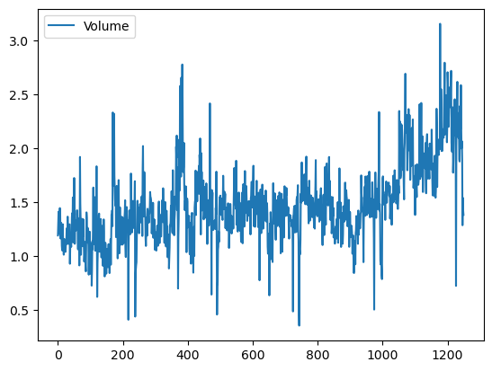

# 1. Datenüberblick

- Tägliche prozentuale Renditen für den S&P 500 Aktienindex zwischen 2001 und 2005.
- Es gibt 1250 Zeilen.
- Es gibt 9 Variablen:
  - Jahr: Datum der Beobachtung
  - Lag1-Lag5: Tägliche Renditen der letzten 5 Tage
  - Volumen: Tägliches Handelsvolumen in Milliarden am Vortag
  - Heute: Heutige Rendite
  - Richtung: Positive ("Up") oder negative ("Down") Rendite

# 2. Packages und Daten

```python=
import numpy as np, pandas as pd, matplotlib.pyplot as plt
import statsmodels.api as sm
from ISLP.models import (ModelSpec as MS, summarize, contrast)
from ISLP import (load_data, confusion_table)
from sklearn.discriminant_analysis import \
 (LinearDiscriminantAnalysis as LDA,
  QuadraticDiscriminantAnalysis as QDA)
from sklearn.naive_bayes import GaussianNB
from sklearn.neighbors import KNeighborsClassifier
from sklearn.preprocessing import StandardScaler
from sklearn.model_selection import train_test_split
from sklearn.linear_model import LogisticRegression
```

```python=
Smarket = load_data('Smarket')
Smarket.head()
```

<table>
  <thead>
<tr>
  <th></th>
  <th>Year</th>
  <th>Lag1</th>
  <th>Lag2</th>
  <th>Lag3</th>
  <th>Lag4</th>
  <th>Lag5</th>
  <th>Volume</th>
  <th>Today</th>
  <th>Direction</th>
</tr>
  </thead>
  <tbody>
<tr>
  <th>0</th>
  <td>2001</td>
  <td>0.381</td>
  <td>-0.192</td>
  <td>-2.624</td>
  <td>-1.055</td>
  <td>5.010</td>
  <td>1.1913</td>
  <td>0.959</td>
  <td>Up</td>
</tr>
<tr>
  <th>1</th>
  <td>2001</td>
  <td>0.959</td>
  <td>0.381</td>
  <td>-0.192</td>
  <td>-2.624</td>
  <td>-1.055</td>
  <td>1.2965</td>
  <td>1.032</td>
  <td>Up</td>
</tr>
<tr>
  <th>2</th>
  <td>2001</td>
  <td>1.032</td>
  <td>0.959</td>
  <td>0.381</td>
  <td>-0.192</td>
  <td>-2.624</td>
  <td>1.4112</td>
  <td>-0.623</td>
  <td>Down</td>
</tr>
<tr>
  <th>3</th>
  <td>2001</td>
  <td>-0.623</td>
  <td>1.032</td>
  <td>0.959</td>
  <td>0.381</td>
  <td>-0.192</td>
  <td>1.2760</td>
  <td>0.614</td>
  <td>Up</td>
</tr>
<tr>
  <th>4</th>
  <td>2001</td>
  <td>0.614</td>
  <td>-0.623</td>
  <td>1.032</td>
  <td>0.959</td>
  <td>0.381</td>
  <td>1.2057</td>
  <td>0.213</td>
  <td>Up</td>
</tr>
  </tbody>
</table>

```python=
Smarket.describe().round(1)
```

<table>
  <thead>
<tr>
  <th></th>
  <th>Year</th>
  <th>Lag1</th>
  <th>Lag2</th>
  <th>Lag3</th>
  <th>Lag4</th>
  <th>Lag5</th>
  <th>Volume</th>
  <th>Today</th>
</tr>
  </thead>
  <tbody>
<tr>
  <th>count</th>
  <td>1250.0</td>
  <td>1250.0</td>
  <td>1250.0</td>
  <td>1250.0</td>
  <td>1250.0</td>
  <td>1250.0</td>
  <td>1250.0</td>
  <td>1250.0</td>
</tr>
<tr>
  <th>mean</th>
  <td>2003.0</td>
  <td>0.0</td>
  <td>0.0</td>
  <td>0.0</td>
  <td>0.0</td>
  <td>0.0</td>
  <td>1.5</td>
  <td>0.0</td>
</tr>
<tr>
  <th>std</th>
  <td>1.4</td>
  <td>1.1</td>
  <td>1.1</td>
  <td>1.1</td>
  <td>1.1</td>
  <td>1.1</td>
  <td>0.4</td>
  <td>1.1</td>
</tr>
<tr>
  <th>min</th>
  <td>2001.0</td>
  <td>-4.9</td>
  <td>-4.9</td>
  <td>-4.9</td>
  <td>-4.9</td>
  <td>-4.9</td>
  <td>0.4</td>
  <td>-4.9</td>
</tr>
<tr>
  <th>25%</th>
  <td>2002.0</td>
  <td>-0.6</td>
  <td>-0.6</td>
  <td>-0.6</td>
  <td>-0.6</td>
  <td>-0.6</td>
  <td>1.3</td>
  <td>-0.6</td>
</tr>
<tr>
  <th>50%</th>
  <td>2003.0</td>
  <td>0.0</td>
  <td>0.0</td>
  <td>0.0</td>
  <td>0.0</td>
  <td>0.0</td>
  <td>1.4</td>
  <td>0.0</td>
</tr>
<tr>
  <th>75%</th>
  <td>2004.0</td>
  <td>0.6</td>
  <td>0.6</td>
  <td>0.6</td>
  <td>0.6</td>
  <td>0.6</td>
  <td>1.6</td>
  <td>0.6</td>
</tr>
<tr>
  <th>max</th>
  <td>2005.0</td>
  <td>5.7</td>
  <td>5.7</td>
  <td>5.7</td>
  <td>5.7</td>
  <td>5.7</td>
  <td>3.2</td>
  <td>5.7</td>
</tr>
  </tbody>
</table>

```python=
Smarket.Direction.value_counts(normalize=True)
```

    Direction
    Up    0.5184
    Down  0.4816
    Name: proportion, dtype: float64

```python=
Smarket.corr(numeric_only=True).round(2)
```

<table>
  <thead>
<tr>
  <th></th>
  <th>Year</th>
  <th>Lag1</th>
  <th>Lag2</th>
  <th>Lag3</th>
  <th>Lag4</th>
  <th>Lag5</th>
  <th>Volume</th>
  <th>Today</th>
</tr>
  </thead>
  <tbody>
<tr>
  <th>Year</th>
  <td>1.00</td>
  <td>0.03</td>
  <td>0.03</td>
  <td>0.03</td>
  <td>0.04</td>
  <td>0.03</td>
  <td>0.54</td>
  <td>0.03</td>
</tr>
<tr>
  <th>Lag1</th>
  <td>0.03</td>
  <td>1.00</td>
  <td>-0.03</td>
  <td>-0.01</td>
  <td>-0.00</td>
  <td>-0.01</td>
  <td>0.04</td>
  <td>-0.03</td>
</tr>
<tr>
  <th>Lag2</th>
  <td>0.03</td>
  <td>-0.03</td>
  <td>1.00</td>
  <td>-0.03</td>
  <td>-0.01</td>
  <td>-0.00</td>
  <td>-0.04</td>
  <td>-0.01</td>
</tr>
<tr>
  <th>Lag3</th>
  <td>0.03</td>
  <td>-0.01</td>
  <td>-0.03</td>
  <td>1.00</td>
  <td>-0.02</td>
  <td>-0.02</td>
  <td>-0.04</td>
  <td>-0.00</td>
</tr>
<tr>
  <th>Lag4</th>
  <td>0.04</td>
  <td>-0.00</td>
  <td>-0.01</td>
  <td>-0.02</td>
  <td>1.00</td>
  <td>-0.03</td>
  <td>-0.05</td>
  <td>-0.01</td>
</tr>
<tr>
  <th>Lag5</th>
  <td>0.03</td>
  <td>-0.01</td>
  <td>-0.00</td>
  <td>-0.02</td>
  <td>-0.03</td>
  <td>1.00</td>
  <td>-0.02</td>
  <td>-0.03</td>
</tr>
<tr>
  <th>Volume</th>
  <td>0.54</td>
  <td>0.04</td>
  <td>-0.04</td>
  <td>-0.04</td>
  <td>-0.05</td>
  <td>-0.02</td>
  <td>1.00</td>
  <td>0.01</td>
</tr>
<tr>
  <th>Today</th>
  <td>0.03</td>
  <td>-0.03</td>
  <td>-0.01</td>
  <td>-0.00</td>
  <td>-0.01</td>
  <td>-0.03</td>
  <td>0.01</td>
  <td>1.00</td>
</tr>
  </tbody>
</table>

- Verzögerte Renditen korrelieren kaum mit der heutigen Rendite.
- Signifikante Korrelation zwischen Jahr und Volumen. Volumen steigt von 2001 bis 2005.

```python=
Smarket.plot(y='Volume');
```



# 3. Logistische Regression

- Verwenden Sie `sm.GLM()` oder `sm.Logit()` aus dem `statsmodels`-Paket für die logistische Regression von `Direction` mit `Lag1` bis `Lag5` und `Volume`.
- Bei `sm.GLM()` geben wir `family=sm.families.Binomial()` an. Die Syntax ähnelt `sm.OLS()`.

```python=
# Design matrix
allvars = Smarket.columns.drop(['Today', 'Direction', 'Year'])
design = MS(allvars)
X = design.fit_transform(Smarket)
y = Smarket.Direction == 'Up'
# Logistic model
glm = sm.GLM(y, X, family=sm.families.Binomial()).fit()
summarize(results)
```

<table>
  <thead>
<tr>
  <th></th>
  <th>coef</th>
  <th>std err</th>
  <th>z</th>
  <th>P>|z|</th>
</tr>
  </thead>
  <tbody>
<tr>
  <th>intercept</th>
  <td>-0.1260</td>
  <td>0.241</td>
  <td>-0.523</td>
  <td>0.601</td>
</tr>
<tr>
  <th>Lag1</th>
  <td>-0.0731</td>
  <td>0.050</td>
  <td>-1.457</td>
  <td>0.145</td>
</tr>
<tr>
  <th>Lag2</th>
  <td>-0.0423</td>
  <td>0.050</td>
  <td>-0.845</td>
  <td>0.398</td>
</tr>
<tr>
  <th>Lag3</th>
  <td>0.0111</td>
  <td>0.050</td>
  <td>0.222</td>
  <td>0.824</td>
</tr>
<tr>
  <th>Lag4</th>
  <td>0.0094</td>
  <td>0.050</td>
  <td>0.187</td>
  <td>0.851</td>
</tr>
<tr>
  <th>Lag5</th>
  <td>0.0103</td>
  <td>0.050</td>
  <td>0.208</td>
  <td>0.835</td>
</tr>
<tr>
  <th>Volume</th>
  <td>0.1354</td>
  <td>0.158</td>
  <td>0.855</td>
  <td>0.392</td>
</tr>
  </tbody>
</table>

- Kleinster p-Wert für `Lag1`, negativer Koeffizient zeigt, dass ein positiver Rückgang gestern die heutige Anstiegswahrscheinlichkeit verringert.
- p-Wert von 0,15 zeigt keine starke Verbindung zwischen `Lag1` und `Direction`.
- `predict()` Methode schätzt die Anstiegswahrscheinlichkeit basierend auf Prädiktorwerten. Ohne Datensatz nutzt es Trainingsdaten.

```python=
probs = results.predict(); probs[:5].round(3)
```

    array([0.507, 0.481, 0.481, 0.515, 0.511])

- Konvertiere Wahrscheinlichkeiten in "Up" oder "Down" Labels basierend auf über oder unter 0,5.

```python=
labels = np.array(['Down']*1250)
labels[probs>0.5] = "Up"
```

- `confusion_table()`: Zeigt richtige/falsche Klassifizierungen.
- Adaptiert von sklearn.metrics: transponiert Matrix, fügt Labels hinzu, nimmt vorhergesagte Labels zuerst.

```python=
confusion_table(labels, Smarket.Direction)
```

<table>
  <thead>
<tr>
  <th>Predicted\Truth</th>
  <th>Down</th>
  <th>Up</th>
</tr>
  </thead>
  <tbody>
<tr>
  <th>Down</th>
  <td>145</td>
  <td>141</td>
</tr>
<tr>
  <th>Up</th>
  <td>457</td>
  <td>507</td>
</tr>
  </tbody>
</table>

- Diagonale der Konfusionsmatrix: richtige Vorhersagen.
- Modell: 507 Tage aufwärts, 145 Tage abwärts, 652 korrekte Vorhersagen.
- Genauigkeit mit `np.mean()`: 52,2%.

```python=
(507+145)/1250, np.mean(labels == Smarket.Direction)
```

(0.5216, 0.5216)

- 52,2% Genauigkeit des Modells irreführend, da Trainings- und Testdaten identisch sind. Testfehler wird unterschätzt.
- Besser: Modell mit Teil der Daten trainieren und mit zurückgehaltenen Daten testen.

```python=
train = (Smarket.Year < 2005)
Smarket_train = Smarket.loc[train]
Smarket_test = Smarket.loc[~train]
Smarket_test.shape
```

(252, 9)

- `train` Boolescher Vektor: 1.250 Elemente (`True` vor 2005, `False` 2005).
- Logistische Regression auf Daten vor 2005, Wahrscheinlichkeiten für 2005 (252 Beobachtungen) vorhersagen.

```python=
X_train, X_test = X.loc[train], X.loc[~train]
y_train = y.loc[train]
glm_train = sm.GLM(y_train, X_train, family=sm.families.Binomial()).fit()
probs = glm_train.predict(exog=X_test)
labels = np.array(['Down']*252)
labels[probs>0.5] = 'Up'
```

```python=
D = Smarket.Direction
L_test = D.loc[~train]
confusion_table(labels, L_test)
```

<table>
  <thead>
<tr>
  <th>Predicted\Truth</th>
  <th>Down</th>
  <th>Up</th>
</tr>
<tr>
  <th>Down</th>
  <td>77</td>
  <td>97</td>
</tr>
<tr>
  <th>Up</th>
  <td>34</td>
  <td>44</td>
</tr>
  </tbody>
</table>

```python=
np.mean(labels == L_test), np.mean(labels != L_test)
```

    (0.480, 0.520)

- Testgenauigkeit: ca. 48%
- Fehlerquote: ca. 52%
- 52% Testfehlerquote ist schlechter als zufälliges Raten.

```python=
L_test.value_counts(normalize=True)
```

    Direction
    Up   0.56
    Down 0.44
    Name: proportion, dtype: float64  

- Entfernen schwacher Prädiktoren könnte helfen.
- Modell neu anpassen mit nur `Lag1` und `Lag2`, den stärksten Prädiktoren.

```python=
model_l1l2 = MS(['Lag1', 'Lag2']).fit(Smarket)
X = model_l1l2.transform(Smarket)
X_train, X_test = X.loc[train], X.loc[~train]
glm_train = sm.GLM(y_train, X_train, family=sm.families.Binomial()).fit()
probs = glm_train.predict(exog=X_test)
labels = np.array(['Down']*252)
labels[probs>0.5] = 'Up'
confusion_table(labels, L_test)
```

<table>
  <thead>
<tr>
  <th>Predicted\Truth</th>
  <th>Down</th>
  <th>Up</th>
</tr>
<tr>
  <th>Down</th>
  <td>35</td>
  <td>35</td>
</tr>
<tr>
  <th>Up</th>
  <td>76</td>
  <td>106</td>
</tr>
  </tbody>
</table>

- Bewerten:
  - Gesamtgenauigkeit.
  - Genauigkeit für Tage mit vorhergesagtem Anstieg.

```python=
(35+106)/252, 106/(106+76)
```

    (0.5595, 0.5824)

- Gesamtgenauigkeit is 56%. Modell sagt 56% der Bewegungen korrekt voraus.
- Bei vorhergesagtem Anstieg, mögliche Handelsstrategie erreicht die Genauigkeit 58% Genauigkeit .
- Vorhersage für `Lag1`: [1.2, 1.1] und `Lag2`: [1.5, -1.8]

```python=
newdata = pd.DataFrame({'Lag1':[1.2, 1.5], 'Lag2':[1.1, -0.8]})
newX = model_l1l2.transform(newdata)
results.predict(newX)
```

    00.479146
    10.496094
    dtype: float64

# 4. Lineare Diskriminanzanalyse

- Da `LDA` automatisch einen Interzept hinzufügt, entfernen wir die Interzept-Spalte aus `X_train` und `X_test`.
- Wir verwenden die Labels direkt anstelle von Boolean-Vektoren `y_train`.

```python=
X_train, X_test = [M.drop(columns=['intercept']) for M in [X_train, X_test]]
lda = LDA(store_covariance=True).fit(X_train, L_train);
```

- In `sklearn` zeigt ein nachgestelltes `_` Werte, die durch `fit()` geschätzt wurden.
- `means_` liefert den Durchschnittswert jedes Prädiktors für jede Klasse.
  - Es zeigt, dass Renditen der letzten zwei Tage vor Marktanstiegen negativ und vor Marktabschwüngen positiv sind.
  - Dieses Ergebnis können wir selbst berechnen.

```python=
lda.means_
```

    array([[ 0.04279022,  0.03389409],
           [-0.03954635, -0.03132544]])

```python=
df = pd.concat([X_train, L_train], axis=1)
df.groupby('Direction', observed=True)[['Lag1', 'Lag2']].mean()
```

<table>
  <thead>
<tr>
  <th>Direction\</th>
  <th>Lag1</th>
  <th>Lag2</th>
</tr>
<tr>
  <th>Down</th>
  <td>0.042790</td>
  <td>0.033894</td>
</tr>
<tr>
  <th>Up</th>
  <td>-0.039546</td>
  <td>-0.031325</td>
</tr>
  </tbody>
</table>

- Das Attribut `priors_` speichert die a-priori Wahrscheinlichkeiten.
- `classes_` ordnet diese Wahrscheinlichkeiten den Labels zu.

```python=
lda.priors_
```

    array([0.492, 0.508])

```python=
lda.classes_
```

array(['Down', 'Up'], dtype='<U4')

- Das Ergebnis zeigt $\hat\pi_{Down}=0.492$ und $\hat\pi_{Up}=0.508$.
- Wir können dies selbst berechnen.

```python=
L_train.value_counts(normalize=True)
```

    Direction
    Up    0.508016
    Down  0.491984
    Name: proportion, dtype: float64

- Bei LDA teilen alle Klassen (Down und Up) die gleiche Kovarianzstruktur.
- sklearn’s LDA schätzt eine gemeinsame Kovarianzmatrix für das gesamte Dataset.
- `lda.covariance_` enthält die gepoolte Kovarianzmatrix der Merkmale.
  - [ [var(lag1), cov(lag1, lag2)],
    [cov(lag1, lag2), var(lag2)] ]

```python=
lda.covariance_
```

    array([[ 1.50886781, -0.03340234],
           [-0.03340234,  1.5095363 ]])

- `lda.scalings_` liefert lineare Diskriminanzvektoren.
- Jede Spalte projiziert Merkmale auf eine neue Achse, die Klassen trennt.
- Bei k Klassen gibt es bis zu k-1 Vektoren.
- Bei binärer Klassifikation (k=2) gibt es einen Vektor.
  - Diese Werte sind die Multiplikatoren für `Lag1` und `Lag2` in der LDA-Entscheidungsregel.

```python=
lda.scalings_
```

    array([[-0.642],
           [-0.513]])

- Wenn `-0.642 * Lag1 - 0.513 * Lag2` groß ist, prognostiziert LDA einen Anstieg; wenn klein, einen Rückgang.

```python=
lda_pred = lda.predict(X_test)
confusion_table(lda_pred, L_test)
```

<table>
  <thead>
<tr>
  <th>Predicted\Truth</th>
  <th>Down</th>
  <th>Up</th>
</tr>
<tr>
  <th>Down</th>
  <td>35</td>
  <td>35</td>
</tr>
<tr>
  <th>Up</th>
  <td>76</td>
  <td>106</td>
</tr>
  </tbody>
</table>

- LDA und Logistic liefern dasselbe Ergebnis.
- Wir schätzen die Klassenwahrscheinlichkeiten für jeden Trainingspunkt.
- Ein 50%-Schwellenwert auf diesen Wahrscheinlichkeiten rekonstruiert die Vorhersagen in `lda_pred`.

```python=
lda_prob = lda.predict_proba(X_test)
lda_prob[:3]
```

    array([[0.49017925, 0.50982075],
           [0.4792185 , 0.5207815 ],
           [0.46681848, 0.53318152]])

```python=
np.all(np.where(lda_prob[:,1] >= 0.5, 'Up','Down') == lda_pred),
np.all([lda.classes_[i] for i in np.argmax(lda_prob, 1)] == lda_pred)
```

    (True, True)

```python=
max(lda_prob[:,0])
```

    0.5202

- Höchste Abnahmewahrscheinlichkeit: 52,02%.
- `sklearn` LDA-Muster: Klassifikator erstellen, mit `fit()` anpassen, mit `predict()` vorhersagen.

# 5. Quadratische Diskriminanzanalyse

- Wir verwenden `QuadraticDiscriminantAnalysis()` abgekürzt als `QDA()`. Syntax ist ähnlich wie bei `LDA()`.

```python=
qda = QDA(store_covariance=True).fit(X_train, L_train);
```

- `qda.means_` und `qda.priors_` liefern dieselben Ergebnisse wie `lda.means_` und `lda.priors_`, weil sie nur von den Trainingsdaten abhängen.
- Der `QDA()`-Klassifikator schätzt eine Kovarianz pro Klasse.
- Kovarianz für die erste Klasse "Down":

```python=
qda.covariance_[0]
```

    array([[ 1.50662277, -0.03924806],
           [-0.03924806,  1.53559498]])

- `qda.scalings_` enthält Skalierungsfaktoren pro Klasse. 
- Erstes Array: erste Klasse, zweites Array: zweite Klasse.
- QDA erzeugt keine linearen Diskriminanzrichtungen wie LDA, da jede Klasse ihre eigene Kovarianzmatrix hat.
- LDA projiziert Daten auf lineare Richtungen, die Klassen trennen. Diese Richtungen sind in `lda.scalings_` gespeichert.
- QDA nutzt klassenabhängige Kovarianz und quadratische Entscheidungsgrenzen.
- QDA hat keine sinnvolle `scalings_`-Attribut.

```python=
qda.scalings_
```

    [array([1.56294495, 1.47927279]), array([1.53455065, 1.47272326])]

```python=
qda_pred = qda.predict(X_test)
confusion_table(qda_pred, L_test)
```

<table>
  <thead>
<tr>
  <th>Predicted\Truth</th>
  <th>Down</th>
  <th>Up</th>
</tr>
<tr>
  <th>Down</th>
  <td>30</td>
  <td>20</td>
</tr>
<tr>
  <th>Up</th>
  <td>81</td>
  <td>121</td>
</tr>
  </tbody>
</table>

```python=
np.mean(qda_pred == L_test)
```

    0.599

- QDA-Vorhersagen sind fast 60% genau. Es ist beeindruckend.
- Dies deutet darauf hin, dass QDA Beziehungen besser erfassen kann als LDA und logistische Regression.

# 6. Naive Bayes

- - Naive-Bayes-Modell mit `GaussianNB()` auf `Smarket`-Daten angepasst, ähnlich wie `LDA()` und `QDA()`.
- Standardmäßig Gaußsche Verteilung, Kerndichtemethode auch möglich.

```python=
NB = GaussianNB().fit(X_train, L_train);
NB.classes_
```

    array(['Down', 'Up'], dtype='<U4')

- `NB.theta_` und `NB.class_prior_` liefern die gleichen Ergebnisse wie `lda.means_` und `lda.priors_` sowie `qda.means_` und `qda.priors_`.
- `NB.var_` liefert die Varianz jedes Prädiktors für jede Klasse.
- `GaussianNB` berechnet Varianzen mit der 1/n-Formel.

```python=
NB.var_
```

    array([[1.504, 1.533],
           [1.514, 1.487]])

```python=
df.groupby('Direction', observed=True)[['Lag1', 'Lag2']].var(ddof=0)
```

<table>
  <thead>
<tr>
  <th>Direction\</th>
  <th>Lag1</th>
  <th>Lag2</th>
</tr>
<tr>
  <th>Down</th>
  <td>1.504</td>
  <td>1.533</td>
</tr>
<tr>
  <th>Up</th>
  <td>1.514</td>
  <td>1.487</td>
</tr>
  </tbody>
</table>

```python=
nb_labels = NB.predict(X_test)
confusion_table(nb_labels, L_test)
```

<table>
  <thead>
<tr>
  <th>Predicted\Truth</th>
  <th>Down</th>
  <th>Up</th>
</tr>
  <th>Down</th>
  <td>29</td>
  <td>20</td>
</tr>
<tr>
  <th>Up</th>
  <td>82</td>
  <td>121</td>
</tr>
  </tbody>
</table>

- Naive Bayes sagt mit 59% Genauigkeit voraus, etwas schlechter als QDA, aber besser als LDA.
- `predict_proba()` von Naive Bayes schätzt, ähnlich wie bei LDA, die Klassenwahrscheinlichkeiten.

```python=
NB.predict_proba(X_test)[:3]
```

    array([[0.4873288 , 0.5126712 ],
           [0.47623584, 0.52376416],
           [0.46529531, 0.53470469]])

# 7. K-Nächste-Nachbarn

```python=
knn1 = KNeighborsClassifier(n_neighbors=1).fit(X_train, L_train)
knn1_pred = knn1.predict(X_test)
confusion_table(knn1_pred, L_test)
```

<table>
  <thead>
<tr>
  <th>Predicted\Truth</th>
  <th>Down</th>
  <th>Up</th>
</tr>
<tr>
  <th>Down</th>
  <td>43</td>
  <td>58</td>
</tr>
<tr>
  <th>Up</th>
  <td>68</td>
  <td>83</td>
</tr>
  </tbody>
</table>

```python=
(83+43)/252, np.mean(knn1_pred == L_test)
```

    (0.5, 0.5)

- K=1 liefert nur (43+83)/252 = 50% Genauigkeit, wahrscheinlich wegen zu flexibler Anpassung.
- Mit K=3 wiederholen wir die Analyse.

```python=
knn3 = KNeighborsClassifier(n_neighbors=3).fit(X_train, L_train)
knn3_pred = knn3.predict(X_test)
np.mean(knn3_pred == L_test)
```

    0.5317460317460317

- Die Ergebnisse verbesserten sich leicht, aber weiteres Erhöhen von K bringt keinen Nutzen. QDA schneidet am besten ab.
- KNN ist auf `Smarket`-Daten unterlegen, liefert aber oft anderswo beeindruckende Ergebnisse.
