# 1. Datenbeschreibung
- Daten von 3000 männlichen Arbeitern aus der Mid-Atlantic-Region.
  - 3000 Zeilen
  - Antwortvariable ist `wage`
- 11 Variablen:
  - `year`: Jahr der Lohnerfassung
  - `age`: Alter des Arbeiters
  - `maritl`: Familienstand
    - 1. Nie verheiratet
    - 2. Verheiratet
    - 3. Verwitwet
    - 4. Geschieden
    - 5. Getrennt
  - `race`: Ethnische Zugehörigkeit
    - 1. Weiß
    - 2. Schwarz
    - 3. Asiatisch
    - 4. Andere
  - `education`: Bildungsstand
    - 1. Kein Schulabschluss
    - 2. Schulabschluss
    - 3. Einige College-Kurse
    - 4. College-Abschluss
    - 5. Weiterführender Abschluss
  - `region`: Region (nur Mid-Atlantic)
  - `jobclass`: Art des Jobs
    - 1. Industriell
    - 2. Information
  - `health`: Gesundheitszustand
    - 1. <= Gut
    - 2. \>= Sehr gut
  - `health_ins`: Krankenversicherung
    - 1. Ja
    - 2. Nein
  - `logwage`: Logarithmus des Lohns
  - `wage`: Lohn in Tauschend

# 2. Packages und Daten

```python=
import numpy as np, pandas as pd, matplotlib.pyplot as plt
import statsmodels.api as sm
from ISLP import load_data
from ISLP.models import (summarize, poly, bs, ns,
                         ModelSpec as MS)
from ISLP.transforms import (BSpline, NaturalSpline)
from ISLP.pygam import (approx_lam,
                        degrees_of_freedom,
                        plot as plot_gam,
                        anova as anova_gam)
from statsmodels.stats.anova import anova_lm
from pygam import (s as s_gam, l as l_gam, f as f_gam,
                   LinearGAM, LogisticGAM)
```

```python=
WageDF = load_data('Wage')
WageDF.head()
```

<table class="dataframe">
  <thead>
    <tr style="text-align: right;">
      <th></th>
      <th>year</th>
      <th>age</th>
      <th>maritl</th>
      <th>race</th>
      <th>education</th>
      <th>region</th>
    </tr>
  </thead>
  <tbody>
    <tr>
      <th>0</th>
      <td>2006</td>
      <td>18</td>
      <td>1. Never Married</td>
      <td>1. White</td>
      <td>1. &lt; HS Grad</td>
      <td>2. Middle Atlantic</td>
    </tr>
    <tr>
      <th>1</th>
      <td>2004</td>
      <td>24</td>
      <td>1. Never Married</td>
      <td>1. White</td>
      <td>4. College Grad</td>
      <td>2. Middle Atlantic</td>
    </tr>
  </tbody>
</table>

<table class="dataframe">
  <thead>
    <tr style="text-align: right;">
      <th></th>
      <th>jobclass</th>
      <th>health</th>
      <th>health_ins</th>
      <th>logwage</th>
      <th>wage</th>
    </tr>
  </thead>
  <tbody>
    <tr>
      <th>0</th>
      <td>1. Industrial</td>
      <td>1. &lt;=Good</td>
      <td>2. No</td>
      <td>4.318063</td>
      <td>75.043154</td>
    </tr>
    <tr>
      <th>1</th>
      <td>2. Information</td>
      <td>2. &gt;=Very Good</td>
      <td>2. No</td>
      <td>4.255273</td>
      <td>70.476020</td>
    </tr>
  </tbody>
</table>

```python=
WageDF.describe().round(3)
```

<table class="dataframe">
  <thead>
    <tr style="text-align: right;">
      <th></th>
      <th>year</th>
      <th>age</th>
      <th>logwage</th>
      <th>wage</th>
    </tr>
  </thead>
  <tbody>
    <tr>
      <th>mean</th>
      <td>2005.791</td>
      <td>42.415</td>
      <td>4.654</td>
      <td>111.704</td>
    </tr>
    <tr>
      <th>std</th>
      <td>2.026</td>
      <td>11.542</td>
      <td>0.352</td>
      <td>41.729</td>
    </tr>
    <tr>
      <th>min</th>
      <td>2003.000</td>
      <td>18.000</td>
      <td>3.000</td>
      <td>20.086</td>
    </tr>
    <tr>
      <th>25%</th>
      <td>2004.000</td>
      <td>33.750</td>
      <td>4.447</td>
      <td>85.384</td>
    </tr>
    <tr>
      <th>50%</th>
      <td>2006.000</td>
      <td>42.000</td>
      <td>4.653</td>
      <td>104.922</td>
    </tr>
    <tr>
      <th>75%</th>
      <td>2008.000</td>
      <td>51.000</td>
      <td>4.857</td>
      <td>128.680</td>
    </tr>
    <tr>
      <th>max</th>
      <td>2009.000</td>
      <td>80.000</td>
      <td>5.763</td>
      <td>318.342</td>
    </tr>
  </tbody>
</table>

# 3. Polynomiale Regression

- Nutzung von `poly()` in `MS()`
- Hauptmerkmale von `poly()`:
  - Polynomiale Generierung:
    - Orthogonale Polynomialterme
  - Raw Polynome:
    - Option verfügbar
  - Intercept-Option:
    - Möglichkeit, Intercept-Term einzuschließen

```python=
# Create a matrix of polynomial basis functions for age 
agePolyDF = MS([poly('age', degree=4)]).fit_transform(WageDF)
agePolyDF.head(2)
```

<table class="dataframe">
  <thead>
    <tr style="text-align: right;">
      <th></th>
      <th>intercept</th>
      <th>poly(age, degree=4)[0]</th>
      <th>poly(age, degree=4)[1]</th>
      <th>poly(age, degree=4)[2]</th>
      <th>poly(age, degree=4)[3]</th>
    </tr>
  </thead>
  <tbody>
    <tr>
      <th>0</th>
      <td>1.0</td>
      <td>-0.038625</td>
      <td>0.055909</td>
      <td>-0.071741</td>
      <td>0.086730</td>
    </tr>
    <tr>
      <th>1</th>
      <td>1.0</td>
      <td>-0.029133</td>
      <td>0.026298</td>
      <td>-0.014550</td>
      <td>-0.002599</td>
    </tr>
  </tbody>
</table>

```python=
LR_agePolySM = sm.OLS(WageDF.wage, agePolyDF).fit()
summarize(LR_agePolySM)
```

<table class="dataframe">
  <thead>
    <tr style="text-align: right;">
      <th></th>
      <th>coef</th>
      <th>std err</th>
      <th>t</th>
      <th>P&gt;|t|</th>
    </tr>
  </thead>
  <tbody>
    <tr>
      <th>intercept</th>
      <td>111.7036</td>
      <td>0.729</td>
      <td>153.283</td>
      <td>0.000</td>
    </tr>
    <tr>
      <th>poly(age, degree=4)[0]</th>
      <td>447.0679</td>
      <td>39.915</td>
      <td>11.201</td>
      <td>0.000</td>
    </tr>
    <tr>
      <th>poly(age, degree=4)[1]</th>
      <td>-478.3158</td>
      <td>39.915</td>
      <td>-11.983</td>
      <td>0.000</td>
    </tr>
    <tr>
      <th>poly(age, degree=4)[2]</th>
      <td>125.5217</td>
      <td>39.915</td>
      <td>3.145</td>
      <td>0.002</td>
    </tr>
    <tr>
      <th>poly(age, degree=4)[3]</th>
      <td>-77.9112</td>
      <td>39.915</td>
      <td>-1.952</td>
      <td>0.051</td>
    </tr>
  </tbody>
</table>

- Erstellen von 100 gleichmäßig verteilten `age`-Werten
  - Zwischen dem minimalen und maximalen Alter
  - Um eine glatte Kurve zu erzeugen

```python=
age_grid100 = np.linspace(WageDF.age.min(), WageDF.age.max(), 100)
age100DF = pd.DataFrame({'age': age_grid100})
agePoly100DF = MS([poly('age', degree=4)]).fit(WageDF).transform(age100DF)
agePoly100DF.head(2)
# MS([poly('age', degree=4)]).fit(ageDF).transform(ageDF) gives different
```

<table class="dataframe">
  <thead>
    <tr style="text-align: right;">
      <th></th>
      <th>intercept</th>
      <th>poly(age, degree=4)[0]</th>
      <th>poly(age, degree=4)[1]</th>
      <th>poly(age, degree=4)[2]</th>
      <th>poly(age, degree=4)[3]</th>
    </tr>
  </thead>
  <tbody>
    <tr>
      <th>0</th>
      <td>1.0</td>
      <td>-0.038625</td>
      <td>0.055909</td>
      <td>-0.071741</td>
      <td>0.086730</td>
    </tr>
    <tr>
      <th>1</th>
      <td>1.0</td>
      <td>-0.037634</td>
      <td>0.052445</td>
      <td>-0.064068</td>
      <td>0.072513</td>
    </tr>
  </tbody>
</table>

- Plotten der angepassten Werte mit Konfidenzintervallen.

```python=
# Calculate the predicted values for the age grid
preds = LR_agePolySM.get_prediction(agePoly100DF)
preds.summary_frame().head(2)
```

<table class="dataframe">
  <thead>
    <tr style="text-align: right;">
      <th></th>
      <th>mean</th>
      <th>mean_se</th>
      <th>mean_ci_lower</th>
      <th>mean_ci_upper</th>
      <th>obs_ci_lower</th>
      <th>obs_ci_upper</th>
    </tr>
  </thead>
  <tbody>
    <tr>
      <th>0</th>
      <td>51.931</td>
      <td>5.298</td>
      <td>41.543</td>
      <td>62.320</td>
      <td>-27.018</td>
      <td>130.881</td>
    </tr>
    <tr>
      <th>1</th>
      <td>56.102</td>
      <td>4.700</td>
      <td>46.887</td>
      <td>65.317</td>
      <td>-22.702</td>
      <td>134.906</td>
    </tr>
  </tbody>
</table>

```python=
# Calculate the confidence bands for the age grid
bands = preds.conf_int(alpha=0.05)
bands[:2,]
```

    array([[41.54283703, 62.32006359],
           [46.8870235 , 65.31661645]])

```python=
fig, ax = plt.subplots(figsize=(8,8))
ax.scatter(WageDF.age, WageDF.wage, facecolor='gray', alpha=0.5)
# Plot the predicted values with confidence bands
for value, style in zip( [preds.predicted_mean,
                          bands[:,0], bands[:,1]],
                         ['b','r--','r--'] ):
    ax.plot(age_grid100, value, style, linewidth=2)
ax.set_xlabel('age'); ax.set_ylabel('wage'); ax.set_title('Degree-4 Polynomial');
```

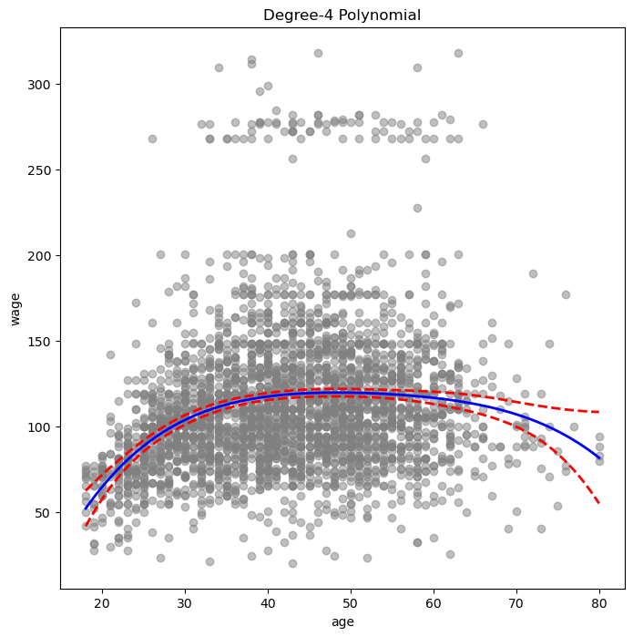

## Wahl des Polynomgrads

- Verwendung von Anova zur Wahl des Polynomgrads
  - Auch Kreuzvalidierung möglich
- Modelle mit Grad 1 bis 5 anpassen
  - Grad 1 ist ein lineares Modell
- Durchführung von ANOVA-Tests mit `anova_lm()` aus `statsmodels.stats.anova`
  - Nullhypothese: Beide Modelle sind gleich
  - Alternativhypothese: Größeres Modell ist besser
- Modelle müssen verschachtelt sein
- Keine F-Statistik und p-Wert für das erste Modell
  - Wegen kein kleineres Modell zum Vergleich

```python=
# Create 5 matrices of polynomial basis functions for age
agePolyMS5LI = [ MS([poly('age', degree=d)]) for d in range(1, 6) ]
agePolyDF5LI = [MS.fit_transform(WageDF) for MS in agePolyMS5LI]
```

```python=
# Two elements of degree-1 
agePolyDF5LI[0].head(2)
```

<table class="dataframe">
  <thead>
    <tr style="text-align: right;">
      <th></th>
      <th>intercept</th>
      <th>poly(age, degree=1)</th>
    </tr>
  </thead>
  <tbody>
    <tr>
      <th>0</th>
      <td>1.0</td>
      <td>-0.038625</td>
    </tr>
    <tr>
      <th>1</th>
      <td>1.0</td>
      <td>-0.029133</td>
    </tr>
  </tbody>
</table>

```python=
# Two elements of degree-2
agePolyDF5LI[1].head(2)
```

<table class="dataframe">
  <thead>
    <tr style="text-align: right;">
      <th></th>
      <th>intercept</th>
      <th>poly(age, degree=2)[0]</th>
      <th>poly(age, degree=2)[1]</th>
    </tr>
  </thead>
  <tbody>
    <tr>
      <th>0</th>
      <td>1.0</td>
      <td>-0.038625</td>
      <td>0.055909</td>
    </tr>
    <tr>
      <th>1</th>
      <td>1.0</td>
      <td>-0.029133</td>
      <td>0.026298</td>
    </tr>
  </tbody>
</table>

```python=
# Run the linear regression for each model
lin_reg1 = sm.OLS(WageDF.wage, agePolyDF5LI[0]).fit()
lin_reg2 = sm.OLS(WageDF.wage, agePolyDF5LI[1]).fit()
lin_reg3 = sm.OLS(WageDF.wage, agePolyDF5LI[2]).fit()
lin_reg4 = sm.OLS(WageDF.wage, agePolyDF5LI[3]).fit()
lin_reg5 = sm.OLS(WageDF.wage, agePolyDF5LI[4]).fit()
# anova_lm(*[sm.OLS(WageDF.wage, DF).fit() for DF in agePolyDF5LI])
```

```python=
# Run an ANOVA on the models
anova_lm(lin_reg1, lin_reg2, lin_reg3, lin_reg4, lin_reg5)
```

<table class="dataframe">
  <thead>
    <tr style="text-align: right;">
      <th></th>
      <th>df_resid</th>
      <th>ssr</th>
      <th>df_diff</th>
      <th>ss_diff</th>
      <th>F</th>
      <th>Pr(&gt;F)</th>
    </tr>
  </thead>
  <tbody>
    <tr>
      <th>0</th>
      <td>2998.0</td>
      <td>5.02e+06</td>
      <td>0.0</td>
      <td>NaN</td>
      <td>NaN</td>
      <td>NaN</td>
    </tr>
    <tr>
      <th>1</th>
      <td>2997.0</td>
      <td>4.79e+06</td>
      <td>1.0</td>
      <td>228786.01</td>
      <td>143.593</td>
      <td>2.363e-32</td>
    </tr>
    <tr>
      <th>2</th>
      <td>2996.0</td>
      <td>4.777e+06</td>
      <td>1.0</td>
      <td>15755.693</td>
      <td>9.888</td>
      <td>1.679e-03</td>
    </tr>
    <tr>
      <th>3</th>
      <td>2995.0</td>
      <td>4.771e+06</td>
      <td>1.0</td>
      <td>6070.152</td>
      <td>3.809</td>
      <td>5.104e-02</td>
    </tr>
    <tr>
      <th>4</th>
      <td>2994.0</td>
      <td>4.770e+06</td>
      <td>1.0</td>
      <td>1282.563</td>
      <td>0.804</td>
      <td>3.696e-01</td>
    </tr>
  </tbody>
</table>

- Modellvergleich:
  - Modell[0] (linear) vs. Modell[1] (quadratisch): 
    - p-Wert: 0.000 
    - Lineares Modell unzureichend
  - Modell[1] (quadratisch) vs. Modell[2] (kubisch): 
    - p-Wert: 0.0017 
    - Quadratisches Modell unzureichend
  - Modell[2] (kubisch) vs. Modell[3] (quartisch): 
    - p-Wert: 0.05
  - Modell[3] (quartisch) vs. Modell[4] (quintisch): 
    - p-Wert: 0.37 
    - Kubisches oder quartisches Modell ausreichend

- Alternativ zu ANOVA:
  - `poly()` generiert orthogonale Polynome
  - Prädiktoren sind unkorreliert 
  - Einfachere Bestimmung der p-Werte

```python=
summarize(LR_agePolySM)
```

<table class="dataframe">
  <thead>
    <tr style="text-align: right;">
      <th></th>
      <th>coef</th>
      <th>std err</th>
      <th>t</th>
      <th>P&gt;|t|</th>
    </tr>
  </thead>
  <tbody>
    <tr>
      <th>intercept</th>
      <td>111.7036</td>
      <td>0.729</td>
      <td>153.283</td>
      <td>0.000</td>
    </tr>
    <tr>
      <th>poly(age, degree=4)[0]</th>
      <td>447.0679</td>
      <td>39.915</td>
      <td>11.201</td>
      <td>0.000</td>
    </tr>
    <tr>
      <th>poly(age, degree=4)[1]</th>
      <td>-478.3158</td>
      <td>39.915</td>
      <td>-11.983</td>
      <td>0.000</td>
    </tr>
    <tr>
      <th>poly(age, degree=4)[2]</th>
      <td>125.5217</td>
      <td>39.915</td>
      <td>3.145</td>
      <td>0.002</td>
    </tr>
    <tr>
      <th>poly(age, degree=4)[3]</th>
      <td>-77.9112</td>
      <td>39.915</td>
      <td>-1.952</td>
      <td>0.051</td>
    </tr>
  </tbody>
</table>

- p-Werte identisch zu ANOVA-Ergebnissen
  - Quadrat der t-Statistiken entspricht F-Statistiken
- ANOVA:
  - Letzte Zeile vergleicht 5. Grad mit 4. Grad
  - Vorheriges Modell `model_poly` endet bei 4. Grad
  - p-Wert bis 4. Grad sichtbar: 0.051
  - p-Wert von 0.37 bei 5. Grad nicht in der Zusammenfassung

```python=
# t-value² of 
(-11.983)**2
```

    143.593

- Vergleich der Modelle:
  - Linear in `age` und `education`
  - Quadratisch in `age` und linear in `education`
  - Kubisch in `age` und linear in `education`

```python=
edu_agePolyMS4LI = [MS(['education', poly('age', degree=d)]) for d in range(1, 4)]
edu_agePolyDF4LI = [MS.fit_transform(WageDF) for MS in edu_agePolyMS4LI]
anova_lm(*[sm.OLS(WageDF.wage, DF).fit() for DF in edu_agePolyDF4LI])
```

<table class="dataframe">
  <thead>
    <tr style="text-align: right;">
      <th></th>
      <th>df_resid</th>
      <th>ssr</th>
      <th>df_diff</th>
      <th>ss_diff</th>
      <th>F</th>
      <th>Pr(&gt;F)</th>
    </tr>
  </thead>
  <tbody>
    <tr>
      <th>0</th>
      <td>2997.0</td>
      <td>3.902e+06</td>
      <td>0.0</td>
      <td>NaN</td>
      <td>NaN</td>
      <td>NaN</td>
    </tr>
    <tr>
      <th>1</th>
      <td>2996.0</td>
      <td>3.759e+06</td>
      <td>1.0</td>
      <td>142862.701</td>
      <td>113.991</td>
      <td>3.838e-26</td>
    </tr>
    <tr>
      <th>2</th>
      <td>2995.0</td>
      <td>3.753e+06</td>
      <td>1.0</td>
      <td>5926.207</td>
      <td>4.728</td>
      <td>2.974e-02</td>
    </tr>
  </tbody>
</table>

# 4. Polynomiale Klassifikation

- Aufgabe in Klassifikation ändern
  - Erstellen der binären Antwortvariable `high_earn`
  - `high_earn` zeigt, ob eine Person mehr als $250,000 jährlich verdient

```python=
# Create the response variable for high earners
high_earn = WageDF.wage > 250
LoR_agePolySM = sm.GLM(high_earn, agePolyDF, family=sm.families.Binomial()).fit()
summarize(LoR_agePolySM)
```

<table class="dataframe">
  <thead>
    <tr style="text-align: right;">
      <th></th>
      <th>coef</th>
      <th>std err</th>
      <th>z</th>
      <th>P&gt;|z|</th>
    </tr>
  </thead>
  <tbody>
    <tr>
      <th>intercept</th>
      <td>-4.301</td>
      <td>0.345</td>
      <td>-12.457</td>
      <td>0.000</td>
    </tr>
    <tr>
      <th>poly(age, degree=4)[0]</th>
      <td>71.964</td>
      <td>26.133</td>
      <td>2.754</td>
      <td>0.006</td>
    </tr>
    <tr>
      <th>poly(age, degree=4)[1]</th>
      <td>-85.773</td>
      <td>35.929</td>
      <td>-2.387</td>
      <td>0.017</td>
    </tr>
    <tr>
      <th>poly(age, degree=4)[2]</th>
      <td>34.163</td>
      <td>19.697</td>
      <td>1.734</td>
      <td>0.083</td>
    </tr>
    <tr>
      <th>poly(age, degree=4)[3]</th>
      <td>-47.401</td>
      <td>24.105</td>
      <td>-1.966</td>
      <td>0.049</td>
    </tr>
  </tbody>
</table>


- Wiederholen:
  - Vorhersage für 100 Werte von `age_df`
  - Angepasste Werte mit Konfidenzintervallen plotten

```python=
# Make predictions and calculate confidence bands
preds = LoR_agePolySM.get_prediction(agePoly100DF)
bands = preds.conf_int(alpha=0.05)
fig, ax = plt.subplots(figsize=(8,8))
ax.scatter(WageDF.age + 0.3*np.random.rand(3000), np.where(high_earn, 0.198, 0.002), facecolor='gray', alpha=0.5, marker='|')
# We use rug plot for age
# Plot the predicted values with confidence bands
for value, style in zip([preds.predicted_mean, bands[:,0], bands[:,1]],
                   ['b','r--','r--']):
    ax.plot(age_grid100, value, style, linewidth=2)
ax.set_ylim([0,0.2]); ax.set_xlabel('Age'); ax.set_ylabel('P(Wage > 250)');
```

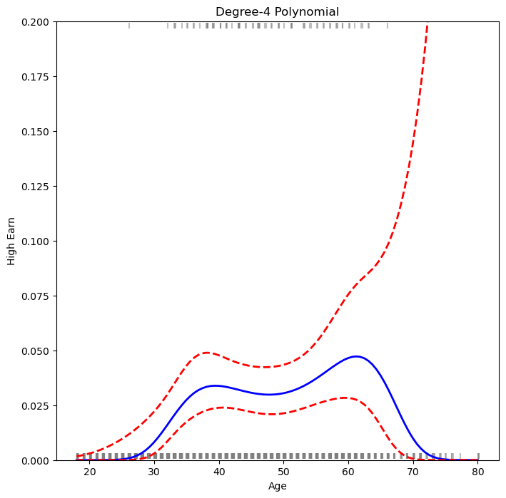

# 5. Stufenfunktion

- Änderung zu einer Stufenfunktion mit 4 Freiheitsgraden.
- Erstellung von 4 Bins mit `pd.qcut()`
  - Bei 25%, 50% und 75% für `age`
  - Dummy-Variablen mit `pd.get_dummies`
- Alternativ:
  - Bins ohne Quantile mit `pd.cut()` erstellen

```python=
# Cut the age variable into quartiles
ageBins = pd.qcut(WageDF.age, 4)
ageBins.head(3)
# 1st and 2nd belongs to the 1st quartile
```

    0    (17.999, 33.75]
    1    (17.999, 33.75]
    2       (42.0, 51.0]
    Name: age, dtype: category
    Categories (4, interval[float64, right]): [(17.999, 33.75] < (33.75, 42.0] < (42.0, 51.0] < (51.0, 80.0]]

```python=
# Create a design matrix for the quartiles
pd.get_dummies(ageBins).head(3)
```

<table class="dataframe">
  <thead>
    <tr style="text-align: right;">
      <th></th>
      <th>(17.999, 33.75]</th>
      <th>(33.75, 42.0]</th>
      <th>(42.0, 51.0]</th>
      <th>(51.0, 80.0]</th>
    </tr>
  </thead>
  <tbody>
    <tr>
      <th>0</th>
      <td>True</td>
      <td>False</td>
      <td>False</td>
      <td>False</td>
    </tr>
    <tr>
      <th>1</th>
      <td>True</td>
      <td>False</td>
      <td>False</td>
      <td>False</td>
    </tr>
    <tr>
      <th>2</th>
      <td>False</td>
      <td>False</td>
      <td>True</td>
      <td>False</td>
    </tr>
  </tbody>
</table>

```python=
LR_stepSM = sm.OLS(WageDF.wage, pd.get_dummies(ageBins)).fit()
summarize(LR_stepSM)
```

<table class="dataframe">
  <thead>
    <tr style="text-align: right;">
      <th></th>
      <th>coef</th>
      <th>std err</th>
      <th>t</th>
      <th>P&gt;|t|</th>
    </tr>
  </thead>
  <tbody>
    <tr>
      <th>(17.999, 33.75]</th>
      <td>94.158</td>
      <td>1.478</td>
      <td>63.692</td>
      <td>0.0</td>
    </tr>
    <tr>
      <th>(33.75, 42.0]</th>
      <td>116.661</td>
      <td>1.470</td>
      <td>79.385</td>
      <td>0.0</td>
    </tr>
    <tr>
      <th>(42.0, 51.0]</th>
      <td>119.189</td>
      <td>1.416</td>
      <td>84.147</td>
      <td>0.0</td>
    </tr>
    <tr>
      <th>(51.0, 80.0]</th>
      <td>116.572</td>
      <td>1.559</td>
      <td>74.751</td>
      <td>0.0</td>
    </tr>
  </tbody>
</table>

- Modell hat keinen Intercept
- Durchschnittsgehälter:
  - Unter 33.75 Jahren: 94,158
  - Zwischen 33.75 und 42 Jahren: 116,660
  - Zwischen 42 und 51 Jahren: 119,188
  - Über 51 Jahre: 116,571

```python=
# Create dummy variables for the age grid
ageBins_grid100 = pd.qcut(age_grid100, 4, labels=ageBins.cat.categories)
ageBins_dummiesDF = pd.get_dummies(ageBins_grid100)
# Make predictions on the age grid
preds = LR_stepSM.get_prediction(ageBins_dummiesDF)
# Calculate the confidence bands
bands = preds.conf_int(alpha=0.05)
# Plot
fig, ax = plt.subplots(figsize=(8,8))
ax.scatter(WageDF.age, WageDF.wage, facecolor='gray', alpha=0.5)
# Plot the predicted values with confidence bands
for value, style in zip([preds.predicted_mean,
                         bands[:,0], bands[:,1]],
                        ['b','r--','r--']):
    ax.plot(age_grid100, value, style)
ax.set_xlabel('age'); ax.set_ylabel('wage'); ax.set_title('Step Function');
```

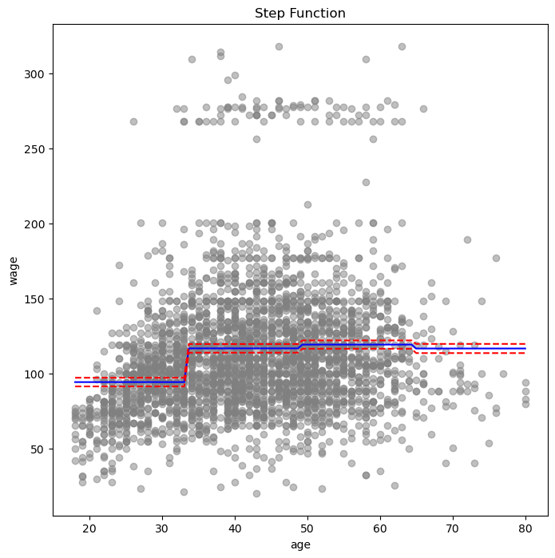

# 6. Splines

- Flexibility: Größere Flexibilität als Polynome und Sprungfunktionen.
- Ansatz:
  - Bereich von X in K Regionen aufteilen.
  - In jeder Region wird eine Polynomfunktion angepasst.
- **Basisfunktion**:
  - Allgemeine Form: $y_i = \beta_0 + \beta_1 b_1(x_i) + \beta_2 b_2(x_i) + \ldots + \beta_K b_K(x_i) + \epsilon_i$
  - Spezialfälle:
    - Polynomiale Regression: $b_j(x_i) = x_i^j$
    - Stückweise-konstante Regression: $b_j(x_i) = I(c_j \le x_i < c_{j+1})$
  - Koeffizienten schätzen mit der Methode der kleinsten Quadrate.
  - Inferenzwerkzeuge für lineare Modelle verfügbar (Standardfehler, F-Statistiken).
  - Alternative Basisfunktionen: Wavelets, Fourier-Reihen.
- **Stückweise (piecewise) Polynome**:
  - Ansatz:
    - Separate Polynome niedrigen Grades über verschiedene Regionen von X anpassen.
  - Beispiel:
    - Kubisches Polynom: $y_i = \beta_0 + \beta_1 x_i + \beta_2 x_i^2 + \beta_3 x_i^3 + \epsilon_i$
    - $\beta_0, \ldots, \beta_3$ variieren in verschiedenen X-Bereichen.
    - Knotenpunkte, wo Koeffizienten sich ändern.
    - Beispiel mit Knoten bei c:
      - Für $x_i < c$: $y_i = \beta_{01} + \beta_{11} x_i + \beta_{21} x_i^2 + \beta_{31} x_i^3 + \epsilon_i$
      - Für $x_i \geq c$: $y_i = \beta_{02} + \beta_{12} x_i + \beta_{22} x_i^2 + \beta_{32} x_i^3 + \epsilon_i$
  - Koeffizienten:
    - Zwei Polynome anpassen: eins für $x_i < c$, eins für $x_i \geq c$.
    - Schätzung mit Methode der kleinsten Quadrate.
  - Flexibilität:
    - Mehr Knoten = flexiblere Polynome.
    - (K + 1) Polynome für K Knoten.
  - Constraints: 
    - Ein d-Grad Polynom: Kontinuität der Ableitungen bis zum Grad d-1 an jedem Knoten.
      - Ein kubische Polynom: Kontinuität, Kontinuität der ersten und zweiten Ableitung.
	  - Eine lineare Polynom: Kontinuität.
	  - Eine konstante Linie: 0.
  - Freiheitsgrade:
    - Ein kubische Polynom benötigt 4 Freiheitsgrade.
      - Berechnung:
        - Insgesamt 4(K + 1) Freiheitsgrade (für K + 1 kubische Segmente)
        - Abzug von 3K Freiheitsgraden (durch die drei Bedingungen an jedem der K Knoten)
        - Ergebnis: 4(K + 1) - 3K = K + 4
    - Eine lineare Polynom benötigt 2 Freiheitsgrade. Insgesamt: 2(K + 1) - K = K + 2 Freiheitsgrade.
    - Eine konstante Linie benötigt 1 Freiheitsgrade. Insgesamt: K + 1

## 6.1. Basis-Splines (B-Splines)

- Regression Splines können durch das Basis-Modell dargestellt werden.
- Kubischer Spline mit K Knoten:
  - $y_i = \beta_0 + \beta_1 b_1(x_i) + \beta_2 b_2(x_i) + \beta_3 b_3(x_i) + \ldots + \beta_{K+3} b_{K+3}(x_i) + \epsilon_i$
  - Basisfunktionen $b_1, b_2, \ldots, b_{K+3}$ werden verwendet. Verschiedene Basisfunktionen sind möglich.
  - Basis für kubische Polynome: $x, x^2, x^3$
  - Hinzufügen einer Truncated Power Basisfunktion pro Knoten.
    - $h(x, \xi) = (x - \xi)_+^3 = \begin{cases} (x - \xi)^3 & \text{wenn } x > \xi \\ 0 & \text{sonst} \end{cases}$
  - Hinzufügen von $\beta_4 h(x, \xi)$ führt zu einer Diskontinuität in der dritten Ableitung bei $\xi$.
    - Funktion bleibt in ersten und zweiten Ableitungen kontinuierlich bei $\xi$.
  - Regression:
    - Intercept und 3 + K Prädiktoren: $X, X^2, X^3, h(X, \xi_1), \ldots, h(X, \xi_K)$
    - $\xi_1, \ldots, \xi_K$ sind die Knoten.
    - Insgesamt gibt es 4 + K Koeffizienten -> 4 + K Freiheitsgrade.
  - Varianz:
    - Splines haben hohe Varianz an den Rändern der Prädiktoren, wenn X sehr klein oder sehr groß ist.
    - Ein natürlicher Spline hat zusätzliche Randbedingungen:
      - Funktion ist linear am Rand.
      - Stabilere Schätzungen an den Rändern.

```python=
# 1. Using a matrix of basis functions with intercept
ageBSDF = BSpline(internal_knots=[25,40,60], intercept=True).fit_transform(WageDF.age)
# BSpline() has intercept=False as default
# Shape of bs_age is 3000 x 7
ageBSDF.head(3)
```

BSpline(intercept=True, internal_knots=[25,40,60], lower_bound=18.0, upper_bound=80.0)
<table class="dataframe">
  <thead>
    <tr style="text-align: right;">
      <th></th>
      <th>[0]</th>
      <th>[1]</th>
      <th>[2]</th>
      <th>[3]</th>
      <th>[4]</th>
      <th>[5]</th>
      <th>[6]</th>
    </tr>
  </thead>
  <tbody>
    <tr>
      <th>0</th>
      <td>1.000000</td>
      <td>0.000000</td>
      <td>0.000000</td>
      <td>0.000000</td>
      <td>0.000000</td>
      <td>0.000000</td>
      <td>0.0</td>
    </tr>
    <tr>
      <th>1</th>
      <td>0.002915</td>
      <td>0.559911</td>
      <td>0.403778</td>
      <td>0.033395</td>
      <td>0.000000</td>
      <td>0.000000</td>
      <td>0.0</td>
    </tr>
    <tr>
      <th>2</th>
      <td>0.000000</td>
      <td>0.000000</td>
      <td>0.114796</td>
      <td>0.618564</td>
      <td>0.262733</td>
      <td>0.003906</td>
      <td>0.0</td>
    </tr>
  </tbody>
</table>

- Kubischer Spline mit 4 Knoten
  - Verwendet 7 Freiheitsgrade (4 + 3)
  - Matrix hat 7 Spalten (inklusive Intercept)

```python=
ageBSDF = MS([bs('age', internal_knots=[25,40,60], name='bs(age)', intercept=True)], intercept=False).fit_transform(WageDF)
ageBSDF.head(3)
# bs() hat intercept=False as default
```

<table class="dataframe">
  <thead>
    <tr style="text-align: right;">
      <th></th>
      <th>intercept</th>
      <th>bs(age)[0]</th>
      <th>bs(age)[1]</th>
      <th>bs(age)[2]</th>
      <th>bs(age)[3]</th>
      <th>bs(age)[4]</th>
      <th>bs(age)[5]</th>
    </tr>
  </thead>
  <tbody>
    <tr>
      <th>0</th>
      <td>1.000000</td>
      <td>0.000000</td>
      <td>0.000000</td>
      <td>0.000000</td>
      <td>0.000000</td>
      <td>0.000000</td>
      <td>0.0</td>
    </tr>
    <tr>
      <th>1</th>
      <td>0.002915</td>
      <td>0.559911</td>
      <td>0.403778</td>
      <td>0.033395</td>
      <td>0.000000</td>
      <td>0.000000</td>
      <td>0.0</td>
    </tr>
    <tr>
      <th>2</th>
      <td>0.000000</td>
      <td>0.000000</td>
      <td>0.114796</td>
      <td>0.618564</td>
      <td>0.262733</td>
      <td>0.003906</td>
      <td>0.0</td>
    </tr>
  </tbody>
</table>

```python=
BS_intcept = sm.OLS(WageDF.wage, ageBSDF).fit()
summarize(BS_intcept)
```

<table class="dataframe">
  <thead>
    <tr style="text-align: right;">
      <th></th>
      <th>coef</th>
      <th>std err</th>
      <th>t</th>
      <th>P&gt;|t|</th>
    </tr>
  </thead>
  <tbody>
    <tr>
      <th>bs(age)[0]</th>
      <td>60.4937</td>
      <td>9.460</td>
      <td>6.394</td>
      <td>0.0</td>
    </tr>
    <tr>
      <th>bs(age)[1]</th>
      <td>64.4742</td>
      <td>5.687</td>
      <td>11.336</td>
      <td>0.0</td>
    </tr>
    <tr>
      <th>bs(age)[2]</th>
      <td>105.1247</td>
      <td>4.262</td>
      <td>24.663</td>
      <td>0.0</td>
    </tr>
    <tr>
      <th>bs(age)[3]</th>
      <td>123.3325</td>
      <td>4.084</td>
      <td>30.201</td>
      <td>0.0</td>
    </tr>
    <tr>
      <th>bs(age)[4]</th>
      <td>116.4845</td>
      <td>5.907</td>
      <td>19.720</td>
      <td>0.0</td>
    </tr>
    <tr>
      <th>bs(age)[5]</th>
      <td>111.1818</td>
      <td>10.379</td>
      <td>10.712</td>
      <td>0.0</td>
    </tr>
    <tr>
      <th>bs(age)[6]</th>
      <td>77.0999</td>
      <td>16.787</td>
      <td>4.593</td>
      <td>0.0</td>
    </tr>
  </tbody>
</table>

```python=
# 2. Using a matrix of basis functions without intercept
ageNoBSDF = BSpline(internal_knots=[25,40,60], intercept=False).fit_transform(WageDF.age)
ageNoBSDF.head(3)
```

BSpline(internal_knots=[25,40,60], lower_bound=18.0, upper_bound=80.0)
<table class="dataframe">
  <thead>
    <tr style="text-align: right;">
      <th></th>
      <th>[0]</th>
      <th>[1]</th>
      <th>[2]</th>
      <th>[3]</th>
      <th>[4]</th>
      <th>[5]</th>
    </tr>
  </thead>
  <tbody>
    <tr>
      <th>0</th>
      <td>0.000000</td>
      <td>0.000000</td>
      <td>0.000000</td>
      <td>0.000000</td>
      <td>0.000000</td>
      <td>0.0</td>
    </tr>
    <tr>
      <th>1</th>
      <td>0.559911</td>
      <td>0.403778</td>
      <td>0.033395</td>
      <td>0.000000</td>
      <td>0.000000</td>
      <td>0.0</td>
    </tr>
    <tr>
      <th>2</th>
      <td>0.000000</td>
      <td>0.114796</td>
      <td>0.618564</td>
      <td>0.262733</td>
      <td>0.003906</td>
      <td>0.0</td>
    </tr>
  </tbody>
</table>

```python=
ageNoBSDF = MS([bs('age', internal_knots=[25,40,60], name='bs(age)')]).fit_transform(WageDF)
ageNoBSDF.head(2)
```

<table class="dataframe">
  <thead>
    <tr style="text-align: right;">
      <th></th>
      <th>bs(age)[0]</th>
      <th>bs(age)[1]</th>
      <th>bs(age)[2]</th>
      <th>bs(age)[3]</th>
      <th>bs(age)[4]</th>
      <th>bs(age)[5]</th>
      <th>bs(age)[6]</th>
    </tr>
  </thead>
  <tbody>
    <tr>
      <th>0</th>
      <td>1.0</td>
      <td>0.000000</td>
      <td>0.000000</td>
      <td>0.000000</td>
      <td>0.000000</td>
      <td>0.000000</td>
      <td>0.0</td>
    </tr>
    <tr>
      <th>1</th>
      <td>1.0</td>
      <td>0.559911</td>
      <td>0.403778</td>
      <td>0.033395</td>
      <td>0.000000</td>
      <td>0.000000</td>
      <td>0.0</td>
    </tr>
  </tbody>
</table>

```python=
summarize(sm.OLS(WageDF.wage, ageNoBSDF).fit())
```

<table class="dataframe">
  <thead>
    <tr style="text-align: right;">
      <th></th>
      <th>coef</th>
      <th>std err</th>
      <th>t</th>
      <th>P&gt;|t|</th>
    </tr>
  </thead>
  <tbody>
    <tr>
      <th>Intercept</th>
      <td>60.4937</td>
      <td>9.460</td>
      <td>6.394</td>
      <td>0.000</td>
    </tr>
    <tr>
      <th>bs(age)[0]</th>
      <td>3.9805</td>
      <td>12.538</td>
      <td>0.317</td>
      <td>0.751</td>
    </tr>
    <tr>
      <th>bs(age)[1]</th>
      <td>44.6310</td>
      <td>9.626</td>
      <td>4.636</td>
      <td>0.000</td>
    </tr>
    <tr>
      <th>bs(age)[2]</th>
      <td>62.8388</td>
      <td>10.755</td>
      <td>5.843</td>
      <td>0.000</td>
    </tr>
    <tr>
      <th>bs(age)[3]</th>
      <td>55.9908</td>
      <td>10.706</td>
      <td>5.230</td>
      <td>0.000</td>
    </tr>
    <tr>
      <th>bs(age)[4]</th>
      <td>50.6881</td>
      <td>14.402</td>
      <td>3.520</td>
      <td>0.000</td>
    </tr>
    <tr>
      <th>bs(age)[5]</th>
      <td>16.6061</td>
      <td>19.126</td>
      <td>0.868</td>
      <td>0.385</td>
    </tr>
  </tbody>
</table>

- Ergebnisse sind identisch, aber unterschiedlich interpretiert:
  - 64.4742 = 60.4937 + 3.9805
- Alternative zu Knoten:
  - Komplexität des Splines mit `df` (Freiheitsgrade) festlegen
  - Kurbische Spline:
    - Mit 3 Knoten hat die Spline-Basis 7 Freiheitsgrade
    - Abzug von 1 (Intercept) ergibt 6 Freiheitsgrade für das Modell.
    - Einstellung `df=6` erzeugt Spline mit 3 Knoten bei 25% (33.75), 50% (42) und 75% (51) Quantilen
  - Stufen Spline (mit Stufenfunktion degree=0):
    -  Mit 3 Knoten hat die Spline-Basis 4 Freiheitsgrade.
    -  Abzug von 1. Einstellung `df=3 erzeugt Spline mit 3 Knoten.

```python=
BSpline(df=6).fit(WageDF.age).internal_knots_
```

    array([33.75, 42, 51])

```python=
BSpline(df=3, degree=0).fit(WageDF.age).internal_knots_
```

    array([33.75, 42, 51])

```python=
# Create the matrix of basis functions
stepBSDF = MS([bs('age', df=3, degree=0)]).fit_transform(WageDF)
stepBSDF.head(3)
```

bs(age, df=3, degree=0)
<table class="dataframe">
  <thead>
    <tr style="text-align: right;">
      <th></th>
      <th>intercept</th>
      <th>[0]</th>
      <th>[1]</th>
      <th>[2]</th>
    </tr>
  </thead>
  <tbody>
    <tr>
      <th>0</th>
      <td>1.0</td>
      <td>0.0</td>
      <td>0.0</td>
      <td>0.0</td>
    </tr>
    <tr>
      <th>1</th>
      <td>1.0</td>
      <td>0.0</td>
      <td>0.0</td>
      <td>0.0</td>
    </tr>
    <tr>
      <th>2</th>
      <td>1.0</td>
      <td>0.0</td>
      <td>1.0</td>
      <td>0.0</td>
    </tr>
  </tbody>
</table>

```python=
summarize(sm.OLS(WageDF.wage, stepBSDF).fit())
```

<table class="dataframe">
  <thead>
    <tr style="text-align: right;">
      <th></th>
      <th>coef</th>
      <th>std err</th>
      <th>t</th>
      <th>P&gt;|t|</th>
    </tr>
  </thead>
  <tbody>
    <tr>
      <th>intercept</th>
      <td>94.1584</td>
      <td>1.478</td>
      <td>63.687</td>
      <td>0.0</td>
    </tr>
    <tr>
      <th>bs(age, df=3, degree=0)[0]</th>
      <td>22.3490</td>
      <td>2.152</td>
      <td>10.388</td>
      <td>0.0</td>
    </tr>
    <tr>
      <th>bs(age, df=3, degree=0)[1]</th>
      <td>24.8076</td>
      <td>2.044</td>
      <td>12.137</td>
      <td>0.0</td>
    </tr>
    <tr>
      <th>bs(age, df=3, degree=0)[2]</th>
      <td>22.7814</td>
      <td>2.087</td>
      <td>10.917</td>
      <td>0.0</td>
    </tr>
  </tbody>
</table>

- Vergleich mit Stufenfunktionsergebnis (`qcut()`)
  - Beispiel: $94.158 + 22.349 = 116.507$ vs. 116.611
  - Abweichung durch Binning-Prozess
    - `qcut()` verwendet $\leq$
    - `bs()` verwendet $<$

- Gleiche Ergebnisse wie bei Stufenfuktion erzielen:
  - `df=4` für Intercept setzen
  - `intercept=True` für `bs()` and `intercept=False` für `MS()` setzen

```python=
stepIIBSDF = MS( [bs('age', df=4, degree=0, intercept=True)],intercept=False )
stepIIBSDF = stepIIBSDF.fit_transform(WageDF)
stepIIBSDF.head(3)
# Alternative way by BSpline()
# BSpline(df=4, degree=0, intercept=True).fit_transform(WageDF.age)
```
bs(age, df=4, degree=0)
<table class="dataframe">
  <thead>
    <tr style="text-align: right;">
      <th></th>
      <th>[0]</th>
      <th>[1]</th>
      <th>[2]</th>
      <th>[3]</th>
    </tr>
  </thead>
  <tbody>
    <tr>
      <th>0</th>
      <td>1.0</td>
      <td>0.0</td>
      <td>0.0</td>
      <td>0.0</td>
    </tr>
    <tr>
      <th>1</th>
      <td>1.0</td>
      <td>0.0</td>
      <td>0.0</td>
      <td>0.0</td>
    </tr>
    <tr>
      <th>2</th>
      <td>0.0</td>
      <td>0.0</td>
      <td>1.0</td>
      <td>0.0</td>
    </tr>
  </tbody>
</table>

```python=
summarize(sm.OLS(WageDF.wage, stepIIBSDF).fit())
```

<table class="dataframe">
  <thead>
    <tr style="text-align: right;">
      <th></th>
      <th>coef</th>
      <th>std err</th>
      <th>t</th>
      <th>P&gt;|t|</th>
    </tr>
  </thead>
  <tbody>
    <tr>
      <th>bs(age, df=4, degree=0)[0]</th>
      <td>94.1584</td>
      <td>1.478</td>
      <td>63.687</td>
      <td>0.0</td>
    </tr>
    <tr>
      <th>bs(age, df=4, degree=0)[1]</th>
      <td>116.5074</td>
      <td>1.563</td>
      <td>74.537</td>
      <td>0.0</td>
    </tr>
    <tr>
      <th>bs(age, df=4, degree=0)[2]</th>
      <td>118.9660</td>
      <td>1.411</td>
      <td>84.291</td>
      <td>0.0</td>
    </tr>
    <tr>
      <th>bs(age, df=4, degree=0)[3]</th>
      <td>116.9398</td>
      <td>1.473</td>
      <td>79.411</td>
      <td>0.0</td>
    </tr>
  </tbody>
</table>

## 6.2. Natural Splines
- Verwendung von `NaturalSpline()` oder `ns()` in `MS()`

```python=
NaturalSpline(internal_knots=[25,40,60]).fit_transform(WageDF.age).head(3)
```

NaturalSpline(internal_knots=[25, 40, 60])
<table class="dataframe">
  <thead>
    <tr style="text-align: right;">
      <th></th>
      <th>[0]</th>
      <th>[1]</th>
      <th>[2]</th>
      <th>[3]</th>
    </tr>
  </thead>
  <tbody>
    <tr>
      <th>0</th>
      <td>0.000000</td>
      <td>0.000000</td>
      <td>0.000000</td>
      <td>0.000000</td>
    </tr>
    <tr>
      <th>1</th>
      <td>0.033395</td>
      <td>-0.140014</td>
      <td>0.420041</td>
      <td>-0.280027</td>
    </tr>
    <tr>
      <th>2</th>
      <td>0.618564</td>
      <td>0.214980</td>
      <td>0.147167</td>
      <td>-0.095507</td>
    </tr>
  </tbody>
</table>

```python=
ageNSDF = MS([ns('age', internal_knots=[25,40,60])]).fit_transform(WageDF)
ageNSDF.head(3)
```

ns(age, internal_knots=[25, 40, 60])
<table class="dataframe">
  <thead>
    <tr style="text-align: right;">
      <th></th>
      <th>intercept</th>
      <th>[0]</th>
      <th>[1]</th>
      <th>[2]</th>
      <th>[3]</th>
    </tr>
  </thead>
  <tbody>
    <tr>
      <th>0</th>
      <td>1.0</td>
      <td>0.000000</td>
      <td>0.000000</td>
      <td>0.000000</td>
      <td>0.000000</td>
    </tr>
    <tr>
      <th>1</th>
      <td>1.0</td>
      <td>0.033395</td>
      <td>-0.140014</td>
      <td>0.420041</td>
      <td>-0.280027</td>
    </tr>
    <tr>
      <th>2</th>
      <td>1.0</td>
      <td>0.618564</td>
      <td>0.214980</td>
      <td>0.147167</td>
      <td>-0.095507</td>
    </tr>
  </tbody>
</table>

```python=
summarize(sm.OLS(WageDF.wage, ageNSDF).fit())
```

<table class="dataframe">
  <thead>
    <tr style="text-align: right;">
      <th></th>
      <th>coef</th>
      <th>std err</th>
      <th>t</th>
      <th>P&gt;|t|</th>
    </tr>
  </thead>
  <tbody>
    <tr>
      <th>intercept</th>
      <td>54.7595</td>
      <td>5.138</td>
      <td>10.658</td>
      <td>0.000</td>
    </tr>
    <tr>
      <th>ns(age, internal_knots=[25, 40, 60])[0]</th>
      <td>67.4019</td>
      <td>5.013</td>
      <td>13.444</td>
      <td>0.000</td>
    </tr>
    <tr>
      <th>ns(age, internal_knots=[25, 40, 60])[1]</th>
      <td>51.3828</td>
      <td>5.712</td>
      <td>8.996</td>
      <td>0.000</td>
    </tr>
    <tr>
      <th>ns(age, internal_knots=[25, 40, 60])[2]</th>
      <td>88.5661</td>
      <td>12.016</td>
      <td>7.371</td>
      <td>0.000</td>
    </tr>
    <tr>
      <th>ns(age, internal_knots=[25, 40, 60])[3]</th>
      <td>10.6369</td>
      <td>9.833</td>
      <td>1.082</td>
      <td>0.279</td>
    </tr>
  </tbody>
</table>

- Natürliche Splines:
  - Erste und letzte Basisfunktionen sind linear
  - Freiheitsgrade: 4 + K - 2 = K + 2 (Kubische Splines mit K Knoten + Intercept)

```python=
NaturalSpline(df=4).fit(WageDF.age).internal_knots_
```

    array([33.75, 42.  , 51.  ])

- Plotten von BSpline und NaturalSpline

```python=
# Rerun the both models
bs_age = MS([bs('age', internal_knots=[25,40,60])]).fit_transform(WageDF)
M_bs = sm.OLS(WageDF.wage, bs_age).fit()
ns_age = MS([ns('age', internal_knots=[25,40,60])]).fit_transform(WageDF)
M_ns = sm.OLS(WageDF.wage, ns_age).fit()
```

```python=
# Calculate the predicted values and confidence bands for both
preds_bs = M_bs.get_prediction(MS([bs('age', internal_knots=[25,40,60])])
                               .fit(WageDF).transform(ageDF))
bands_bs = preds_bs.conf_int(alpha=0.05)
preds_ns = M_ns.get_prediction(MS([ns('age', internal_knots=[25,40,60])])
                               .fit(WageDF).transform(ageDF))
bands_ns = preds_ns.conf_int(alpha=0.05)
```

```python=
fig, axs = plt.subplots(1, 2, figsize=(16, 8))
# First subplot: B-spline
axs[0].scatter(WageDF.age, WageDF.wage, facecolor='gray', alpha=0.5)
for val, ls in zip([preds_bs.predicted_mean, bands_bs[:, 0], bands_bs[:, 1]], ['b', 'r--', 'r--']):
    axs[0].plot(age_grid100, val, ls, linewidth=2)
axs[0].set_xlabel('age'); axs[0].set_ylabel('wage'); axs[0].set_title('B-spline')
# Second subplot: Natural spline
axs[1].scatter(WageDF.age, WageDF.wage, facecolor='gray', alpha=0.5)
for val, ls in zip([preds_ns.predicted_mean,
                    bands_ns[:, 0], bands_ns[:, 1]],
                   ['b', 'r--', 'r--']):
    axs[1].plot(age_grid100, val, ls, linewidth=2)
axs[1].set_xlabel('age'); axs[1].set_title('Natural spline');
```

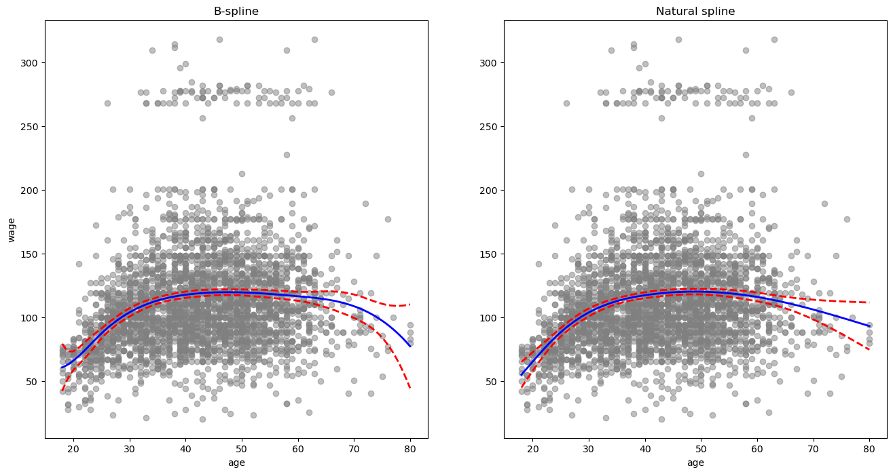

- Wahl der Knoten
  - Platzierung:
    - Mehr Knoten bei schneller Funktionsänderung.
    - Weniger Knoten in stabilen Bereichen.
    - Oft gleichmäßig verteilt.
    - Beispiel: Knoten bei den 25., 50. und 75. Perzentilen des Alters.
  
  - Anzahl:
    - Verschiedene Knotenzahlen testen und beste Kurve wählen.
    - Kreuzvalidierung verwenden.
    - Methode: Daten teilen, Spline anpassen, Vorhersagen machen, RSS berechnen.
    - Kleinster RSS bestimmt optimale Knotenzahl.

  - Additive Spline-Modelle:
    - Anpassung an mehrere Variablen.
    - Gleiche Freiheitsgrade für alle Variablen, z.B. vier.

- Vergleich zur Polynomregression:
  - Natürlicher kubischer Spline vs. Polynomial 15. Grades.
  - Polynomial zeigt schlechte Ergebnisse an den Rändern.
  - Natürlicher kubischer Spline passt besser.

  - Vorteile von Splines:
    - Stabilere Schätzungen.
    - Bessere Ergebnisse bei schneller Funktionsänderung.
    - Weniger Knoten in stabilen Bereichen.


# 7. Smoothing Splines

- Einführung
  - Regression Splines nutzen Knoten und Basisfunktionen.
  - Smoothing Splines glätten Kurven anders.

- Überblick
  - Ziel: Funktion $g(x)$, die Daten gut anpasst.
  - Minimierung von $\sum_{i=1}^{n} (y_i - g(x_i))^2 + \lambda \int (g''(t))^2 \, dt$.
  - $\lambda$: Tuning-Parameter für Glätte.

- Eigenschaften
  - $\lambda = 0$: Exakte Interpolation.
  - $\lambda \to \infty$: Gerade Linie.
  - $\lambda$ steuert Bias-Varianz-Kompromiss.
  - Minimierende Funktion ist ein natürlicher kubischer Spline.

- Wahl des Smoothing Parameters λ
  - $\lambda$ beeinflusst effektive Freiheitsgrade ${df}_λ$.
  - ${df}_λ$ variiert von $n$ (flexibel) bis 2 (glatt).

- Kreuzvalidierung
  - Wähle $\lambda$ durch Minimierung des kreuzvalidierten RSS.
  - LOOCV effizient berechnen:
      $RSS_{cv}(\lambda) = \sum_{i=1}^{n} \left[ \frac{y_i - \hat{g}_{\lambda}(x_i)}{1 - \{S_{\lambda}\}_{ii}} \right]^2$.

**ANWENDUNG**

- Smoothing Spline
  - Spezifischer Typ des Generalized Additive Model (GAM)
  - Verwendet quadratischen Fehler für ein Merkmal
- Verwendung von `pygam`:
  - Jede Spalte entspricht einer Glättungsoperation:
    - 's' für Smoothing Spline
    - 'l' für linear
    - 'f' für kategoriale Variablen
- `lam` ist der Strafparameter $\lambda$

```python=
# Create a column ndarray for age
ageCol = np.asarray(WageDF.age).reshape((-1,1))
ageCol[:3]
```

    array([[18],
           [24],
           [45]], dtype=int64)

```python=
GAM = LinearGAM(s_gam(0, lam=0.6))
# 0: take the first variable (column) with index=0
# s_gam() take only one integer, not list. 
# If multiple columns are needed, use sperate s_gam() for each column.
GAM.fit(ageCol, WageDF.wage);
```

- Plotten des Smoothing Spline mit 5 $\lambda$-Werten:
    - Bereiche: $10^{-2}$ bis $10^6$

```python=
# Create a grid of lambdas
lambdas = np.logspace(-2, 6, 5) # 0.01, 1, 100, 10000, 10^6
# Plotting
fig, ax = plt.subplots(figsize=(8,8))
ax.scatter(WageDF.age, WageDF.wage, facecolor='gray', alpha=0.5)
# Plot the GAM fit for each lambda
line_styles = ['-', '--', '-.', ':', (0, (20,5))]
for lam, ls in zip(lambdas, line_styles):
    GAM = LinearGAM(s_gam(0, lam=lam)).fit(ageCol, WageDF.wage)
    ax.plot(age_grid100,
            GAM.predict(age_grid100),
            label='{:.1e}'.format(lam), linestyle=ls, linewidth=3)
ax.set_xlabel('age'); ax.set_ylabel('wage'); ax.legend(title=r'$\lambda$');
```

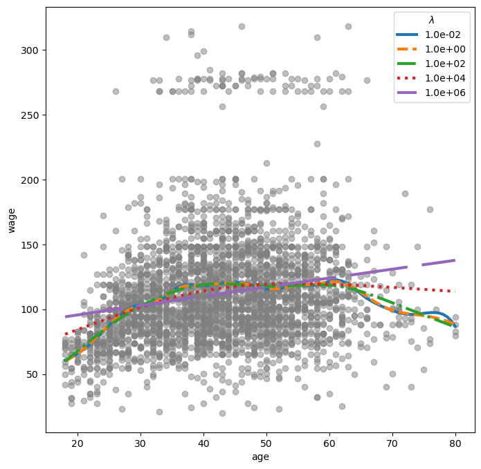

- `pygam` Paket kann optimalen Glättungsparameter suchen.

```python=
# Search the best lambda and fit the model
GAM = LinearGAM(s_gam(0))
# Search the best lambda and fit the model
GAM_opt = GAM.gridsearch(ageCol, WageDF.wage)
# Plot the model with the best lambda
ax.plot(age_grid100,
        GAM_opt.predict(age_grid100),
        label='Grid search',
        linewidth=3, color='k', linestyle=(0, (5,20)))
ax.legend(title=r'$\lambda$'); fig
```

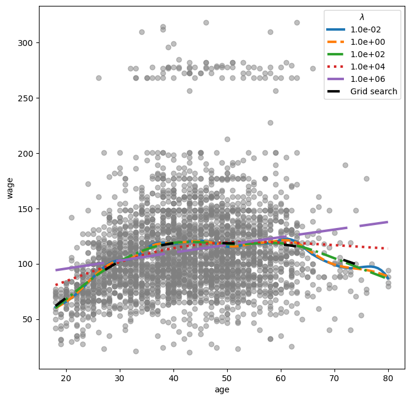

```python=
print('Best lambda:', GAM_opt.lam)
print('Effective degrees of freedom:', GAM_opt.statistics_['edof'].round(3))
```

    Best lambda: [[251.189]]
    Effective degrees of freedom: 5.644

- Wir verwenden das Paket `ISLP.pygam`, um das Lambda zu finden, das 4 Freiheitsgrade liefert.

```python=
# Get the smoothing spline term
smooth_term = GAM.terms[0]
# Identify the lambda
lam4 = approx_lam(ageCol, smooth_term, 4)
print('Lambda for 4 effective degrees of freedom:', lam4)
smooth_term.lam = lam4
```

    Lambda for 4 effective degrees of freedom: [1446.685]
    Effective degrees of freedom: 4.000000100003132

- Glättungsspline mit verschiedenen Freiheitsgraden plotten.
- Achsenabschnitt erhöht Freiheitsgrade um 1.
  - Beispiel: `df=2` ergibt eine lineare Linie.

```python=
fig, ax = plt.subplots(figsize=(8,8))
ax.scatter(WageDF.age, WageDF.wage, facecolor='gray', alpha=0.5)
# Plot with five degrees of freedom
for df in [1,3,4,8,15]:
    lam = approx_lam(ageCol, gam.terms[0], df+1) # df + intercept
    gam.terms[0].lam = lam
    gam.fit(ageCol, WageDF.wage)
    ax.plot(age_grid100,
            gam.predict(age_grid100),
            label='{:d}'.format(df))
ax.set_xlabel('Age'); ax.set_ylabel('Wage');
ax.legend(title='Degrees of freedom');
```

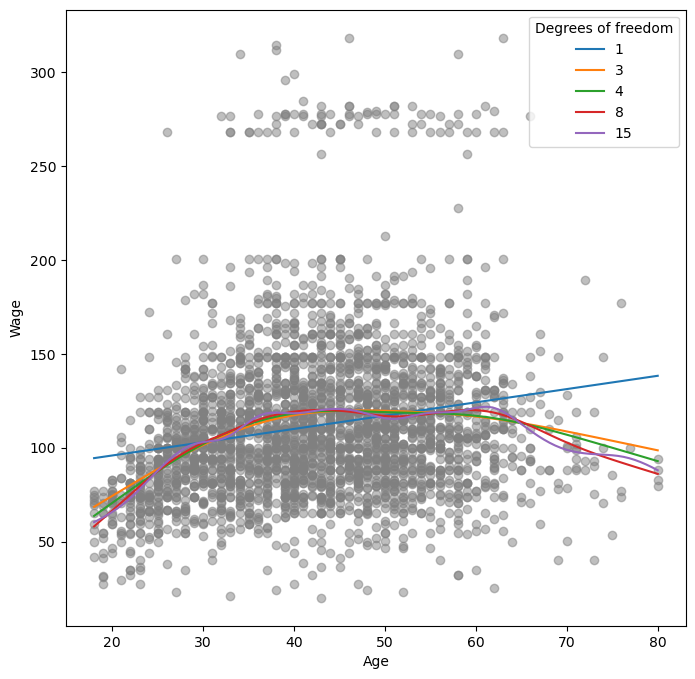

# 8. GAMs mit mehreren Termen
## 8.1. Natürliche Splines of `age`, `year` and Category of `education`
- Verwenden natürliche Splines für `year` und `age`.
- Behandeln `education` als qualitativen Prädiktor.
  - Alle Spalten von `education` werden verwendet, daher wird der Achsenabschnitt weggelassen.

```python=
ageNS = NaturalSpline(df=4).fit_transform(WageDF.age)
yearNS = NaturalSpline(df=5).fit_transform(WageDF.year)
# Create a combined design matrix
XNS_GamLI = [ageNS, yearNS, pd.get_dummies(WageDF.education)]
XNS_GamDF = np.hstack(XNS_GamLI)
# Shape of XNS_GamDF: 3000 x 14
GAM_plural = sm.OLS(WageDF.wage, XNS_GamDF).fit()
summarize(GAM_plural)
```

<table class="dataframe">
  <thead>
    <tr style="text-align: right;">
      <th></th>
      <th>coef</th>
      <th>std err</th>
      <th>t</th>
      <th>P&gt;|t|</th>
    </tr>
  </thead>
  <tbody>
    <tr>
      <th>x1</th>
      <td>46.4460</td>
      <td>3.732</td>
      <td>12.446</td>
      <td>0.000</td>
    </tr>
    <tr>
      <th>x2</th>
      <td>28.9349</td>
      <td>3.884</td>
      <td>7.449</td>
      <td>0.000</td>
    </tr>
    <tr>
      <th>x3</th>
      <td>63.6722</td>
      <td>9.231</td>
      <td>6.898</td>
      <td>0.000</td>
    </tr>
    <tr>
      <th>x4</th>
      <td>10.9669</td>
      <td>7.650</td>
      <td>1.434</td>
      <td>0.152</td>
    </tr>
    <tr>
      <th>x5</th>
      <td>1.8374</td>
      <td>3.177</td>
      <td>0.578</td>
      <td>0.563</td>
    </tr>
    <tr>
      <th>x6</th>
      <td>10.4409</td>
      <td>3.790</td>
      <td>2.755</td>
      <td>0.006</td>
    </tr>
    <tr>
      <th>x7</th>
      <td>2.0020</td>
      <td>3.399</td>
      <td>0.589</td>
      <td>0.556</td>
    </tr>
    <tr>
      <th>x8</th>
      <td>9.6055</td>
      <td>4.053</td>
      <td>2.370</td>
      <td>0.018</td>
    </tr>
    <tr>
      <th>x9</th>
      <td>5.8989</td>
      <td>2.419</td>
      <td>2.438</td>
      <td>0.015</td>
    </tr>
    <tr>
      <th>x10</th>
      <td>43.8013</td>
      <td>4.383</td>
      <td>9.993</td>
      <td>0.000</td>
    </tr>
    <tr>
      <th>x11</th>
      <td>54.7329</td>
      <td>4.037</td>
      <td>13.558</td>
      <td>0.000</td>
    </tr>
    <tr>
      <th>x12</th>
      <td>67.1982</td>
      <td>4.159</td>
      <td>16.156</td>
      <td>0.000</td>
    </tr>
    <tr>
      <th>x13</th>
      <td>81.9664</td>
      <td>4.231</td>
      <td>19.371</td>
      <td>0.000</td>
    </tr>
    <tr>
      <th>x14</th>
      <td>106.3711</td>
      <td>4.456</td>
      <td>23.872</td>
      <td>0.000</td>
    </tr>
  </tbody>
</table>

- Wir erstellen Partialabhängigkeitsdiagramme für jeden Term im Modell.
1. Age
- Neue Vorhersagematrix erstellen.
- Alle Spalten außer `age` sind auf Mittelwerte gesetzt.
- Die vier `age`-Spalten sind mit der natürlichen Spline-Basis für die `age_grid100`-Werte gefüllt.

```python=
# Create ndarray of all zeros with shape 100 x 4
agePartARR = np.zeros((100, 14))
# Replace all values with the mean of its column
agePartARR[:] = XNS_GamDF[:].mean(0)[None,:]
# Replace values of the first four columns with the basis functions for age
agePartARR[:,:4] = NaturalSpline(df=4).fit_transform(age_grid100)
# Calculate the predicted values
preds = GAM_plural.get_prediction(agePartARR)
# Calculate the confidence bands
bounds_age = preds.conf_int(alpha=0.05)
# Because we do not have the intercept, we need to subtract the center
partial_age = preds.predicted_mean
center = partial_age.mean()
partial_age -= center
bounds_age -= center
# Plot
fig, ax = plt.subplots(figsize=(8,8))
ax.plot(age_grid100, partial_age, 'b', linewidth=3)
ax.plot(age_grid100, bounds_age[:,0], 'r--', linewidth=3)
ax.plot(age_grid100, bounds_age[:,1], 'r--', linewidth=3)
ax.set_xlabel('Age'); ax.set_ylabel('Effect on wage')
ax.set_title('Partial dependence of age on wage');
```

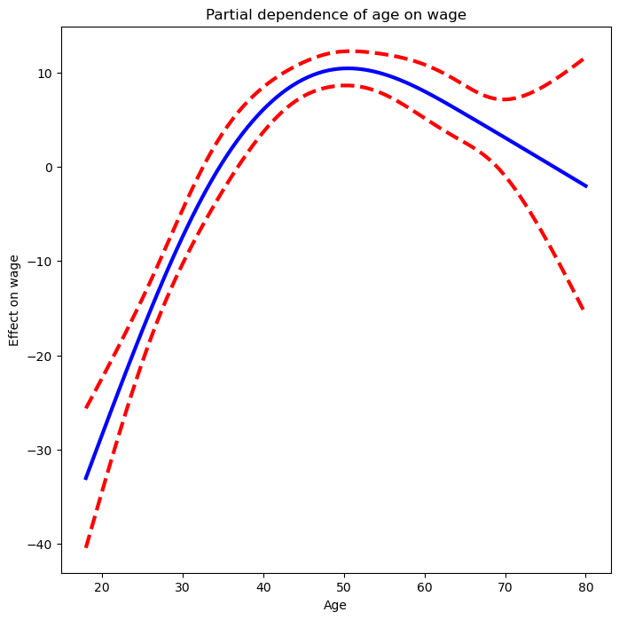


2. year

```python=
# Create a grid of years
year_grid100 = np.linspace(2003, WageDF.year.max(), 100)
# Copy the first 100 rows of the design matrix because year_grid has only 100 values
yearPartARR = np.zeros((100, 14))
yearPartARR[:] = XNS_GamDF[:].mean(0)[None,:]
# Replace the values of the columns 4 to 9 with the basis functions for year
yearPartARR[:,4:9] = NaturalSpline(df=5).fit_transform(year_grid100)
# Calculate the predicted values and confidence bands
preds = GAM_plural.get_prediction(yearPartARR)
bounds_year = preds.conf_int(alpha=0.05)
partial_year = preds.predicted_mean
center = partial_year.mean()
partial_year -= center
bounds_year -= center
# Plot
fig, ax = plt.subplots(figsize=(8,8))
ax.plot(year_grid100, partial_year, 'b', linewidth=3)
ax.plot(year_grid100, bounds_year[:,0], 'r--', linewidth=3)
ax.plot(year_grid100, bounds_year[:,1], 'r--', linewidth=3)
ax.set_xlabel('Year'); ax.set_ylabel('Effect on wage')
ax.set_title('Partial dependence of year on wage');
```

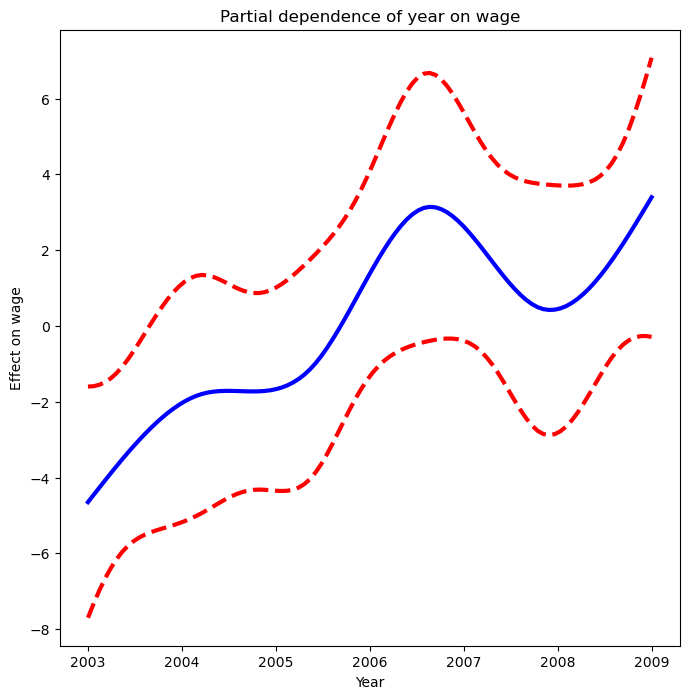

## 8.2. Glättungssplines of `age`, `year` and Category of `education`
- `pygam` benötigt Matrizen, daher konvertieren wir `education` mit `cat.codes` in ein Array.
- Für `year` verwenden wir sieben Basisfunktionen, da es sieben eindeutige Werte (2003-2009) hat.

```python=
# Design matrix
XSmS_GamARR = np.column_stack( [WageDF.age, WageDF.year, WageDF.education.cat.codes] )
XSmS_GamARR[:3]
```

    array([[  18, 2006,    0],
           [  24, 2004,    3],
           [  45, 2003,    2]], dtype=int64)

```python=
GAM_full = LinearGAM(s_gam(0) + s_gam(1, n_splines=7) + f_gam(2, lam=0))
GAM_full = GAM_full.fit(XSmS_GamARR, WageDF.wage)
```

- `s_gam()` uses the default value of `lam=0.6` (arbitrary choice).
- `f_gam(2, lam=0)` uses `lam=0` to avoid any shrinkage.
- `plot_pygam` aus `ISLP.pygam` kann das Ergebnis von `LinearGAM()` für jeden Term plotten.
1. Age

```python=
fig, ax = plt.subplots(figsize=(8,8))
# Plot the first term
plot_gam(GAM_full, 0, ax=ax)
ax.set_xlabel('Age'); ax.set_ylabel('Effect on wage')
ax.set_title('Partial dependence of age on wage - default lam=0.6');
```

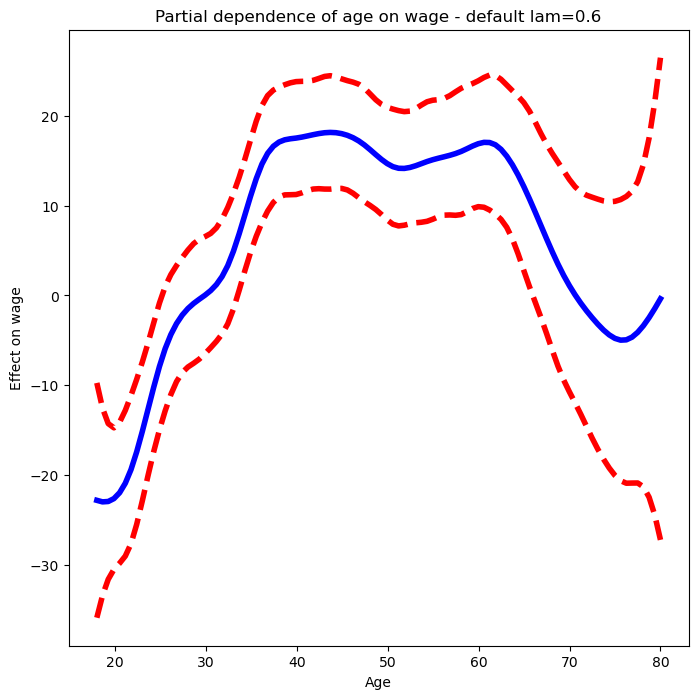

- Funktion schwankt.
- `df` statt `lam` angeben.
  - GAM mit vier Freiheitsgraden für `age` und `year`.
  - Einen Freiheitsgrad für den Achsenabschnitt hinzufügen.

```python=
age_term = GAM_full.terms[0]
age_term.lam = approx_lam(XSmS_GamARR, age_term, df=4+1)
year_term = GAM_full.terms[1]
year_term.lam = approx_lam(XSmS_GamARR, year_term, df=4+1)
# Refit the model
GAM_full = GAM_full.fit(XSmS_GamARR, WageDF.wage)
```

- Das Aktualisieren von `age_term.lam` aktualisiert auch `gam_full.terms[0]`.
  - Dasselbe gilt für `year_term.lam`.
- Das erneute Plotten für `age` zeigt eine glattere Kurve.

```python=
fig, ax = plt.subplots(figsize=(8,8))
plot_gam(GAM_full, 0, ax=ax)
ax.set_xlabel('Age'); ax.set_ylabel('Effect on wage')
ax.set_title('Partial dependence of year on wage');
```

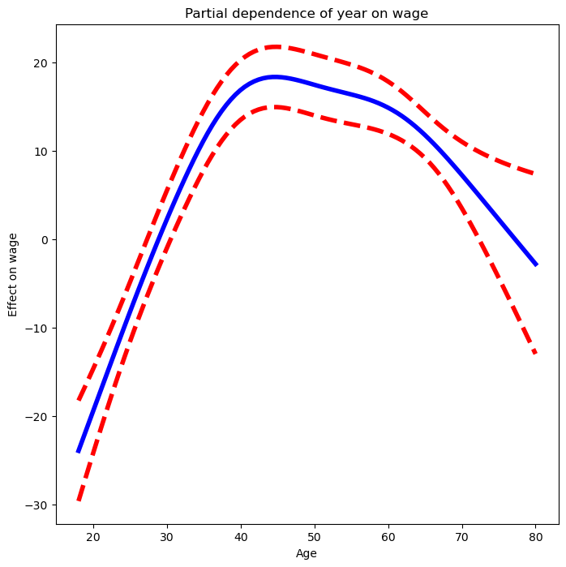

2. Year

```python=
fig, ax = plt.subplots(figsize=(8,8))
ax = plot_gam(GAM_full, 1)
ax.set_xlabel('Year'); ax.set_ylabel('Effect on wage')
ax.set_title('Partial dependence of year on wage');
```

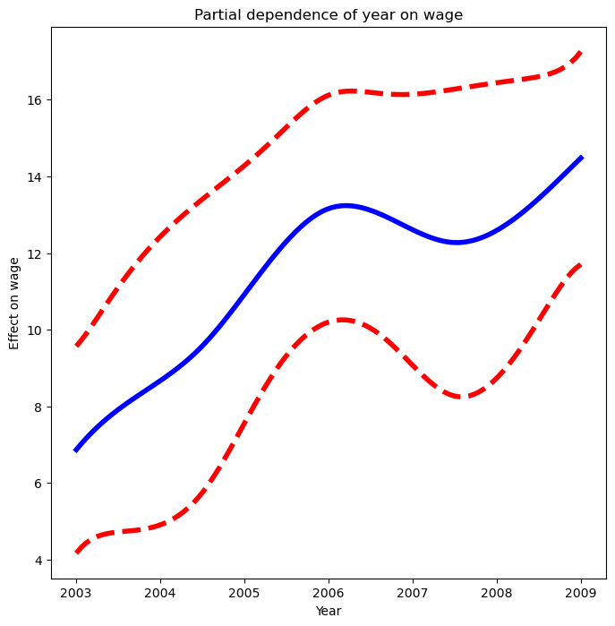

3. Education
- Das Partialabhängigkeitsdiagramm zeigt die angepassten Konstanten für jede Stufe dieser Variable.

```python=
fig, ax = plt.subplots(figsize=(8, 8))
ax = plot_gam(GAM_full, 2)
ax.set_xlabel('Education'); ax.set_ylabel('Effect on wage')
ax.set_title('Partial dependence of wage on education')
ax.set_xticklabels(WageDF['education'].cat.categories, fontsize=8);
```

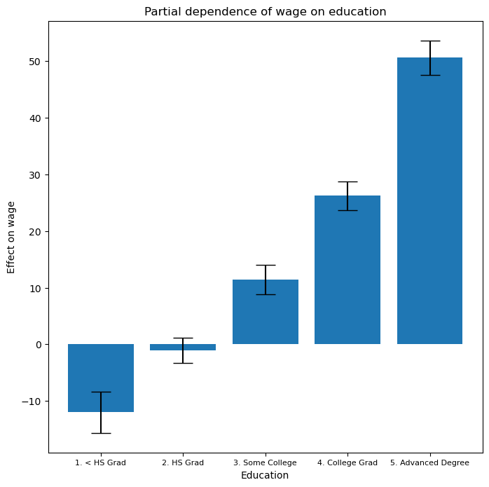

## 8.3. ANOVA-Tests für additive Modelle

- In allen Modellen scheint die Funktion von `year` linear zu sein.
- Wir führen ANOVA-Tests durch, um das beste Modell zu bestimmen:
  - GAM ohne `year`
  - GAM mit `year` als linearem Term
  - GAM mit `year` als Glättungsspline

1. Ohne `year`
```python=
gam_0 = LinearGAM(s_gam(0) + f_gam(2, lam=0))
gam_0.fit(XSmS_GamARR, WageDF.wage)
# Set df = 4+1 for the age term
gam_0.terms[0].lam = approx_lam(XSmS_GamARR, gam_0.terms[0], df=4+1)
# Refit the model
gam_0.fit(XSmS_GamARR, WageDF.wage);
```

2. Mit linear `year`
```python=
gam_1 = LinearGAM(s_gam(0) + l_gam(1, lam=0) + f_gam(2, lam=0))
gam_1.fit(XSmS_GamARR, WageDF.wage)
# Set df = 4+1 for the age term
gam_1.terms[0].lam = approx_lam(XSmS_GamARR, gam_1.terms[0], df=4+1)
# Refit the model
gam_1.fit(XSmS_GamARR, WageDF.wage);
```

3. Mit smoothing spline `year`
```python=
gam_2 = LinearGAM(s_gam(0) + s_gam(1, n_splines=7) + s_gam(2, lam=0))
gam_2.fit(XSmS_GamARR, WageDF.wage)
# Set df = 4+1 for the age term
gam_2.terms[0].lam = approx_lam(XSmS_GamARR, gam_2.terms[0], df=4+1)
# Set df = 4+1 for the year term
gam_2.terms[1].lam = approx_lam(XSmS_GamARR, gam_2.terms[1], df=4+1)
# Refit the model
gam_2.fit(XSmS_GamARR, WageDF.wage);

```

```python=
anova_gam(gam_0, gam_1, gam_2)
```

<table class="dataframe">
  <thead>
    <tr style="text-align: right;">
      <th></th>
      <th>deviance</th>
      <th>df</th>
      <th>deviance_diff</th>
      <th>df_diff</th>
      <th>F</th>
      <th>pvalue</th>
    </tr>
  </thead>
  <tbody>
    <tr>
      <th>0</th>
      <td>3.714e+06</td>
      <td>2991.004</td>
      <td>NaN</td>
      <td>NaN</td>
      <td>NaN</td>
      <td>NaN</td>
    </tr>
    <tr>
      <th>1</th>
      <td>3.696e+06</td>
      <td>2990.005</td>
      <td>17616.543</td>
      <td>0.999</td>
      <td>14.265</td>
      <td>0.002</td>
    </tr>
    <tr>
      <th>2</th>
      <td>3.693e+06</td>
      <td>2987.007</td>
      <td>3602.894</td>
      <td>2.998</td>
      <td>0.972</td>
      <td>0.436</td>
    </tr>
  </tbody>
</table>

- Modell mit linearem Term in `year` wird bevorzugt.
- Modell mit nicht-linearem Term in `age` wird bevorzugt.
- Es gibt eine `summary()`-Methode für die GAM-Anpassung.

```python=
GAM_full.summary()
```

	# LinearGAM

	| Attribute                     | Value                |
	|-------------------------------|----------------------|
	| **Distribution**              | NormalDist           |
	| **Effective DoF**             | 12.9927              |
	| **Link Function**             | IdentityLink         |
	| **Log Likelihood**            | -24117.907           |
	| **Number of Samples**         | 3000                 |
	| **AIC**                       | 48263.7995           |
	| **AICc**                      | 48263.94             |
	| **GCV**                       | 1246.1129            |
	| **Scale**                     | 1236.4024            |
	| **Pseudo R-Squared**          | 0.2928               |

	| Feature Function | Lambda      | Rank | EDoF | P > x       | Sig. Code |
	|------------------|-------------|------|------|-------------|-----------|
	| **s(0)**         | [465.0491]  | 20   | 5.1  | 1.11e-16    | ***       |
	| **s(1)**         | [2.1564]    | 7    | 4.0  | 8.10e-03    | **        |
	| **f(2)**         | [0]         | 5    | 4.0  | 1.11e-16    | ***       |
	| **intercept**    |             | 1    | 0.0  | 1.11e-16    | ***       |

	### Significance codes:
	- 0 '***'
	- 0.001 '**'
	- 0.01 '*'
	- 0.05 '.'
	- 0.1 ' '
	- 1

	#### Warnings:
	1. **Fitting splines and a linear function to a feature introduces a model identifiability problem which can cause p-values to appear significant when they are not.**
	2. **p-values calculated in this manner behave correctly for un-penalized models or models with known smoothing parameters, but when smoothing parameters have been estimated, the p-values are typically lower than they should be, meaning that the tests reject the null too readily.**


- Vorhersagen mit `gam`-Objekten wie bei `lm`-Objekten mit der `predict()`-Methode.
- Vorhersagen auf dem Trainingssatz (angepasste Werte).

```python=
Yhat = GAM_full.predict(XSmS_GamARR)
print('First three fitted values:', Yhat[:3])
print('First three true values:', WageDF.wage[:3].values)
```

    First three fitted values: [52.366  99.638 111.772]
    First three true values:   [75.043  70.476 130.982]

## 8.4. Logistic GAM
- Verwenden `LogisticGAM()` from `pygam`.

```python=
# Set and fit logistic GAM
GAM_logit = LogisticGAM(s_gam(0) + s_gam(1, n_splines=7) + f_gam(2, lam=0))
GAM_logit.fit(XSmS_GamARR, high_earn)
# Set df = 4+1 for the age term
GAM_logit.terms[0].lam = approx_lam(XSmS_GamARR, GAM_logit.terms[0], df=4+1)
# Set df = 4+1 for the year term
GAM_logit.terms[1].lam = approx_lam(XSmS_GamARR, gam_2.terms[1], df=4+1)
# Fit the model
GAM_logit.fit(XSmS_GamARR, high_earn);
```

```python=
fig, ax = plt.subplots(figsize=(8, 8))
ax = plot_gam(GAM_logit, 2)
ax.set_xlabel('Education'); ax.set_ylabel('Effect on wage')
ax.set_title('Partial dependence of wage on education')
ax.set_xticklabels(WageDF['education'].cat.categories, fontsize=8);
```

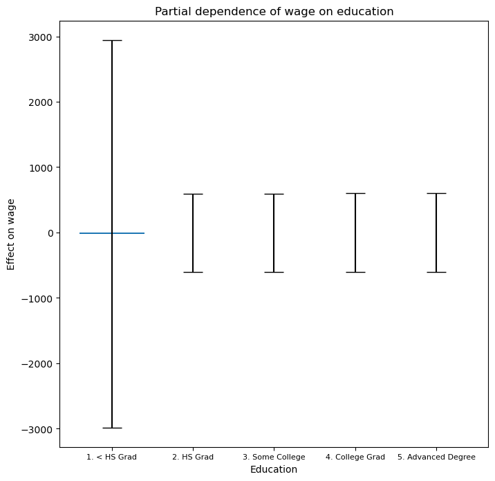

- Modell ist flach, hohe Fehlerbalken in der ersten Kategorie. Daten genauer prüfen.

```python=
pd.crosstab(high_earn, WageDF.education)
```

<table class="dataframe">
  <thead>
    <tr style="text-align: right;">
      <th>wage\education</th>
      <th>1. &lt; HS Grad</th>
      <th>2. HS Grad</th>
      <th>3. Some College</th>
      <th>4. College Grad</th>
      <th>5. Advanced Degree</th>
    </tr>
  </thead>
  <tbody>
    <tr>
      <th>False</th>
      <td>268</td>
      <td>966</td>
      <td>643</td>
      <td>663</td>
      <td>381</td>
    </tr>
    <tr>
      <th>True</th>
      <td>0</td>
      <td>5</td>
      <td>7</td>
      <td>22</td>
      <td>45</td>
    </tr>
  </tbody>
</table>

- Keine hohen Verdiener in der ersten Bildungskategorie, Modell passt schwer.
- Logistische Regression ohne diese Kategorie liefert bessere Ergebnisse.

```python=
# Create a indicator vector for lower education
only_hs = WageDF.education == '1. < HS Grad'
# Remove rows with lower education
WageHsDF = WageDF[~only_hs]
XHsDF = np.column_stack([WageHsDF.age, WageHsDF.year, WageHsDF.education.cat.codes-1])
# WageHsDF.education.cat.codes minus 1 due to a bug in pygam. 
# It relabels the education values and has no effect on the fit.
# Create the response variable for high earners
high_earn_hs = WageHsDF.wage > 250
```

```python=
GAM_logit_hs = LinearGAM(s_gam(0) + s_gam(1, n_splines=7) + f_gam(2, lam=0))
GAM_logit_hs.fit(XHsDF, high_earn_hs)
# Set df = 4+1 for the age term
GAM_logit_hs.terms[0].lam = approx_lam(XHsDF, gam_2.terms[0], df=4+1)
# Set df = 4+1 for the year term
GAM_logit_hs.terms[1].lam = approx_lam(XHsDF, gam_2.terms[1], df=4+1)
# Refit the model
GAM_logit_hs.fit(XHsDF, high_earn_hs);
```

```python=
fig, ax = plt.subplots(figsize=(8, 8))
ax = plot_gam(GAM_logit_hs2, 2)
ax.set_xlabel('Education'); ax.set_ylabel('Effect on wage')
ax.set_title('Partial dependence of high earner status on education')
ax.set_xticklabels(WageDF_hs['education'].cat.categories[1:], fontsize=8);
```

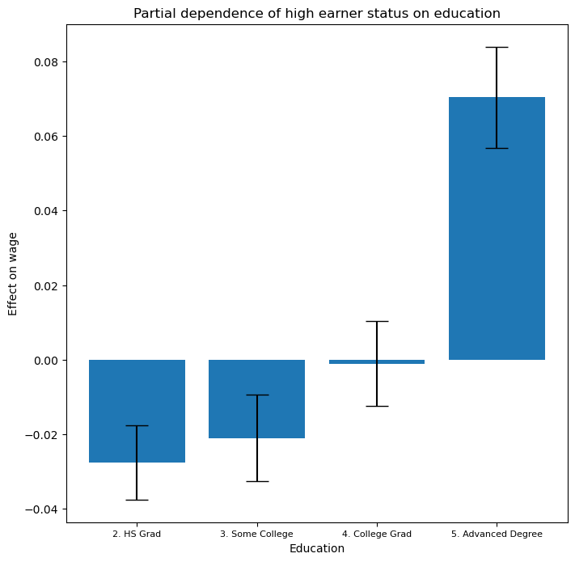

```python=
fig, ax = plt.subplots(figsize=(8, 8))
ax = plot_gam(GAM_logit_hs2, 1)
ax.set_xlabel('Year'); ax.set_ylabel('Effect on wage')
ax.set_title('Partial dependence of high earner status on year');
```

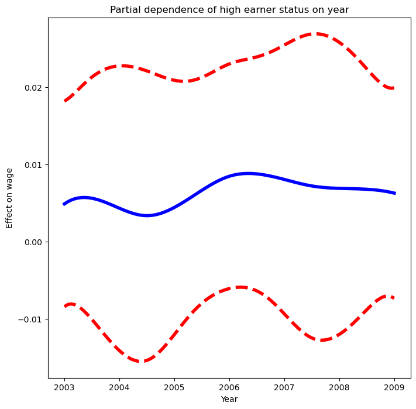

```python=
fig, ax = plt.subplots(figsize=(8, 8))
ax = plot_gam(GAM_logit_hs2, 0)
ax.set_xlabel('Age'); ax.set_ylabel('Effect on wage')
ax.set_title('Partial dependence of high earner status on age');
```

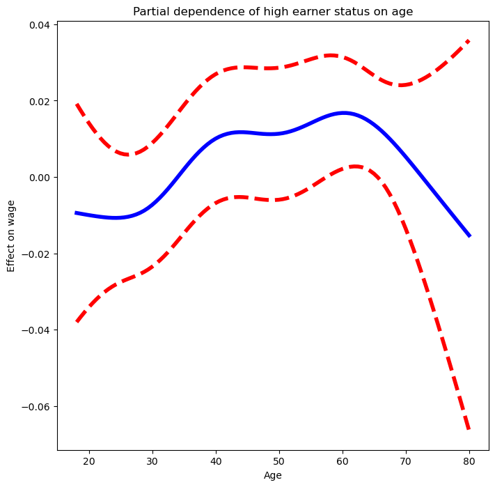

# 9. Lokales Regressionsmodell

- Definition
  - Anpassung nicht-linearer Funktionen durch nahe liegende Trainingsdaten.

- Algorithmus 7.1 Lokale Regression bei X = $x_0$
    1. Sammeln von s = k/n der nächsten Trainingspunkte zu $x_0$.
    2. Gewichte $K_{i0} = K(x_i, x_0)$ zuweisen, wobei der nächste Punkt das höchste Gewicht hat.
    3. Gewichtete Kleinste-Quadrate-Regression der $y_i$ auf die $x_i$ mit den Gewichten anpassen.
    4. Angepasster Wert bei $x_0$ ist $\hat{f}(x_0) = \hat{\beta}_0 + \hat{\beta}_1 x_0$.

- Wichtige Entscheidungen
  - Gewichtungsfunktion K definieren.
  - Wahl der Regression: linear, konstant oder quadratisch.
  - Wichtigste Entscheidung: Wahl der Spanne s (Anteil der Punkte für $x_0$).
  - Kleinere s-Werte führen zu flexibleren Anpassungen, größere s-Werte zu globalen Anpassungen.
  - Kreuzvalidierung oder direkte Vorgabe von s.

- Verallgemeinerungen
  - Anpassung an mehrere Merkmale $X_1, X_2, \ldots , X_p$ möglich.
  - Modelle können global in einigen Variablen und lokal in anderen (z.B. Zeit) sein.
  - Anpassung an zwei Variablen $X_1$ und $X_2$ durch zweidimensionale Nachbarschaften.
  - In höheren Dimensionen schwierig, da wenige Trainingsdaten nahe bei $x_0$.

- Hinweise
  - Lokale Regression benötigt alle Trainingsdaten für Vorhersagen, ähnlich wie k-nächste Nachbarn.
  - Flexibilität durch Wahl der Spanne s gesteuert.
  - Vorsicht bei hoher Dimensionalität, da wenige nahe Trainingsdaten.


- `lowess()` aus `sm.nonparametric` für lokales Regressionsmodell verwenden.
- Lokale lineare Regressionsmodelle mit Spannen von 0.2 und 0.5 anpassen.
- Spanne von 0.5 ergibt glatteres Modell als 0.2.

```python=
lowess = sm.nonparametric.lowess
# Plot
fig, ax = plt.subplots(figsize=(8,8))
ax.scatter(WageDF.age, WageDF.wage , facecolor='gray', alpha=0.5)
for span in [0.2, 0.5]:
    fitted = lowess(WageDF.wage, WageDF.age, frac=span, xvals=age_grid)
    ax.plot(age_grid, fitted, label='{:.1f}'.format(span))
ax.set_xlabel('Age', fontsize=20); ax.set_ylabel('Wage', fontsize=20)
ax.legend(title='span');
```

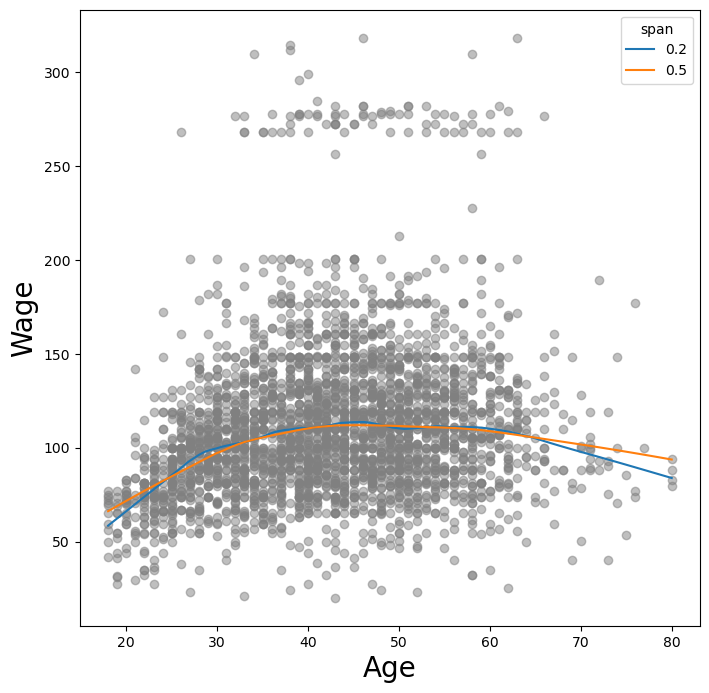
